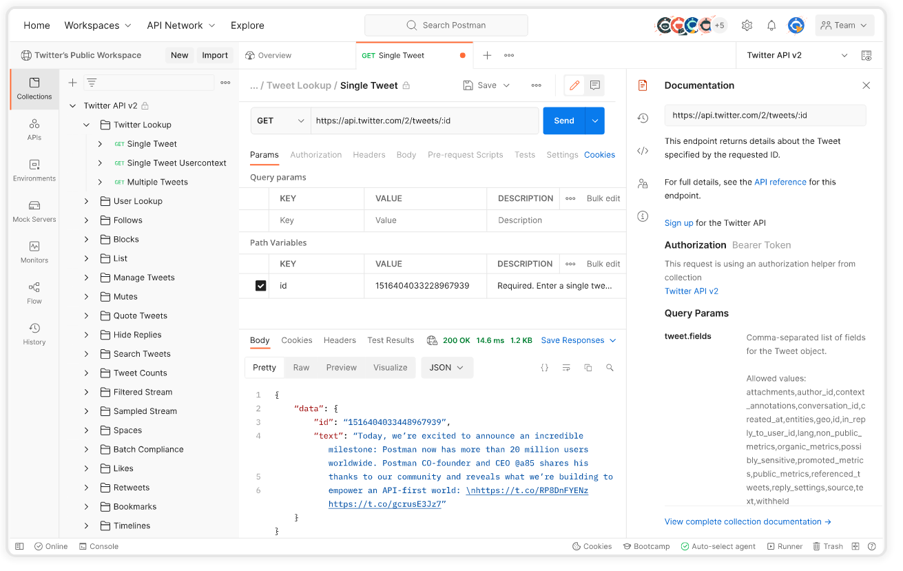

# Development Tools

## Visual Code

Because HTML is actually just text, you can use your favorite text editor such as Notepad, Notepad++, Visual Studio Code, Brackets, ... for this. Some of those editors also offer a 'live preview' which is very useful while you are designing your page.

We use Visual Studio Code to build our projects. If it is not already installed on your system, go to the [Visual Studio Code website](https://code.visualstudio.com/) and download the version for your system. 

### Extensions

Information about installing extensions can be found at the  [Visual Studio Code User's Guide](https://code.visualstudio.com/docs/editor/extension-marketplace).

#### Live server

Launches a local development server with live reload feature for static & dynamic pages.

#### TypeScript Vue Plugin (Volar)

Volar gives you syntax highlighting, TypeScript support, and intellisense for template expressions and component props within Vue components.

## Node.js

Node.js is an open-source, cross-platform Javascript runtime environment.

Just install the current version from [nodejs.org](https://nodejs.org/en)

## Postman

Postman is a API platform for testing your API applications. 

You can download the app from [Postman](https://www.postman.com/downloads/)

