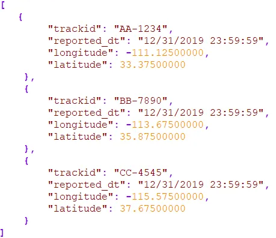

# Frontend scripting

## Communication 

Let's take a closer look at some of the communication protocols used in communication over the web.

### Uniform Resource Locator - URL

Uniform Resource Locators or short URLs are standardized names for internet resources. URLs point to pieces of information and tells two things about that piece of information.

* Telling where they are located
* How to interact with them


As you can see, a URL can exist out of several parts:

* **Scheme**: it tells the client how to access the resource. The URL says to use the HTTP protocol
* **Userinfo**: Login credentials user. For obvious reasons nog realy used.
* **Host**: is the server location, telling where the resource is hosted, in this case the host or server is called
* **Port**: on what TCP port to connect to on the host (server). This defaults to port 80 if omitted*
* **Resource path**: it tells what local resource on the server is being requested. 
* **Query**: queries can be used to filter down the resource. The query is prefixed by the ? character.
* **Fragment**: can be used to identify a single piece within the resource. The fragment is prefixed by the # character

#### Absolute versus relative URL

Web clients (browsers) understand a few shortcuts.
Relative URLs are a shorthand for specifying a resource within a resource URL’s can be absolute or relative.
* An absolute URL contains all the information to access a resource.
* A relative URL is incomplete. To get all the information it must interpret it relative to another URL, called the base.
Relative URLs are relative to the document in which it is found.


|Relative URL | Example  |
|- | - |
| Same folder | `reviews.html` |
| Child folder | `music/listings.html` |
| Grandchild folder | `movies/dvd/reviews.html` |
| Parent folder | `../index.html` |
| Grandparent folder | `../../index.html` |

### Hypertext Transfert Protocol - HTTP

HTTP is a protocol to access the data on the World Wide Web. It can be used to transfer the data in the form of text, audio, video, and so on and uses a MIME-like format.

#### Features

* **Connectionless protocol**: HTTP is a connectionless protocol. HTTP client initiates a request and waits for a response from the server. When the server receives the request, the server processes the request and sends back the response to the HTTP client after which the client disconnects the connection. The connection between client and server exist only during the current request and response time only.
* **Media independent**: HTTP protocol is a media independent as data can be sent as long as both the client and server know how to handle the data content. It is required for both the client and server to specify the content type in MIME-type header.
* **Stateless**: HTTP is a stateless protocol as both the client and server know each other only during the current request. Due to this nature of the protocol, both the client and server do not retain the information between various requests of the web pages.

#### Messages

**Request Message**: The request message is sent by the client that consists of a request line, headers, and sometimes a body.

 

Frequently used HTTP Requests are GET, POST, DELETE.

**Response Message**: The response message is sent by the server to the client that consists of a status line, headers, and sometimes a body.


The server always sends a response status code:

* 1xx : Informational
* 2xx : Succes
* 3xx : Redirection
* 4xx : Client error
* 5xx : Server error

### Domain Name System - DNS

A DNS server is a computer with a database containing the public IP addresses associated with the names of the websites an IP address brings a user to. DNS acts like a phonebook for the internet. Whenever people type domain names, like vives.be or google.be, into the address bar of web browsers, the DNS finds the right IP address. The site’s IP address is what directs the device to go to the correct place to access the site’s data.

Once the DNS server finds the correct IP address, browsers take the address and use it to send data to content delivery network (CDN) edge servers or origin servers. Once this is done, the information on the website can be accessed by the user. The DNS server starts the process by finding the corresponding IP address for a website’s uniform resource locator (URL).

### JavaScript Object Notation - JSON

JSON is a text-based data format following JavaScript object syntax. Even though it closely resembles JavaScript object literal syntax, it can be used independently from JavaScript, and many programming environments feature the ability to read and generate JSON.

This format is typicaly used in REST-API applications.


**Example**



### Message Queuing Telemetry Transport - MQTT

MQTT is a standards-based messaging protocol, or set of rules, used for **machine-to-machine communication**. Smart sensors, wearables, and other Internet of Things (IoT) devices typically have to transmit and receive data over a resource-constrained network with limited bandwidth. These IoT devices use MQTT for data transmission, as it is easy to implement and can communicate IoT data efficiently. MQTT supports messaging between devices to the cloud and the cloud to the device.

#### Why is the MQTT protocol important?
The MQTT protocol has become a standard for IoT data transmission because it delivers the following benefits:

* **Lightweight and efficient**: MQTT implementation on the IoT device requires minimal resources, so it can even be used on small microcontrollers. For example, a minimal MQTT control message can be as little as two data bytes. MQTT message headers are also small so that you can optimize network bandwidth.

* **Scalable**: MQTT implementation requires a minimal amount of code that consumes very little power in operations. The protocol also has built-in features to support communication with a large number of IoT devices. Hence, you can implement the MQTT protocol to connect with millions of these devices.

* **Reliable**: Many IoT devices connect over unreliable cellular networks with low bandwidth and high latency. MQTT has built-in features that reduce the time the IoT device takes to reconnect with the cloud. It also defines three different quality-of-service levels to ensure reliability for IoT use cases— at most once (0), at least once (1), and exactly once (2).

* **Secure**: MQTT makes it easy for developers to encrypt messages and authenticate devices and users using modern authentication protocols, such as OAuth, TLS1.3, Customer Managed Certificates, and more.

* **Well-supported**: Several languages like Python, Javascript, Node,... have extensive support for MQTT protocol implementation. Hence, developers can quickly implement it with minimal coding in any type of application.

## Frontend scripting with Javascript

**JavaScript** (JS) is a lightweight, interpreted programming language with top-notch features. Although best known as the web page scripting language, it is also used by many non-browser environments, such as node.js.

The standard for JavaScript is ECMAScript. As of 2012, all modern browsers fully support ECMAScript 5.1. On June 17, 2015, ECMA International released the sixth major version of ECMAScript, officially called ECMAScript 2015, and more commonly referred to as ECMAScript 2015 or ES2015. Since then, the ECMAScript standards have been released on an annual basis.

Don't confuse JavaScript with the Java programming language. Both "Java" and "JavaScript" are trademarks or registered trademarks of Oracle in the US and other countries. In contrast, the two programming languages ​​have very different syntax, semantics, and applications.

Javascript allows web pages to be made more interactive by accessing and modifying the content and layout of a web page while the page is being viewed in the browser. i.e. Javascript allows you to make a web page **dynamic** so that it responds to what the user does. Every action that needs to be done takes place via a **script** and is processed by the browser, so on the **client-side**.

::: tip 💡Supporting learning materials
We recommend the following supporting learning materials:

* Ferguson, R. (2019). Beginning JavaScript: The Ultimate Guide to Modern JavaScript Development. [Link](https://limo.libis.be/primo-explore/fulldisplay?docid=TN_springer_s978-1-4842-4395-4_313453&context=PC&vid=VIVES_KATHO&search_scope=ALL_CONTENT&tab=all_content_tab&lang=nl_BE:) (you must first log in via [ limo](http://limo.libis.be/index.html#/vives) before you can use this link)

* [Mozilla developer page](https://developer.mozilla.org/en-US/docs/Web/JavaScript)

* [LinkedIn Learning](https://www.academicsoftware.eu/) via Academic Software (choose Web Platform)
:::

### Troubleshooting

When we write code it is usually by trial and error. Making mistakes is part of the coding proces.
We distinguish two types of errors:

* **Syntax errors**: These are errors where the Javascript syntax is not correct. Usually these are typos or bits we forgot.
* **Logic errors**: Here the syntax of Javascript is correct but the result is not what we expected or intended. The fault lies in the logic of our program, which is more difficult to figure out.

Fortunately, our browser has a development environment that can help us with this. For Google Chrome you open this via `F12` and in Safari you can open this via the `Develop > Show Web Inspector` menu.

You can log values ​​of variables to the console to try and find logic errors.

```js
console.log('Result : ' + total);
```

Sometimes the error is a bit more complex and we need to debug.
Have a look at the information on the [developer page of Chrome](https://developer.chrome.com/docs/devtools/javascript/)

### Become familiar with the syntax

First of all you need to understand that javascript is interpreted line by line by the browser. While with c++ you compile the program into machine language instructions and then let it run independently.

#### Add javascript to your html page.

You can choose to add a script block to your html page. If possible, avoid this technique.

```html
<head>
    <script defer type="text/javascript">
        // here goes the java code
    </script>
</head>
```
Or you can work with a separate file, which is preferable.

```html
<head>
    <script defer src="/scripts/script.js"></script>
</head>
```

By using the attribute `defer` the browser will wait for the DOM to be loaded before loading the script. This can be imported for users with slow internet connection.

::: tip 💡Tip
* Create a 'scripts' folder in your project folder in which you place the Javascript files.
* If you use other javascripts in your javascript, you must place these script links before yours.
:::

#### Variables

In javascript, variables are loosely typed, which means that the data type depends on what you put in the variable. So you can perfectly have an integer in a variable one moment and have a string in that same variable a few moments later.

**let**
```js
let y = 13
```
Let is a variable definition that is valid only within the block scope `{}` in which it is defined.

**var**
```js
var y = 12
```
Var is a general variable definition, so if you define it within a function, the function is the scope of the variable, if you place it at the top, the entire script file becomes the scope.

**const**
```js
const y = 11
```
Const is the definition of a constant, has the same scope as let but you cannot change the value.

::: warning ❗Attention
If you define a variable without let, var or const then it is automatically a global variable. Then you must pay attention not to define a variable with the same name anywhere else.

To avoid accidentally forgetting let, var or const you can add `"use strict";` at the top of your script file. Then you will get an error message if you forget.
:::

🔥 **Variable Naming Rules**

1. The name must start with a letter, a `$` or a `_`. Never with a number!
2. The name can contain letters, numbers, a `$` or a `_`. Never a `-` or `.`!
3. You cannot use words that have a script meaning (eg var).
4. The name is case sensitive, you always start it with a lowercase letter. You never reuse a variable name with a different capital combination.
5. Use a name that describes its information content.
6. If a name consists of several words, use a capital letter  for the second and next word(s) (eg firstName), also called **lowerCamelCase**.

#### Data types

Within javascript 7 primitive data types are used:
* **Boolean**: true or false
* **Number**: integer or float
* **BigInt**: an integer with unlimited size, recognizable by a small n after the number e.g. `23232n`
* **String**: text
* **Undefined**: the data type is not yet defined eg `let a;`
* **Null**: to indicate a special value 'null'
* **Symbol**: each instance is unique, eg `Symbol("description");`

In addition, you have the **object** type that can be used to store a collection of values.
```js
let obj = {name: 'Samira', age : 25};
```
There are 4 more special object types:
* **Function**
* **Array**
* **Date**
* **RegExp**

#### Logical operators

We can use the well-known logical operators in javascript to build conditions:

* `&&` the AND operator
* `||` the OR operator
* `!` the NOT operator

What is special about the interpretation of conditions is that javascript looks at the condition until the outcome has been determined with certainty, the rest of the condition is no longer interpreted at that time.
```js
false && (a=2) // left part is false, so the condition is false, a=2 will not be executed anymore.
```

#### Decisions

We can use the usual decision trees in javascript:

```js
if(...){
  // code
}
else if(...){
  // code
}
else {
  // code
}

switch(answer){
  case "YES":
    // code
    break;
  default:
    // code
    break;
}
```
We also have the ternary operator:
```js
(animal === 'cat') ? console.log("cat") : console.log("no cat");
```

#### Loops

We can also work with loops in Javascript:

```js
// for loop
for (let i=0; i<10; i++){}

// for-of loop
let names = ['Pete','John','Pol'];
for (let name of names) {
   console.log(name);
};

// for-in loop
let names = {n1:'Pete',n2:'John',n3:'Pol'};
for (let i in names) {
   if(names.hasOwnProperty(i)) console.log(names[i]);
};

// forEach loop
let names = ['Pete','John','Pol'];
names.forEach(function(name) {
    console.log(name);
});

// while loop
let count = 5;
while (count > 0){
  console.log(count);
  count--;
}

//do-while loop
let count = 5;
do {
  console.log(count);
  count--;
} while (count > 0);
```

<!-- TODO : Overname cursus eigen cursus -- Verder doen bij functies -->

## Typescript

<!-- TODO : Nog aan te leren en uit te schrijven -->