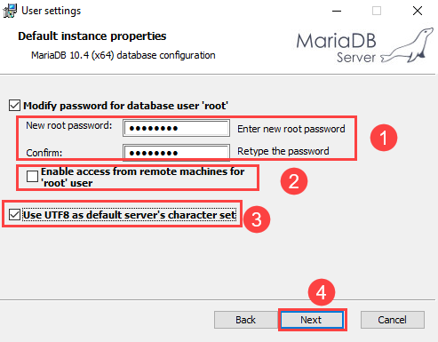
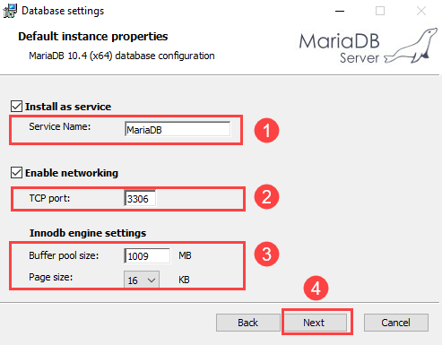

# Backend databases

To be able to store, retrieve, edit or delete data we will use a database.
To be able to do that we need a database service, in this course we will focus on relational databases **MySQL** and **MariaDB**.

A relational database stores data in the form of tables containing rows and columns. It ensures referential integrity between the rows of a table and interprets queries to fetch information from the database. One database can contain several tables each existing of rows and columns (fixed structure).

**MySQL**

MySQL is a free, open-source, relational database management system (RDBMS) created by MySQL AB for web application development. In most cases, MySQL works alongside PHP, Apache web servers, and Linux distributions. It’s modifiable using the Structured Query Language (SQL).

**MariaDB**

MariaDB is a fork of MySQL. The developers built the RDBMS to preserve MySQL’s structure and features. They feared that the system’s acquisition by Oracle – the corporation behind the Oracle Database, which was MySQL’s biggest competitor at the time ‒ would jeopardize the database.

MariaDB’s developers make sure that each release is compatible with the corresponding version of MySQL. MariaDB not only adopts MySQL’s data and table definition files but also uses identical client protocols, client APIs, ports, and sockets. The goal is to let MySQL users switch to MariaDB hassle-free.

Much like MySQL, MariaDB is modifiable using SQL statements.

## Setup MySQL database

First we will need to install our MySQL RDBMS from Oracle. [MySQL Community Downloads](https://dev.mysql.com/downloads/installer/)

* Choose the **Full** type and let it install.


* In the configuration set the config type to **Development Machine** port to **3306**.


* Next choose a Root password 

:::warning 🔥Warning
Write your root pasword down somewhere so you don't forget!
:::

<!--  Mag weg als ik phpmyadmin kan gebruiken
Once your MySQL server is up and running you can login to it with your **MySQL Workbench** by using your root acces.


-->

## Setup MariaDB database

First we will need to install our MariaDB RDBMS from MariaDB.org. [MariaDB Download](https://mariadb.org/download/)

* Choose the directory that stores the MariaDB files and click the Next button. The default location on Windows is `C:\Program Files\MariaDB 10.4\`.

* Next choose a Root password 



:::warning 🔥Warning
Write your root pasword down somewhere so you don't forget!
:::

* Configure MariaDB



## Install phpMyAdmin


<!-- TODO : install and configure phpmyadmin op NgInx server -->

## Creating a database with an application user

Because we don't want web applications using the root acces to logon to our database, we will create a new database with a dedicated user to acces only that database.

Now let's use our database admin tool with root acces and create a new database called `VIVES` for school purposes with a specific user called `webuser`to acces this database.

```sql
CREATE DATABASE vives;
USE vives;
CREATE USER 'webuser'@'localhost' IDENTIFIED BY "secretpassword";
GRANT ALL PRIVILEGES ON vives.* TO 'webuser'@'localhost';
```

## CRUD interactions with a database

**CRUD** is the acronym for **CREATE, READ, UPDATE and DELETE**. These terms describe the four essential operations for creating and managing persistent data elements in relational databases.

### Create

The CREATE operation **adds a new record** to a database. In RDBMS, a database table row is referred to as a record, while columns are called attributes or fields. The CREATE operation adds one or more new records with distinct field values in a table.

Example SQL statement:
```sql
INSERT INTO <table name> VALUES (field value 1, field value, 2…)
```

### Read

READ returns records from a database table based on some search criteria. The READ operation can return all records and some or all fields.

Example SQL statement:
```sql
SELECT field 1, field 2, …FROM <table name> [WHERE <condition>]
```

### Update

UPDATE is used to modify existing records in the database. For example, this can be the change of address in a customer database or price change in a product database. Similar to READ, UPDATEs can be applied across all records or only a few, based on criteria.

An UPDATE operation can modify and persist changes to a single field or to multiple fields of the record. If multiple fields are to be updated, the database system ensures they are all updated or not at all. 

Example SQL statement:
```sql
UPDATE <table name> SET field1=value1, field2=value2,… [WHERE <condition>]
```

### Delete

DELETE operations allow the user to remove records from the database. A hard delete removes the record altogether, while a soft delete flags the record but leaves it in place. For example, this is important in payroll where employment records need to be maintained even after an employee has left the company.

Example SQL statement:
```sql
DELETE FROM <table name> [WHERE <condition>]
```


