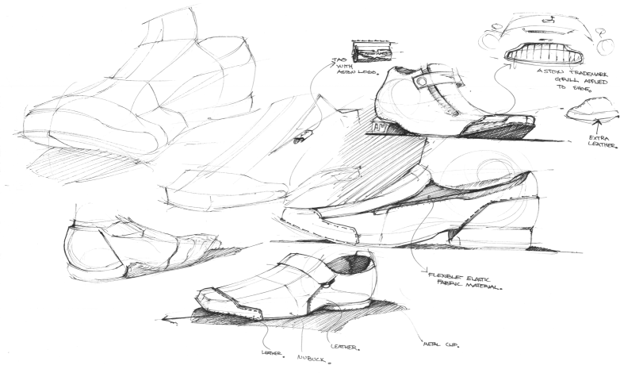
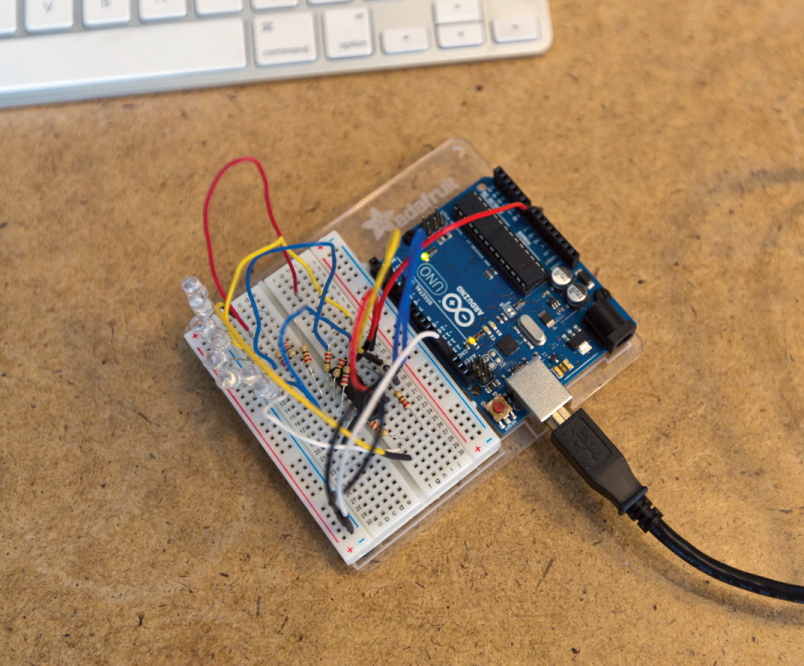
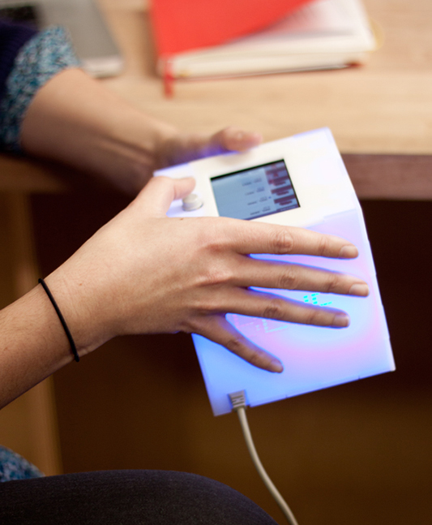
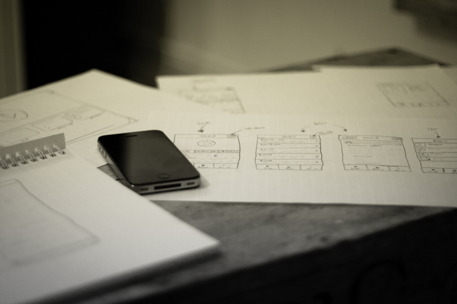
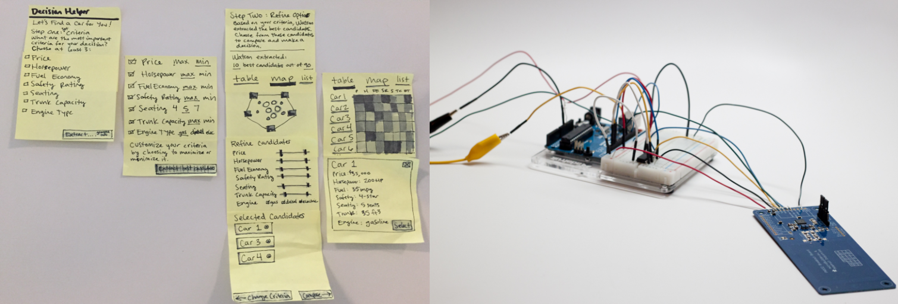
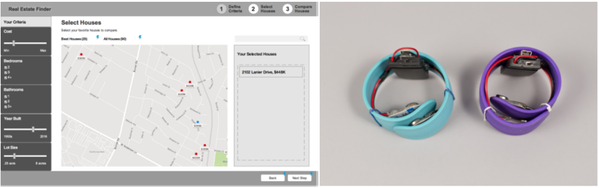

# Introduction

## What is a prototype?

Prototypes are created every day for all sorts of situations. Even if you haven’t consciously been making prototypes, they have most likely intuitively been part of your process or even your daily life. A prototype is “a first, typical or preliminary model of something, especially a machine, from which other forms are developed or copied.” This “preliminary model” can be anything that takes an idea that’s in your head and gives it a form to test. As long as your goal is to always improve your idea, everything is a prototype. They can be sketches, sculptures, or intricate drawings. Or they can be coded, soldered, and fully functional products. All sorts of industries create prototypes of their work to test and try out different ideas, as you’ll read in the following sections.

:::tip Definition of a prototype 
A prototype is a model that gives form to an idea so that tests can be performed with the aim of making improvements.
:::

### Industrial Design

In industrial design, prototypes include hundreds of sketches, foam models, material studies, ergonomic studies, and final forms. These short-listed forms are created in the proper materials and tested for material longevity and feel before the final form is chosen and prepared for manufacturing. Industrial designers spend most of their time prototyping their ideas before settling on the proper form for production.

### Personal Electronics

For developing personal electronics, a subset of industrial design, prototypes also begin with sketches and studies of form. Additional layers of complexity for electronics include figuring out the necessary electrical components and needing to test the different component functions. For that purpose, other prototypes include larger electronics to test each individual component, then slowly combining them together to get the code to work properly and incorporate the functions.

Only after the components are all added together, with each section tested along the way, do these designers start soldering smaller versions of those components together and user testing them in the actual final setting. This type of project also needs material testing and potentially a parallel process of prototyping an accompanying app that will control the personal electronic.

### Software and Apps

When developing software, the prototypes include sketches or a user flow showing the ideal path and functionality that the user will need, wireframes in a testable form (either paper or clickable), clickable or coded prototypes, and visually designed, high-fidelity prototypes. Each of these prototypes can be improved throughout the process, and can be altered by testing.

Each software prototype has a specific use and assumption that it manifests. Earlier in a process, prototypes target big-picture questions like information architecture, overall user flow, and format of the product. Later on in the process, prototypes are more refined to test specific elements such as styles, interaction patterns, and UI text. 

Before making an initial prototype for any industry, you must have a basic understanding of who your user is in order to design an experience for the specific situation that user is in. User research allows you to interview potential end users and map out their personas (a representation of their goals and behavior) to help guide you along your design process.

## Why do we prototype?

There are many great reasons to make prototypes and to include them early and often in your process. The four reasons I’ll cover are as follows: 
* to understand
* to test and improve
* to communicate
* to advocate.

Each of these is similar, but has a unique twist to why prototypes are valuable.

### To Understand

It’s easy to get stuck in your head when you’re trying to tackle a new idea. A great way to understand the problem you’re taking on, and to discover the best way to approach it, is to explore the problem through prototypes. By sketching many different variations of an interface, wearable, or other product, you can quickly understand the direction the work is taking you, and also begin discussing your ideas with the rest of your team. Prototypes at this stage allow you the freedom to think through all the different ways you could solve the problem, discover new problems that need to be addressed, and help you to refine your ideas with the feedback you receive. As long as you intend to improve your ideas, these sketches are both ideation and prototype.

### To Test and Improve

Testing and improving products is the main reason to prototype. Now that you have a better hold on the problem you’re addressing, you can dig into specific parts of your product design through iterative prototyping. Each prototype you build will address a specific assumption or design element, that you then test with users to either support or disprove your assumption. It should be the cheapest means to an answer, so these prototypes are fast and disposable. After you’ve gained insights from testing a prototype, you should feel comfortable using only part of the prototype moving forward, or even tossing out the prototype and making a new one for the next assumption. This process is similar to the scientific method in that you’re building small experiments to test your hypotheses along the way, each test is unique for the hypothesis it’s testing, but different because user testing has a qualitative emphasis as opposed to being based purely on empirical data.

### To Communicate

Another use for prototypes is to communicate to your team, investors, stakeholders, or end users. It’s more valuable to show an idea through an artifact than to merely talk about it. By having a prototype, no matter what fidelity level, you can actually point to what you’re talking about instead of asking your audience to imagine your idea themselves. If you only talk, each person will create their own different mental picture of your idea, and it will be difficult to align all those hidden expectations. Prototypes allow you to get everyone on the same page for the direction you’re going, without as much
opportunity for miscommunication during your process.

### To Advocate

Finally, you can use prototypes to advocate for a design or direction. The process of prototyping and user testing delivers valuable insights and user quotes that support a specific direction for the product. By sharing these results with management and product owners, you can advocate for a better user experience, and therefore a more sellable product. At the end of the day, the better the user experience is overall, the more marketable and useful your end product will be to your user.

## How Is Prototyping for Physical and Digital Products Similar?

Prototypes for physical and digital products have a few similarities and a few differences. We’ll go over what’s similar first, then dig into both types individually to learn the different tools and processes for developing them.

### Goals

The first similarity is the goal of prototypes. As I’ve mentioned before, the goal and benefit of prototypes is to make the best product possible by focusing on a specific user and their problem. By focusing on the user, and having a user-centered design approach, your product will be addressing a direct need of that user and will be much more viable and sellable. When you have a user as your guiding star, you will naturally design iteratively and user test each step of the way.

### Fidelity Levels

The other similarity is the use of different fidelity levels for prototypes to test different aspects of the design. Fidelity means how closely the prototype looks to the finished product. Both types of prototypes benefit from starting with low fidelity and slowly increasing the fidelity level until most of your assumptions are tested and either proved or fixed. But the designer must be flexible and able to decide which fidelity is right for the assumptions they’re testing. If a prototype’s fidelity level is too high, the user will subconsciously believe that the design is “finished” and will only give feedback on polishing areas instead of the broad concepts. If a prototype’s fidelity level is too low, the user might not understand the context and get lost in the generalities.

### Low Fidelity

Low-fidelity prototypes are best for testing your core concepts, getting over initial fears, and catching potential problems before they get too big to fix. This type of prototype doesn’t look like your final product at all: it’s in a different medium, at a different size, and is usually not visually designed (although you should be thinking about visual design during this whole process).

It’s the easiest and cheapest prototype to make, and doesn’t require as much time or skill to complete. Some examples include paper prototypes, storyboards, wireframes, mood boards, sketches, and component prototypes. The goal of a lowfidelity prototype is to test basic and big assumptions, including user flows, information architecture, labeling, navigation layout, basic organization, and user mental models. With this rough prototype, your user won’t waste time giving feedback on the execution and appearance of the interface or device.

### Mid Fidelity

Mid-fidelity prototypes start to look like your final product. They are a good balance between cost (time or otherwise) and value, and have either been more visually designed or are in the final medium (on screen, in browser, or physically designed). Examples include clickable prototypes, Axure prototypes, coded prototypes, and initial electronic prototypes. The goal of a mid-fidelity prototype is to test more specific assumptions, such as whether the user found a specific function, if it was easy to navigate through the whole product, or if the wearable’s vibration was disruptive. They don’t take as long to make as high-fidelity prototypes, but you can begin testing more detailed parts of the interactions.

### High Fidelity

High-fidelity prototypes are the real deal. They’ve been visually designed and are in the final medium of either physical materials or in browser and coded. Some examples include fully coded and designed digital experiences and high-quality industrial design models. At this point, most of your assumptions should have been tested in earlier prototypes. It’s best to use this type of prototype to test small details like overall user reactions to the experience, legibility of the font sizes, and long-term wearability.

|| Low fidelity | Mid-fidelity | High fidelity |
|-|--|--|--|
| **Pros** | Fast, low-skill, cheap, made with materials available around you | More interactive, easier to test, good balance of time and quality | Complete design, including visuals, content, and interactions; can test very detailed interactions |
| **Cons** | Limited interactions, harder to test details and full flows, little context for users | More time-intensive, but not fully functional | Very time-intensive, requires skills with software or coding, hard to test large concepts |
| **Use** | Exploring and testing highlevel concepts like user flows and information architecture; best for making lots of different versions and testing them against each other | User testing specific interactions and guided flows; also better for stakeholder presentations, as these prototypes have more context | User testing very specific interactions and details, final testing of user flows, and presenting final design work to stakeholders |
