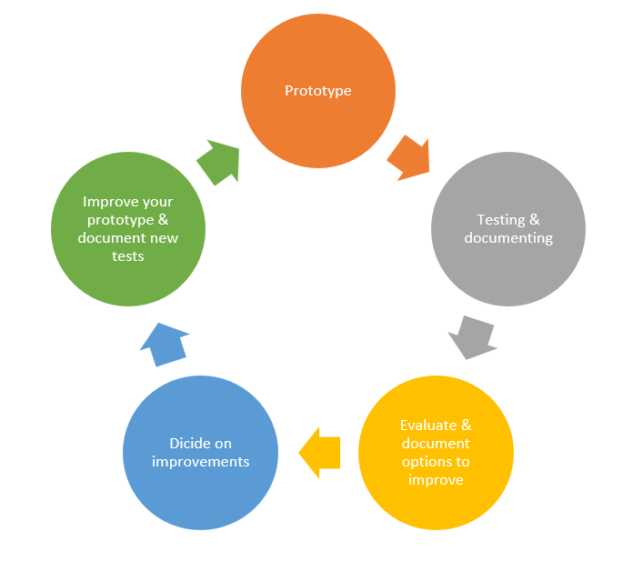

# Prototypes for physical products

Prototyping for physical products has a few essential features and processes that are not the same for digital products. The main aspects you must take into account are the materials and tactility of the physical product and the electronics involved in its functionality. We won’t dig too much into the industrial design side of physical products, but I will address some ways to prototype the outer materials and the inner functionality.

## Materials and Tactility

Materials are a very important part of physical products. Keep in mind that any wearable that touches human skin needs to be thoughtfully designed to interact with a nerve-filled surface. Different materials are better or worse for this application. As you’re designing the functionality in the electronics, you also need to decide how the user interacts with the product (touch, voice, or through their smartphone), or if it’s a
wearable, where it will reside on the body (wrist, neck, upper arm, etc.), and how it will communicate with the user (vibration motors, LED light, sound, etc.). Think through how the surface will be cleaned, and make sure the materials will not cause allergic reactions. For example, if you’re designing for a sports-related wearable, consider silicon or neoprene as materials that can stand up to a sweat and motion. Throughout your process, make sure to test your prototypes as close to possible to the final position on the body, so that you can get proper feedback on the form and material concerns. You should use prototyping to test different types of materials, forms, and placements during your process to help you decide which direction to go.

When designing for non-wearable smart objects, keep in mind the environment in which those objects will live. How can you best prototype and test your idea in its ideal environment? Not only will you be choosing build materials (such as injection-molded plastic), you might also choose finishing materials such as wood veneers or silicon covers.

The material choice also contributes to the tactility of the product. What are the literal touch points on your product? You might have screens, buttons, haptics, or even an accelerometer to track motion. The decisions you make about the tactile components will help you develop the prototypes you need to test these components, separately and then together as a product.

## Electronics

That leads us to the electronics. It may seem overwhelming to begin working with electronics, but it’s such a fun and engaging way to prototype!

When you have an idea for a new physical, electronics-based product, and a specific user that you’re solving a problem for, it’s time to begin prototyping. Determine what components you’ll need and how they should work together based on your full use case. Components can include how you collect information with sensors, including temperature, light, sound, motion, and pressure sensors or analog dials; how the device will interact with a phone or computer (Bluetooth, WiFi, or cord), and different outputs such as lights, sound, or haptics.

## Low-Fidelity Prototypes

The first low-fidelity prototype you can make is sketches of potential circuits and how your different components should interact also known als the **architecture document**. Or if you haven’t made circuits before, write out in a story how the different sensors and outputs will work together and draw how they interact. Either of these directions is a prototype to test with your electrically minded friends. If you’re new to electronics, this is a great time to read up on some of the basics, so that you understand what you’ll need and basic safety.

Once you get the hang of building small circuits, you’ll want to prototype and test each of your main components individually before combining them together. 

## Mid to High Fidelity

Now that you have the hang of testing individual pieces, you can increase the fidelity level and begin testing the whole experience as part of a series of prototypes. 

