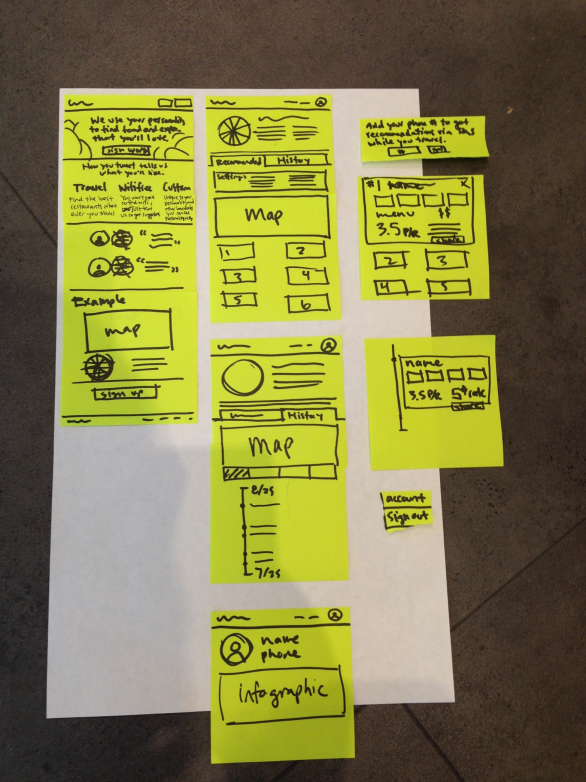
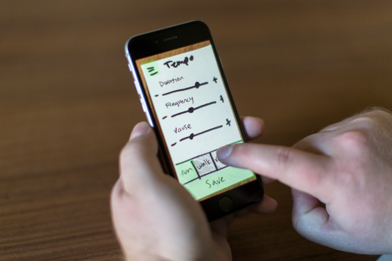

# Prototypes for digital products

Prototyping for digital products has its own set of essential characteristics, which includes creating a unified experience across multiple devices. Software and apps are accessed not only on computers, but also on smartphones, smart watches, tablets, and other interfaces. The unique aspects of designing for the screen are thinking through the different user flows that might occur, responsive design, and designing for screen, touch, and voice interactions.

## User Flow

User flow is how someone navigates and uses your software or app design. After you understand what pain point you’re solving for the user, and the user’s goal within the software, you design the route that will be the easiest and fastest way for a user to complete his or her task, or the “happy path.” These flows must be prototyped and tested to make sure that they are clear, and that users actually follow them. Oftentimes, a user will find a new way to move through your app, and might miss the main functions because of that. By testing prototypes, you’ll be able to improve the overall design to help the
user easily flow from task to task.

## Responsive Design

If you’re designing a web-based digital experience, you must design it to be responsive and mobile-first. Smartphone browsing has exponentially
increased in the last few years, and surpassed desktop browsing in 2014. With this in mind, it’s important to create prototypes
for a variety of screen sizes, and even better to create responsive prototypes that can be used to test both desktop and mobile
experiences.

## Designing for All Interaction Types

With mobile interaction comes **designing for touch**, and additional sets of constraints to design within. Your navigation and menus must be accessible, and your content must be legible in a smaller screen size. This type of interface can include voice input and audio
output depending on your functions. These aspects are a little more difficult to prototype, but creating proxy interactions and playtesting
can allow you to test the interface at a lower fidelity before you commit to extensive implementations. 

## Low- and Mid-Fidelity Prototypes

The lowest fidelity prototype that you can start with is writing out the user flow, as this will determine the type of interactions you need
to prototype later. Start with how the user finds your app and write out the flow until they are finished using it. Write out
each step that the user will take to complete their task in your app. If you write this out on Post-its, you can think through alternative
flows by reordering them. This exercise helps you be flexible with the interface you design. 

Now that you have a core idea for the function of your app, you can begin to test some of your basic assumptions with low-fidelity prototypes. If you’re designing a website or software that has navigation, you can develop the information architecture through a card sort or through paper prototypes.

### Paper Prototype

Paper prototypes are low fidelity, low cost, and low skill. They’re fast to make and test, and enable you to try out many different ways to solve the same problem in a short amount of time. To make a paper prototype, think through the specific assumption you want to test (navigation, completing a partial task, etc.) and decide which parts of the design will be needed. Draw out your wireframes on separate pieces of paper or Post-its, with each interaction having an additional piece of paper. Make sure to include real content so that your test doesn’t give you false feedback
due to the lack of context in your design.

You can also make different fidelities of paper prototypes. By adding more content, more detailed buttons, and illustrations, you can get
feedback on all parts of your design. Try out alternative wordings for your calls to action, different sizes of buttons, and even completely
different layouts for the same content. This step is where you want to establish your core assumptions, and experiment while you
still have the opportunity. 

### Clickable Prototype

Another way to make a low- or mid-fidelity prototype is by turning your analog paper prototypes into clickable prototypes. This automates the interactions a bit, and makes it easier to test. There are many apps that make this easy including Prototyping on Paper, Axure, and InVision. You can take pictures of each of the screens you drew, put hot spots on interactive areas such as buttons and text fields, and select what happens when they’re clicked. Then you can test these clickable prototypes similar to how you did the paper prototypes, but with less work on your behalf to move the paper pieces around during the session.

A mid-fidelity prototype can also be created using more powerful software like Sketch, InVision, or Axure, and built from scratch. The learning curve is a bit higher and it takes more time, but you can build a dynamic prototype, adding real data and content, more functionality, and different interactions as needed, and then save it out to access online through the browser. Some of these tools include basic animation capability, which is important to test during this phase to determine loading order, UI help text, and even error states. Mid-fidelity clickable prototypes are good for testing general
interaction patterns on the actual device and using real input such as finger, mouse, or keyboard.

## Coded Prototype

Coded prototypes are also mid-fidelity, because they are in the same medium that the final product will be. Coding a basic prototype with HTML/CSS is relatively straightforward for midfidelity, and allows you to create a responsive design that can be tested across different browsers and devices. You can also use pattern libraries such as Bootstrap or Foundation to help you build faster. However, when you need more complex interactions and higher fidelity levels, you’ll need to use JavaScript, or other more powerful programming languages.

These prototypes should also include visual design, even in its initial stages. Visual design should never be left until the end of the process;
it should be developed alongside the functionality and fidelity levels of the prototypes. Visual cues help users interact more intuitively with the system, and include spacing, color, font choices and sizes, and iconography. Keep an eye out for users that don’t notice important calls to action, interactive fields, or links. Visual design greatly helps these areas and may need to be tweaked depending on your testing.

## High-Fidelity Prototype

Now that you’ve worked out most of your assumptions through prototyping and user testing, and fixed any big problems along the way, you can create high-fidelity prototypes to bring all of your learning and design together. The best approach is a highfidelity coded prototype that  should include high-fidelity visual design (this is the time for pixelperfect), your exact data, content, and written material, and animations and interactions. It’s still a prototype, so the entire system might not be present, but the parts that are should look exactly like the expected final product.

At this point in your process, you’re testing minute details and interactions. Is the font size appropriate for the different media sizes? Are
the animations adding to the experience and not distracting the user? Is the content easy to read, and are the calls to action clear and
accessible? You can conduct longer, more detailed tests, and users can tackle complex interactions.
Use these prototyping types as a toolkit from which you can pull what you need, when you need to. Remember to write out the
assumptions you’re testing, and then choose the proper fidelity level and type of prototype you need to prove or disprove that assumption.
The best user experience designers and prototypers don’t depend on just one tool; they have a whole arsenal of options that
they’re comfortable with, and choose which one to use for each specific engagement.