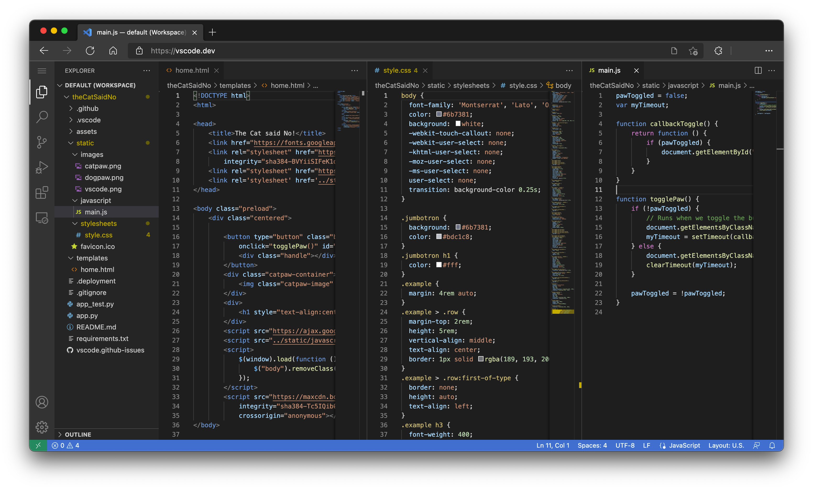

# Developmenttools

Because HTML is actually just text, you can use your favorite text editor such as Notepad, Notepad++, Visual Studio Code, Brackets, ... for this. Some of those editors also offer a 'live preview' which is very useful while you are designing your page.

We use Visual Studio Code to build our projects. If it is not already installed on your system, go to the [Visual Studio Code website](https://code.visualstudio.com/) and download the version for your system. 

After installation you also add the live server extension. For more information on how to do this, see the [Visual Studio Code User's Guide](https://code.visualstudio.com/docs/editor/extension-marketplace).

