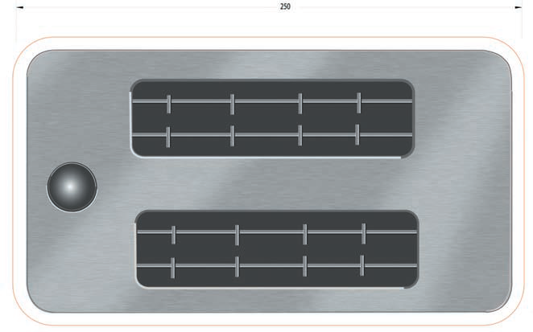

# Paper & Cardboard

Paper comes in many forms and is categorized as sheet, cardboard, or corrugated cardboard. It is a renewable, environmentally friendly, easy-to-work-with material. Since paper requires few tools it is both accessible and mobile. Its low-tech nature might create the perception that it is suitable mainly for craft projects, but it is actually an extremely fl exible set of materials, more limited by skill and imagination than by its properties.

Paper sheet comes in many different thicknesses and levels of shine and texture. Card stock is the thickest paper that can be cut with scissors and fed easily through a computer printer. Paper thicker than 0.5mm is classified as cardboard and is more easily cut with an utility knife on a cutting board than with scissors. Your local art store will stock special high-quality cardboard for modelmaking such as mat board. For even more structural paper there is
corrugated cardboard, available from companies that sell packaging materials, as well as from recycled scraps. It makes sense to **reuse old materials** when prototyping for exploration.

## Applications for Paper

It is usually easy to draw conclusions about form and function in another material based on observing how a simple paper model behaves. For example, paper
behaves in much the same way as sheet metal, but is much easier to use in a prototyping application. Paper studies of proportion and size, or the kinematic
movement of mechanisms, as well as important packaging principles and collapsibility, are therefore common.

## Cross-Sectional Models

To create a surface representation of more complex geometry it is usually easier and more effective to make models from a series of cross sections. Such models approximate the shape as a series of slices and give a good idea of size and proportion.

## Example - Bread Toaster

This tutorial shows the benefits of using an inkjet printer to create a visual model in paper. Even a quick model made in paper will be helpful for quickly evaluating overall shape and size. At the same time it is important to realize the limitations of paper; clever methods of folding can be used to
create almost any geometry, but the return on invested time quickly diminishes. This example is probably at the limit of what it makes sense to do in
paper. For more complex geometry it would be easier to create a crosssectional model.
These drawings (numbered 1 to 4) show the sequence of construction. All pieces can be made directly from computer printouts, except the corner pieces, which are fabricated by curving pieces of paper. Note how tabs have been entered on the side panels to create stiffness and overlapping joints. Tabs along curved edges have to be notched in order to be folded.

**Step 1** Orthographic views of the toaster are created in CAD. These are printed on sheets of paper.

**Step 2** In order to add some stiffness to the model, the bottom is glued to a piece of cardboard.

**Step 3** Tabs are added manually by offsetting the edges by approximately 1cm. Remember that the four vertical corners are shown on the side elevations, but are separate pieces. Tabs that run along curved sections are notched in order to allow them to be bent.

**Step 4** The paper panels can now start to be assembled with glue. Tape is also used on the inside to hold the pieces together while they are drying.

**Step 5** The corner pieces are curved and cannot be created directly from the elevations. Instead, they are folded with a series of bends using a ruler to curve the paper.

**Step 6** The resulting corner posts have to be trimmed to fit and are glued in place with tabs. Small clips or low-stick tape is used to hold the tabs together while drying. The corner posts could also easily have been made in polystyrene foam.

**Step 7** You can create a high level of realism with a rendering. This view can be printed on glossy paper to capture some of the details and then trimmed and glued on to the top of the toaster.

