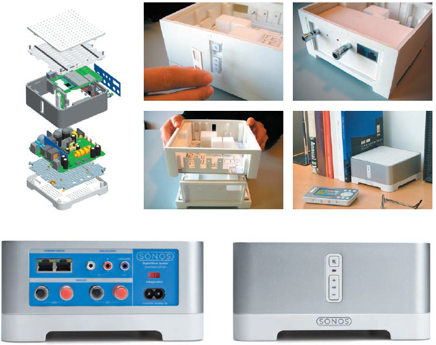
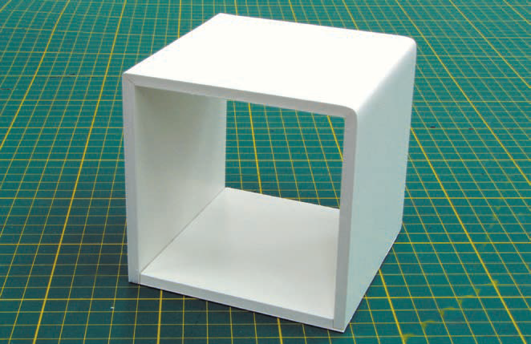
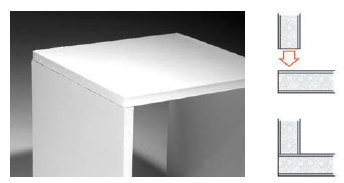
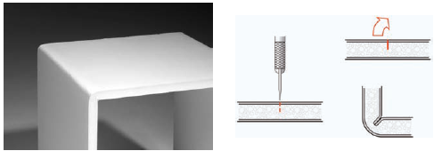
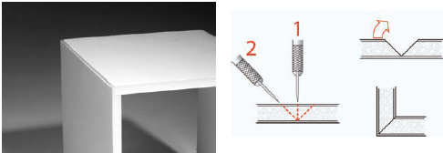
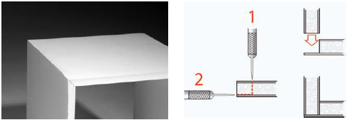
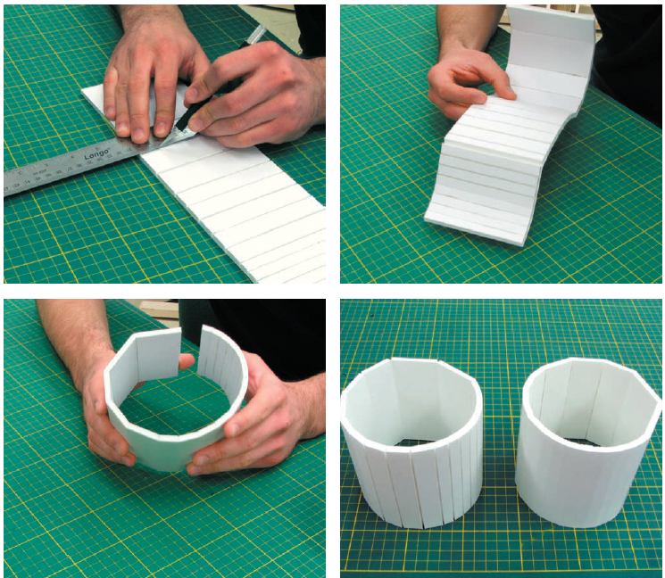

# Foamcore

Foamcore is a sheet material consisting of a Styrofoam core laminated between two layers of smooth paper, producing a lightweight yet rigid structure. It is available in various thicknesses typically ranging from 3mm to 13mm, with 6mm being the most common choice. It is easier to work with and produces neater and stronger models than corrugated cardboard. This is because the foam center produces a uniform solid edge that is also easy to cut. The best
source for foamcore is the local art store, which usually carries a range of thicknesses and sizes, but craft and stationery stores also tend to carry a small selection. Different colors are available, but the standard white is mostly used in practice because of its neutral color.
Most geometric shapes can easily be created in foamcore. 

Foamcore is used to study both form and function. The product’s internal configuration is often prototyped by using real parts such as batteries, motors,
and other electronics in conjunction with foamcore. This gives the design team a good idea of assembly and fit. The Sonos ZonePlayer 120 is a wireless digital amplifier whose casing was developed by Y Studios in San Francisco. The designers made extensive use of foamcore in the design process, which allowed them to explore functional as well as visual aspects through this low-fidelity material. The assembly sequence was, for example, explored to test the viability of the industrial design intent. Real speaker connectors were added to study how they interfaced with the back panel and the circuit boards within. Thinner cardboard was used to simulate circuit boards, with polystyrene foam blocks standing in for electronic components. This example shows how low-fidelity materials can be modified rapidly, thus keeping the design process fluid. The designer gets a good feel of the proportions and complexity early in the process before the design progresses into 3D CAD development.

## Working with Foamcore

Foamcore is similar in function to corrugated cardboard, but more aesthetically pleasing. With a little bit of planning and skill, the foam edge can be hidden, producing neat, clean models. Cutting should always be done on a cutting mat and with a sharp utility knife. It is a good idea to keep a box of extra blades handy, as these should be replaced at the slightest hint of wear. Most projects will require multiple blade replacements. Thicker-blade utility knives should be avoided, as they tend to crush the board and ruin the edge. The foamcore should always be cut with a minimum of three passes. The first goes through the top paper layer, the second cuts through the foam, and the last cuts through the bottom paper layer. Straight cuts are done with a metal ruler, whereas curves are cut carefully by hand. Clean, sharp corners can easily be made to hide the core material and create a
continuous exterior surface. Sharp corners at various angles can be made, as well as curved corners of various radii. The level of control over edges is much higher than with corrugated cardboard and is often a reason in itself for choosing this material. Hot glue is mostly used to glue parts together.

### Corners

There are four types of corners: simple butt, bevel, folded, and rabbet. These corner joints all have their own particular benefits.

*Cube with four types of corners: folded sharp (upper left), folded round (upper right), butt (lower left), and rabbet (lower right).*

#### Butt Joint Corner

The simple butt joint is the fastest and most efficient corner, though it exposes the foam from one board. For exploratory work or functional test prototypes this type of joint is often satisfactory.

#### Folded Round Corner

The foamcore is scored on the inside with a partial cut and then bent. This compresses and crushes the core while stretching the outside paper layer
enough to create a rounded edge roughly equal to the board thickness.

#### Folded Sharp Corner

By cutting out a wedge-shaped V-notch of foam, the board can be bent into a tight corner. Obtuse and acute angles are also possible and can be graphically
calculated by drawing a V-shaped groove to the required angle on the end of the board. The wedge is then carefully cut so that the blade does not cut through the bottom layer of paper. Beveled or mitered corners can also be made by mating two different parts that have been trimmed at an angle. In this case each piece would be trimmed to half the total angle.

#### Rabbet Corner

The rabbet corner involves removing a slot in one of the parts, which the other part fi ts into, effectively hiding the joint. It is especially useful in situations where a piece of foamcore is made to fi t over a curve.

### Curves

Curved planes and cylinders are formed by approximation. A series of tight folds creates a curve as a series of straight segments. The simplest approach is to score the material at regular intervals and then bend it so that the cuts are on the outside. If a smooth exterior surface is desired then the folds should be on the inside. This usually requires a series of V-notches so that the material can be folded more easily.

