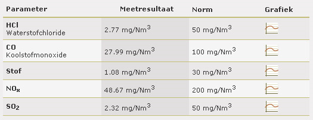

# Webstructure with HTML

> 🌐 Supporting learning material
>
> LinkedIn Learning course: [HTML Essential Training](https://www.linkedin.com/learning/html-essential-training-4/)
>
> Cheatsheet: [Cheatsheet HTML](/files/cheatsheet_html.pdf)

The structure of a web page is created using HTML, which is the standard **markup language** for creating web pages. HTML stands for **H**yper **T**ext **M**arkup **L**anguage. It describes the structure of a web page based on HTML elements that tell the browser how the page content is structured.

HTML elements, also called **tags**, are like containers. They tell something about the information inside their **opening tag** and **closing tag**.


Let's take a closer look at one such tag:

```html
<a href="https://www.vives.be">Visit VIVES</a>
```

* `<a>` is the **opening tag**
* `href` is the **attribute name**
* `"https://www.vives.be"` is the **attribute value**
* `</a>` is the **closing tag**

## The basic structure

What does the basic structure of a web page actually look like?

When you start a new HTML document, the basic structure looks like this:

```html
<!DOCTYPE html>
<html lang="en">
    <head>
        <meta charset="UTF-8">
        <meta http-equiv="X-UA-Compatible" content="IE=edge">
        <meta name="viewport" content="width=device-width, initial-scale=1.0">
        <title>Document</title>
    </head>
    <body>
        
    </body>
</html>
```

:::tip 💡Tip
In Visual Code just make a new `.html` file and type `html:5`
:::

Let's take a closer look at this.

* All HTML documents must start with a document type declaration `<!DOCTYPE html>`.
* The HTML document itself starts with `<html lang="...">` and ends with `</html>`. Here `lang="..."` is important for text reading software, otherwise it can sound quite strange :-).
* The HTML element `<head>` is a container that contains information about the page. Metadata is not shown on the page. The `<meta>` element is used to specify metadata such as the page description, search terms, author, ....

For example:
```html
<meta charset="UTF-8">
<meta name="description" content="Free Web tutorials">
<meta name="keywords" content="HTML,CSS,XML,JavaScript">
<meta name="author" content="John Doe">
<meta http-equiv="refresh" content="30">
<meta name="viewport" content="width=device-width, initial-scale=1.0">
```

* The `<meta>` charset element indicates which character set is used.
* The `<meta>` description element captures the description for the web page.
* The `<meta>` keywords element determines search terms for the web page on search engines such as google.
* The `<meta>` author element determines the author of the web page.
* The `<meta>` refresh element specifies how much time the page will refresh itself.
* The `<meta>` viewport element instructs the browser to take device width into account when displaying elements on the page.

The visible part of the HTML document can be found between `<body>` and `</body>`.

::: tip 💡Provide a readable HTML document

**1. Use indents**

You can add indents automatically in Visual Studio Code by choosing `format document` in the right mouse menu.
It improves the readability of your HTML document.

**2. Comment your code**

Adding comments to your HTML document can provide more explanation for a certain piece of code, making it easier for the reader to understand what is happening.

```html
<!-- This is a comment line -->

<!-- And this is
a comment
block -->
```
:::

:::tip 💡Good practices

* If you provide manual indentation, always use either spaces or tabs, but don't combine them.
* Always use lowercase letters for tags, so `` and not `` or ``.
* Always use lowercase letters for attributes, so `<a href="...">` and not `<a HREF="...">` or `<a Href="...">`.
* Always use double quotes for attribute values, so `<textarea rows="5">` and not `<textarea row=5>` or `<textarea row='5'>`.
* Always close your tags, so `<p> ... </p>` and not `<p> ...`.
* Always use relative url references to the root of your website.

:::


## HTML elements

Which elements do we now have available to structure our page?

### Text

#### Header

You can indicate a header with the `<h1>` to `<h6>` tags. Where the `<h1>` is the most important heading and the `<h6>` is the least important.

```html
<h1>Heading 1</h1>
<h2>Heading 2</h2>
<h3>Heading 3</h3>
<h4>Heading 4</h4>
<h5>Heading 5</h5>
<h6>Heading 6</h6>
```

::: warning 🔥Note
Headers are used by search engines to determine the structure of your web page. You use them exclusively for that purpose and not to make certain text larger or bold.
:::

#### Paragraph

You can recognize a paragraph by the `<p>` element.

```html
<p>This is a paragraph.</p>
<p>This is another paragraph.</p>
```

::: warning 🔥Note
In your html code you can add extra spaces or lines, but the browser will ignore them and display the text as a long continuous text.
If you want a new line in a paragraph you can use `<br>`.
:::

#### Formatting

All text in an html document can be formatted by the following elements:

* `<b>` - bold
* `<strong>` - important
* `<i>` - italics
* `<em>` - emphasized
* `<mark>` - marked
* `<small>` - small
* `<del>` - deleted
* `<ins>` - added
* `<sub>` - subscript
* `<sup>` - superscript

#### Special characters

Some commonly used characters:

* `&copy` - copyright
* `&reg` - registered
* `&euro` - euros

::: warning 🔥Note
Do not use `-` in html text but rather `&ndash`, `&mdash` or `&minus` depending on the context.
:::

#### Quotes

If you want to quote something from a book, magazine or website, you can use `<q>` for a short quote or `<blockquote>` for part of a quote.

```html
<p>WWF's goal is to: <q>Build a future where people live in harmony with nature.</q></p>

<blockquote cite="http://www.worldwildlife.org/who/index.html">
For 50 years, WWF has been protecting the future of nature.
The world's leading conservation organization,
WWF works in 100 countries and is supported by
1.2 million members in the United States and
close to 5 million globally.
</blockquote>
```

### Lists

#### Unordered list

An unordered list starts with the `<ul>` element, each element of the list starts with the `<li>` element. This list elements are marked with a bullet.

```html
<ul>
  <li>Coffee</li>
  <li>Tea</li>
  <li>Milk</li>
</ul>
```

#### Ordered list

An ordered list starts with the `<ol>` element and has the `type` attribute to determine the type of list marker.

|Type | Description |
|---- | ------------ |
|type="1" | The list will be numbered with numbers |
|type="A" | The list will be numbered with capital letters |
|type="a" | The list will be numbered with lowercase |
|type="I" | The list will be numbered with Roman numerals in capital letters |
|type="i" | The list will be numbered with lowercase Roman numerals |

```html
<ol type="1">
  <li>Coffee</li>
  <li>Tea</li>
  <li>Milk</li>
</ol>
```
#### Descriptive list

A descriptive list is a list of terms, each with a description of the term. The `<dl>` element defines such a list where the `<dt>` element represents the term and the `<dd>` represents the description.

```html
<dl>
  <dt>Coffee</dt>
  <dd>-black hot drink</dd>
  <dt>Milk</dt>
  <dd>-white cold drink</dd>
</dl>
```

### Hyperlinking

#### Link to another page, website or file

Links can be found on almost every web page, they enable the user to navigate the site. An HTML link is a hyperlink that allows you to jump to another document. When the cursor hovers over such a link, it changes into a hand.

Hyperlinks are indicated in HTML with the `<a>` element and follow the following syntax `<a href="url">link text</a>`. Where URL stands for **U**niform **R**esource **L**ocator better known as web address.

Yes can use an absolute URL for a file that is not from your own site.

```html
<a href="http://www.vives.be">University College VIVES</a>
```
Or a relative URL for a file that does come from your own site.

```html
<a href="contact.html">Contact Form</a>
```
You can specify a `target` reference so that the browser knows where to open the page. A `target` reference can have the following value:

* `_blank` - opens in a new tab
* `_self` - opens in the current tab
* `_parent` - opens in the parent frame
* `_top` - opens in the full body of the current page

```html
<a href="http://www.vives.be" target="_blank">University College VIVES</a>
```
You can also add a hyperlink to an image:

```html
<a href="http://www.vives.be" target="_blank">
     
</a>
```
#### Link to another place on the same page

To do this, you must first provide the place you want to link to with an 'id', which is a unique identifier.
You can then refer to that ID in your URL.

```html
<h1 id="top">Head of page</h1>
<a href="#section1">Section 1</a><br />
<a href="#section2">Section 2</a><br />
<a href="#section3">Section 3</a><br /><br />
<h2 id="section1">Section 1</h2>
<p>A paragraph with some text</p>
<h2 id="section2">Section 2</h2>
<p>A paragraph with some text</p>
<h2 id="section3">Section 3</h2>
<p>A paragraph with some text</p>
<p><a href="#top">Top</a></p>
```
#### Link to an email address

To do this, put `mailto:` in your URL followed by the email address.

```html
<a href="mailto:ronny.mees@vives.be">Email Ronny Mees</a>
```

### Media

#### Pictures

Images can greatly enhance your page's design while clarifying the content at the same time.

Images are indicated with the `` element and use the following syntax ``.

Yes can use an absolute URL for an image that is not from your own site.
```html

```
Or a relative URL for images that do come from your own site.

```html


```
You can also define dimensions of the image.

```html

```
::: tip 💡Good practice
1. It is recommended to always keep images on your own website. The internet is so dynamic that there is no guarantee that a link to an image will work in the future. The image can be deleted or moved.

2. The internet is awash with beautiful, compelling, eye-catching images, and it can be tempting to use them for your personal or professional project. However, **most of the images you find online are not available for use without the expressed permission or license from the copyright owner**.
:::

#### Audio & video

You can add audio to your web page as follows:

```html
<audio src="media/intro.mp3" controls>
   Your browser does not support the audio tag
</audio>
```

You can add video to your web page as follows:

```html
<video src="media/intro.mp4" controls poster="img/intro.jpg">
   Your browser does not support the video tag
</video>
```

#### Embedded media

You can add media such as eg youtube, google maps, google trents, ... to your web page with `iframe`, go to the source and copy the embed code.

### Tables

Only use a table if the meaning is in danger of being lost without the table.

eg Here you can hardly do anything else than to use a table:



An HTML table can be recognized by the `<table>` element. Each row to the `<tr>` element and a header to the `<th>` element. A cell is then defined with the `<td>` element. A caption can be added immediately below the table with the `<caption>` element.

```html
<table>
   <caption>Members of the council</caption>
   <tr>
     <th>Firstname</th>
     <th>Last name</th>
     <th>Age</th>
   </tr>
   <tr>
     <td>John</td>
     <td>Smith</td>
     <td>25</td>
   </tr>
   <tr>
     <td>Tara</td>
     <td>Jackson</td>
     <td>42</td>
   </tr>
</table>
```
To make a cell multi-column we use the `colspan` attribute.

```html
<table>
   <tr>
     <th>Name</th>
     <th colspan="2">Telephone</th>
   </tr>
   <tr>
     <td>Bill Gates</td>
     <td>55577854</td>
     <td>55577855</td>
   </tr>
</table>
```
To make a cell span several rows we use the `rowspan` attribute.

```html
<table>
   <tr>
     <th>Name:</th>
     <td>Bill Gates</td>
   </tr>
   <tr>
     <th rowspan="2">Phone:</th>
     <td>55577854</td>
   </tr>
   <tr>
     <td>55577855</td>
   </tr>
</table>
```

### Container

The container element can be used to group elements in your HTML document.

#### DIV

A `<DIV>` element is typically used to group elements and format them.

```html
<div>
   <h2>London</h2>
   <p>London is the capital city of England. It is the most populous city in the United Kingdom, with a metropolitan area of over 13 million inhabitants.</p>
</div>
```

#### SPAN

A `<span>` element can also group HTML elements and is usually used to display part of a text in a certain format.

#### SECTION

A `<section>` element can be used to indicate a section or chapter of a page.

#### Horizontal line

The `<hr>` element represents a split in the document in a visually separate manner.

### Forms

A `<form>` element defines a part in a page where user input is expected.

#### Entry

The most important element is the `<input>` element. It can be displayed in different ways depending on the `type` attribute used.

*Text / password*

A 1-line text input field.

```html
Firstname:<br>
<form>
   Username:<br>
   <input type="text" name="username"><br>
   User password:<br>
   <input type="password" name="psw">
</form>
```

*Submit/reset button*

A submit or reset button for the form.

```html
<form action="/action_page.php">
   Firstname:<br>
   <input type="text" name="firstname" value="Mickey"><br>
   Lastname:<br>
   <input type="text" name="lastname" value="Mouse"><br><br>
   <input type="submit" value="Submit">
   <input type="reset">
</form>
```

*Radio button or check box*

You can use a radio button or checkbox to allow a selection between elements.

```html
<form>
   <input type="radio" name="gender" value="male" checked> Male<br>
   <input type="radio" name="gender" value="female"> Female<br>
   <input type="radio" name="gender" value="other"> Other
   <input type="checkbox" name="vehicle1" value="Bike"> I have a bike<br>
   <input type="checkbox" name="vehicle2" value="Car"> I have a car
</form>
```

#### Select

With the `<select>` element you can display a drop-down list.

```html
<select name="cars">
   <option value="volvo">Volvo</option>
   <option value="saab">Saab</option>
   <option value="fiat">Fiat</option>
   <option value="audi">Audi</option>
</select>
```
#### Textarea

The `<textarea>` element is used to represent a multi-line input field.

```html
<textarea name="message" rows="10" cols="30">
The cat was playing in the yard.
</textarea>
```

#### Fieldset & legend

The `<fieldset>` element is used to group elements in a form that belong together.
With the `<legend>` element you can give a title to the group.

```html
<fieldset>
   <legend>Contact details</legend>
   <label>Email:<br />
   <input type="text" name="email"/></label><br />
   <label>Mobile:<br />
   <input type="text" name="mobile"/></label><br />
   <label>Phone:<br />
   <input type="text" name="telephone"/></label><br />
</fieldset>
```

### Button

The `<button>` element represents a clickable button.

```html
<button type="button" onclick="alert('Hello World!')">Click Me!</button>
```

## Layout elements

Inside our `<body>` we can still define layout elements.

### Header & footer

A `<header>` element usually includes the header of the page like:
* A banner image
* The title
* A navigation bar

A `<footer>` element usually contains the closing information of the page such as:
* copyright rule
* links to various information pages
* links to socials

### Navigation

A `<nav>` element contains the navigation bar of the page

### An article

An `<article>` element contains a part of the page that actually stands on its own.

### An Aside

A `<aside>` element can have two purposes:
* If it is in an `<article>` it is information about what is in the article but is not essential.
* If it is outside an `<article>` it is full page information, for example it may contain links to other sections of the website or recent blogs or a search field, ...

### A section

A `<section>` element groups information that belongs together and can contain several `<article>` elements.


