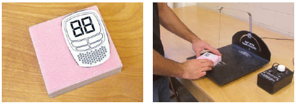

# Polystyrene Foam

Closed-cell polystyrene foam is an inexpensive and easily worked material for low-fidelity form exploration work. It is made by infusing polystyrene plastic with gas during the manufacturing process. Although its main use is in housing insulation or product packaging, it is also very popular as a desktop modelmaking material since it can be sculpted quickly with the simplest of tools. This material is suitable for complex forms made by a subtractive sculptural process. The iterative mindset reigns when working in polystyrene foam. A fluid process allows the designer to move between hand sketching, foam modeling, and digital modeling so as to keep the ideas flowing.

There are two different kinds of polystyrene foam. Extruded foam (XPS) is a readily available solid insulation material sold in various thickness sheets at
building supply stores. Depending on the supplier, it will be manufactured in different colors, including pink, blue, or white. It may also be purchased as thicker pallets from specialty suppliers. The low density of the material 2lb/ft3 (40kg/m3) makes it extremely easy to work with.
Expanded polystyrene foam (EPS) is the second kind, and is essentially the same material except it consists of beads that are pre-expanded and then fused
together with steam. This manufacturing process is suitable for making molded shapes and is frequently used in product packaging. EPS is typically white in color. The beaded construction also makes it harder to work with than XPS, as the beads tend to break off and create unsmooth edges and surfaces. It is therefore inferior to XPS as a modeling material.

## Applications for Polystyrene Foam

Polystyrene foam is suitable where speed and a lower level of fidelity are needed. Exploration of form and overall visual proportion is a typical application. Although not very strong it is sometimes used in early user testing of ergonomics and fit. The main benefit is the low cost and the fact that it can be worked with simple hand tools into complex forms right at the designer’s desktop. The speed with which foam can be worked also allows multiple variations to be realized and evaluated side by side.

For larger models it is often more cost-effective and easy to handle than other, heavier modeling materials. Polystyrene foam is, for example, used to verify tool paths for CNC machining as the material is inexpensive and can be cut quickly before investing in a more expensive machining board.

Polystyrene foam does, however, have limitations. The low density and soft structure means that it is easily dented and will not hold fine details. For
ergonomic testing the material does not exhibit the final product weight properly and if weighted it will be prone to breaking. Polystyrene foam models are generally unpainted, or painted only in a neutral color such as white. This is usually appropriate for low-fidelity prototypes and avoids unnecessary discussion about product details at the early stage of a project.

## Working with Polystyrene Foam

### Shaping

Polystyrene is a thermoplastic. This means that under heat the material will become flexible and then melt. It can therefore be easily shaped and cut with a low-voltage electric tool known as a hotwire. Several advancements have been made to hotwire technology, including handheld tools that add flexibility and carving potential for a finer level of detail. These specialty tools are worth the investment if you want to make a great many foam models. Hotwire tools do, however, cause the plastic to melt and emit toxic fumes. Good ventilation is therefore necessary.

In addition to hotwire tools, rasps and sandpaper are used to shape accurate surfaces. In the example below, a polystyrene foam sphere is shaped with
successively finer tools. Start by cutting a cylinder that has the same diameter as the sphere (see picture above). The height should also be equal to the sphere diameter. If necessary, laminate two or more sections of polystyrene foam together to attain the necessary thickness. The rasp is used for the initial rough removal of material followed by a coarse-grit sandpaper to establish overall form. The final smoothing is done with medium-grit sandpaper. The sphere is made perfectly round by using a sanding template of the correct radius. The sanding template is made from foam as well with a fi ne-grit sandpaper glued to the inside radius.

Masking tape can be used as a sanding mask to control transitions. The foam sands more easily than the tape and thus helps create an edge. Simple templates
are used to check radii and curvatures.

The computer should be used where it saves time and makes the work easier and more productive. This can be as basic as creating outlines in Illustrator® and then printing them out on paper, which is then affixed as a cutting outline. Remember to think additively. It is easier to make bits and pieces and add them together, rather than try to carve everything out of a solid block. Sometimes the designer may wish to add a little more material to thicken a surface or change a detail. Plasticine can be used in cases of quick exploration as it can be easily added on top of foam, although it cannot be painted. Sometimes a section of the model will be cut away and replaced with a new piece. This deconstructive approach is very common in explorative work and creates a fluid workflow that is open to changing and examining variations on the design.

### Gluing

White paper glue or carpenter’s glue (which is very similar) and rubber cement are used for laminating sheets together for thicker models as well as to affix labels or decals. Thin amounts of spray glue will also work, but this is a less environmentally-friendly option. For attaching small pieces or detail, cyanoacrylate glues will work well. Solvent-based glues such as contact cement should not be used as they will chemically eat through the polystyrene foam and ruin the work. Hot glue melts the foam surface upon contact. Hardened hot glue also presents problems for cutting and sanding, as it is harder than the foam.

### Fillers and Paint

It is generally preferable to avoid filling and painting polystyrene foam. A simple unpainted model made quickly for a formal study should not be painted just to make it look more realistic. In fact this extra step not only creates extra work, but also may detract from the exploratory nature and advantages of the material. Water-based spackle-type fillers work best as they do not melt the foam and they will sand about as easily as the foam itself. They are suitable only for filling small areas, such as when creating an inside radius. 

When polystyrene foam prototypes are finished and painted it is usually only to hide fillers with a coat of primer or for preliminary color studies. Paints should be water-based and preferably flat. This is because a flat finish will not show surface defects or paint strokes as easily. Even if the fi nal product is intended to be glossy, it is usually understood that these models are exploratory. The primer coat is usually water-based gesso, a particle-filled paint used to seal canvas for subsequent painting. This is usually applied with a good brush. When it dries it may be sanded with fine sandpaper and then painted with a water-based acrylic paint, applied by hand, roller or airbrush. Water-based acrylic primers will also work. 

Spray bombs and oil-based paints will eat through the surface of the model. Many students learn the hard way and end up having to rebuild the model from scratch.

### Detailing

Foam is a low-fidelity material. Finer product details such as parting lines, buttons, and screens are not made effectively in polystyrene foam. These are instead usually added in the form of two-dimensional labels that both save time and look better on these low-fidelity prototypes. Graphic design tape can be used effectively to visualize parting lines. For early study models, markers may be used directly on the surface of the model. For a more refined appearance, a label is designed in Adobe Illustrator® or other software. These are printed on paper and then glued on to the foam model. Often regular bond paper is preferred to glossy stock as it is thinner and easier to apply. 

## Example - Children's Walkie-Talkie

This tutorial will show you how to make a model in XPS foam. Small details such as the LCD and buttons will be illustrated on paper labels designed in
Illustrator® and printed on a regular inkjet printer. The labels and lack of paint both save time and keep the workmanship clean and crisp.

**Step 1** A full-scale 2D rendering layout is created. Alternatively, this could be hand-drawn (for a very quick model) or created in CAD. This drawing will be used as a template for foam cutting and sanding. The labels for the LCD display and speaker grill will also be printed from this file.

**Main Body Step 1** The top view of the model is glued to the foam with glue stick or rubber cement (these types of glue allow the label to be peeled
off later). Next the profi le is cut using a hotwire, leaving a little extra material for fi nishing. Be sure to do some testing with feed and voltage on a
scrap piece beforehand. The outline could also be cut on a bandsaw, scroll saw, or even by hand.

**Main Body Step 2** The hotwire trims the part to size, but leaves a coarse outline. The extra millimeter of material should be left so that it can be smoothed with 320-grit sandpaper. The top outline template will be peeled off for the next step.

**Main Body Step 3** In order to create the convex top surface, the transition is marked with masking tape. A top label is also added that defines the top
LCD plane.

**Main Body Step 4** The convex top surface is carefully shaped with 320-grit sandpaper. Since the paper label resists sanding more than the foam, the transitions are kept crisp and clean.

**Main Body Step 5** A side-profile template can be used to check that the profile is as intended. This step is not strictly needed, but helps maintain a
predefined shape. A new top label will later need to be printed and applied, since the label has been sacrificed during sanding.

**Antenna Step 1** The top and side views of the antenna are cut out and affi xed to a piece of foam.

**Antenna Step 2** Both profiles are now cut on the hotwire. The elliptical cross section is sanded by hand.

**Antenna Step 3** The final elliptical antenna is checked against the main body for fit.

**Final Assembly Step 1** New labels are printed and trimmed. The model is now ready for final assembly with rubber cement. White paper glue will also work well.

**Final Assembly Step 2** Printed labels are affixed.

**Final Assembly Step 3** Thin graphic design tape is applied to define the parting line as shown.

