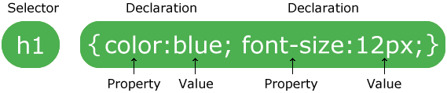

# Webstyling with CSS

> 🌐 Supporting learning material
>
> LinkedIn Learning course: [CSS Essential Traininng](https://www.linkedin.com/learning/css-essential-training-3)
>
> Cheatsheet: [Cheatsheet CSS](/files/cheatsheet_css.pdf)

**C**ascading **S**tyle **S**heets is a style sheet language used to describe the presentation of an HTML document.

CSS is designed to allow the separation of presentation and content of a web page. This makes the whole more accessible, more flexible and has better control over the presentation characteristics. Multiple web pages can also share the same layout by using the same .css file.

To better understand how CSS works, think about each HTML element as a frame. What CSS actually does is define the layout of such a frame.

## Methods

### In line

Inline formatting happens inside the HTML tags. Each HTML tag can be provided with a css layout.

```html
<body style="background-color: green">
```

A big disadvantage is that you have to repeat this layout for every HTML tag for the entire website.
It is therefore recommended to use this method as little as possible!

### Internal

With this method, you're going to bring all the formatting together in a style tag at the top of the HTML page.
```html
<style>
     body{
         background-color: green;
     }
</style>
```
This is already a bit better than the previous method, but for several pages you have to copy that layout again, which significantly increases the chance of errors.
Also try to avoid this method as much as possible unless you are making a one-page website.

### External

This method takes the information that was in the style tag with the internal method and puts it in a .css file.
```css
body{
    background-color: green;
}
```
This `.css` file must then of course be linked to the HTML page.

```html
<link rel="stylesheet" type="text/css" href="/styles/style.css">
```

::: warning 🔥'Good practice'
Working with an external CSS file is preferred, so we will only use this method for this course.
:::

::: tip 💡Tip
If you want to use multiple style sheets and do not want to overload your html code with them, you can place the link to your master style.css file in your html code and then import the others into your style.css.

```css
@import "/styles/forms.css"

html{
   background-color: #334455;
}
```
:::

## Overwrite & Inherit

### Overwrite

CSS works on the principle that the last change is what will actually be visible.

e.g. if a CSS file (the same or a file loaded before it) says:

```css
div {
   background-color: green;
   colour: white;
   margin: 0;
}
```

and afterwards you write

```css
div {
   colour: yellow;
   padding: 10;
}
```

then the result will be for a `<DIV>` element

```css
div {
   background-color: green;
   colour: yellow;
   padding: 10;
   margin: 0;
}
```

### Inherit

CSS works on the principle of inheritance. I.e. that elements that are children of another element also automatically inherit all formatting from that element.

## CSS base

### Format set

A CSS style set consists of a selector and a definition block:



The selector points to the HTML element you want to format.

The definition block contains one or more formats separated by a semicolon.
Each of those formats contains a CSS property and its value separated by a colon.
Each format is enclosed in parentheses.

### Commentary

In CSS, comments start with `/*` and end with `*/`. Feel free to comment on multiple lines.

```css
p {
   colour: red;
   /* This is a single line comment */
   text-align: center;
}

/* This is
a multi line
comments */
```

### Selector

1. The selector selects an HTML element based on its element name.

     In this example, all `<p>` elements are centered on the page and given a red text color:
     ```css
     p {
         text-align: center;
         colour: red;
     }
     ```
2. The id selector uses the id attribute of an HTML element to select a specific element.

     An element ID is unique in a page, so it is used to select one element.
    
     To select an element with a specific id we write a `#` before the id name of this element:
     ```css
     #para1 {
         text-align: center;
         colour: red;
     }
     ```
3. The class selector uses the class attribute of an HTML element to select it.

     To select an element with a specific class, we write a `.` before the class name of this element:
     ```css
     .center {
         text-align: center;
         colour: red;
     }
     ```
4. Combined selector

     In this example, only `<p>` elements with the class="center" are formatted:
     ```css
     p.center {
         text-align: center;
         colour: red;
     }
     ```
5. Grouped selector

     Here all h1, h2, and p elements are formatted:
    ```css
     h1, h2, p {
         text-align: center;
         colour: red;
     }
     ```

6. Pseudo class selector

     The pseudo class selector will select a state or relationship of an element:
     ```css
     a:hover {
       background-color: green;
       colour: white;
     }
     ```
7. Pseudo element selector

     To select part of an element:
     ```css
     p::first-line {
       font-size: 12px;
     }
     ```

8. Attribute selector

     You can select something based on attribute value:
     ```css
     input[type=button]{
       colour: green;
     }
     ```

### Apply color

We know several ways to apply color in CSS:

1. By the color name

     You can refer to a color by its name (<a href="https://www.w3schools.com/colors/colors_names.asp" target="_blank">list</a>)

     ```css
     h1 {
         background-color: red;
     }
     ```
2. Via the RGB value
 
     You can refer to a color by its RBG value where each parameter (red, green, blue) represents a color intensity between 0 and 255.
    
     ```css
     h1{
         color: rgb(60, 179, 113);
     }
     ```
     By using **rgba(red,green,blue,alpha)** you can add transparency. The alpha parameter is a number between 0.0 (fully transparent) and 1.0 (not transparent at all)

3. Via the hex value

     You can refer to a color by its hexadecimal value **#rrggbb** where rr(red), gg(green) and bb(blue) are hexadecimal values between 00 and FF.

     eg #ff0000 is shown as red because rr was given the value FF while the other colors were given a value of 00.
     ```css
     table{
         color: #6a5acd;
     }
     ```
4. Via the HSL value

     You can refer to a color by its hue, saturation and brightness **hsl(hue, saturation, lightness)**

     Hue (hue) is the number of degrees on the color wheel from 0 to 360 where 0 is red, 120 is green, and 240 is blue.
    
     Saturation is expressed in percent where 0% is a shade of gray and 100% represents the full color.

     Lightness is also expressed in percent where 0% is black and 100% is white.

     ```css
     .card{
         background-color: hsl(39, 100%, 50%);
     }
     ```
     Again you can use **hsla(hue, saturation, lightness, alpha)** to add transparency.

If you are looking for a specific color, this [color picker](https://www.w3schools.com/colors/colors_picker.asp) can be a useful tool.

### Units

You can freely use the following units interchangeably:


| Unit | Type | Relationship | Example |
| --- | --- | --- | --- |
| px | absolute | screen pixels | p{font-size: 14px} |
| em | percentage | % of parent element font size | p{font-size: 1.2em} |
| brake | percentage | % of root element font size | p{font-size: 0.75rem} |
| % | percentage | % of parent size or font size | .left {width: 20%} |

## CSS properties

### Background

In addition to changing the background color of an HTML element, you can also load an image as the background.

* **background-image** : specifies the image to be used as background. By default, this image is repeated over the entire element.
* **background-repeat** : how that repetition should be done.
* **background-position** : at which position the image should be placed.
* **background-attachment** : specifies whether the image should scroll with the page or be fixed.
```css
     body{
         background-image: url("/images/img_tree.png");
         background-repeat: no-repeat;
         background-position: right top;
         background-attachment: fixed;
     }
```

### Border

With the CSS **border** property you can set the style, thickness and color of a border.


```css
     p {
         border style: solid;
     }
```
### Margin

The CSS **Margin** property allows you to create space around an element beyond the edge of the element.

```css
p {
   margin-top: 100px;
   margin-bottom: 100px;
   margin-right: 150px;
   margin-left: 80px;
}
/* or via the short note */
p {
   margin: 25px 50px 75px;
}
```
### Padding

The CSS **padding** property does the same thing as margin but along the inside edge of an element.

```css
div {
   padding-top: 50px;
   padding-right: 30px;
   padding-bottom: 50px;
   padding-left: 80px;
}
/* or via the short note */
div {
   padding: 25px 50px 75px 100px;
}
```


### Height and width

As you might guess, the CSS **height** and **width** properties define the height and width of an element.

You can set the value to `auto` or express it in `pixels` or `%`.

```css
div {
   height: 200px;
   width: 50%;
   background-color: powderblue;
}
```
### Text

In addition to the color, van can also record several properties of text.

```css
h1 {
   colour: green;
   text-align: center;
   text-decoration: underline;
   text transform: capitalize;
   text-indent: 50px;
   letter spacing: 3px;
   line height: 1.8;
   word spacing: 10px;
   text-shadow: 3px 2px red;
   font-family: "Times New Roman", Times, serif;
}
```
:::tip 💡Tip
Always use `" "` around text with spaces.
:::

### Left

You can style a hyperlink as follows:

```css
/* Unvisited link */
a:link {
   colour: red;
}

/* Visited link */
a:visited {
   colour: green;
}

/* Mouse over link */
a:hover {
   color: hot pink;
}

/* Selected link */
a:active {
   colour: blue;
}
```

### Lists

You can adjust the list marker as follows:

```css
ul.a {
   list-style-type: circle;
}

ul.b {
   list-style-type: square;
}

ol.c {
   list-style-type: upper-novel;
}

ol.d {
   list-style-type: lower-alpha;
}
```

or even use an image as a marker:

```css
ul {
   list-style-image: url('/images/sqpurple.gif');
}
```

### Tables

You can change the layout of your table as follows:

```css
table {
   border-collapse: collapse;
   width: 100%;
}

th, td{
   border: 1px solid black;
   height: 50px;
   text-align: center;
   vertical-align: bottom;
   padding: 15px;
}
```

### Input

You can of course completely style an input field, a nice fact is that you can also provide it with an icon.

```css
input#email{
   background-image: url("images/email.png");
}
```


### Display

The CSS **display** property will determine if and how an element is displayed.

```css
/*make a blocklevel element inline*/
li {
   display: in-line;
}
/*create an inline element blocklevel*/
span {
   display: block;
}
/*remove the element*/
h1.hidden {
   display: none;
}
```

### Max width

The CSS **max-width** property sets a maximum width of an element.

```css
div.ex2 {
   max-width: 500px;
   margin: auto;
   border: 3px solid #73AD21;
}
```

### Float

The CSS **float** property allows an element to float.

```css
/*image floating on the right*/
img {
   float: right;
}
```
:::tip 💡Tip
If a float element goes outside the parent element, you can prevent that by adding `overflow: hidden` to the parent element.
:::

### Calculations

It can sometimes be useful that instead of using a fixed value that you can calculate.

```css
ul {
   border: 3px solid black;
   width: calc(100% - 6px);
}
```

