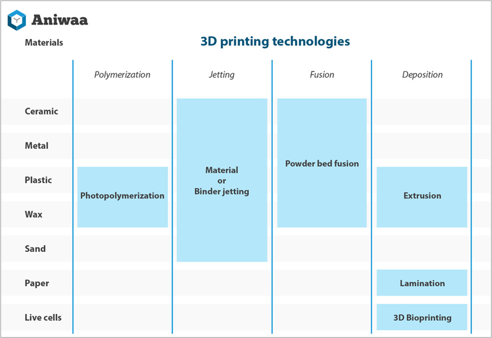

# Introduction to 3D printing

3D printing is building an object layer by layer by adding material and energy where necessary, this is often referret to as additive manufacturing. 

:::tip Additive Manufacturing
Process of joining materials to make objects from 3D model data, usually layer upon layer, as opposed to subtractive manufacturing methodologies.
:::

This process is mainly used for plastics and metals, but can also be used for other materials (food, construction, ...)

we distinguish the following additive manufacturing techniques:

## Additive manufacturing technologies

Let's take a closer look at some of the frequently used technologies.

### Fused Deposition Modeling

Fused Deposition Modeling or FDM is the most commonly used technology.It falls under the extrusion technique and is mainly used for plastics.

For more complex forms it is often necessary to use supports, some 3D printers can use multiple spools so the support material can be different from the main material so it doesn't stick to the object.

To save material a infill pattern is often used.

## Steps of 3D printing

3D printing involves 3 steps:
* creating a model
* slicing that model in layers
* printing that model

