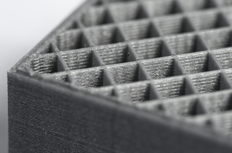

# Introduction to 3D printing

3D printing is building an object layer by layer by adding material and energy where necessary, this is often referret to as additive manufacturing. 

:::tip Additive Manufacturing
Process of joining materials to make objects from 3D model data, usually layer upon layer, as opposed to subtractive manufacturing methodologies.
:::

This process is mainly used for plastics and metals, but can also be used for other materials (food, construction, ...)

There are several types of 3D printing, which include:

* Stereolithography (SLA)
* Selective Laser Sintering (SLS)
* Fused Deposition Modeling (FDM)
* Digital Light Process (DLP)
* Multi Jet Fusion (MJF)
* Direct Metal Laser Sintering (DMLS)
* Electron Beam Melting (EBM)

Selecting the right 3D printing process for your application requires an understanding of each process’ strengths and weaknesses and mapping those attributes to your product development needs. Let’s first discuss how 3D printing fits within the product development cycle and then take a look at common types of 3D printing technologies and the advantages of each.

## 3D Printing for Rapid Prototyping and Beyond

It’s safe to say 3D printing is most often used for prototyping. Its ability to quickly manufacture a single part enables product developers to validate and share ideas in a cost-effective manner. Determining the purpose of your prototype will inform which 3D printing technology will be the most beneficial. Additive manufacturing can be suitable for a range of prototypes that span from simple physical models to parts used for functional testing.

Despite 3D printing being nearly synonymous with rapid prototyping, there are scenarios when it’s a viable production process. Typically these applications involve low-volumes and complex geometries. Often, components for aerospace and medical applications are ideal candidates for production 3D printing as they frequently match the criteria previously described

## Five 3D Printing Considerations

Like most things in life, there’s rarely a simple answer when selecting a 3D printing process. There are five key criteria to determine what technology will meet your needs:

* Budget
* Mechanical requirements
* Cosmetic appearance
* Material selection
* Geometry

## Polymer 3D Printing Processes

Let’s outline some common plastic 3D printing processes and discuss when each provides the most value to product developers, engineers, and designers.

### Stereolithography (SLA)

Stereolithography is the original industrial 3D printing process and belongs to a family of additive manufacturing technologies known as vat photopolymerization, commonly known as resin 3D printing.

These machines are all built around the same principle, using a light source, a laser or projector, to cure liquid resin into hardened plastic. The main physical differentiation lies in the arrangement of the core components, such as the light source, the build platform, and the resin tank.

SLA printers excels at producing parts with high levels of detail, smooth surface finishes, and tight tolerances. The quality surface finishes on SLA parts, not only look nice, but can aid in the part’s function, testing the fit of an assembly, for example. It’s widely used in the medical industry and common applications include anatomical models and microfluidics.

### Selective Laser Sintering (SLS)

Selective laser sintering (SLS) melts together small particles of polymer powders into a solid structure. Since SLS parts are made from real thermoplastic material, they are durable, suitable for functional testing, and can support living hinges and snap-fits. In comparison to SL, parts are stronger, but have rougher surface finishes. SLS doesn’t require support structures so the whole build platform can be utilized to nest multiple parts into a single build, making it suitable for part quantities higher than other 3D printing processes. Many SLS parts are used to prototype designs that will one day be injection-molded.

1. **Printing**: The powder is dispersed in a thin layer on top of a platform inside of the build chamber. The printer preheats the powder to a temperature somewhat below the melting point of the raw material, which makes it easier for the laser to raise the temperature of specific regions of the powder bed as it traces the model to solidify a part. The laser scans a cross-section of the 3D model, heating the powder to just below or right at the melting point of the material. This fuses the particles together mechanically to create one solid part. The unfused powder supports the part during printing and eliminates the need for dedicated support structures. The platform then lowers by one layer into the build chamber, typically between 50 to 200 microns, and the process repeats for each layer until parts are complete.

2. **Cooling**: After printing, the build chamber needs to slightly cool down inside the print enclosure and then outside the printer to ensure optimal mechanical properties and avoid warping in parts.

3. **Post-processing**: The finished parts need to be removed from the build chamber, separated, and cleaned of excess powder. The powder can be recycled and the printed parts can be further post-processed by media blasting or media tumbling.

### Digital Light Processing (DLP)

Digital light processing is similar to SLA in that it cures liquid resin using light. The primary difference between the two technologies is that DLP uses a digital light projector screen whereas SLA uses a UV laser. This means DLP 3D printers can image an entire layer of the build all at once, resulting in faster build speeds. While frequently used for rapid prototyping, the higher throughput of DLP printing makes it suitable for low-volume production runs of plastic parts.

### Multi Jet Fusion (MJF)

Similar to SLS, Multi Jet Fusion also builds functional parts from nylon powder. Rather than using a laser to sinter the powder, MJF uses an inkjet array to apply fusing agents to the bed of nylon powder. Then a heating element passes over the bed to fuse each layer. This results in more consistent mechanical properties compared to SLS as well as improved surface finish. Another benefit of the MJF process is the accelerated build time, which leads to lower production costs.

### Fused Deposition Modeling (FDM)

Fused deposition modeling (FDM) is a common desktop 3D printing technology for plastic parts. An FDM printer functions by extruding a plastic filament layer-by-layer onto the build platform. It’s a cost-effective and quick method for producing physical models. There are some instances when FDM can be used for functional testing but the technology is limited due to parts having relatively rough surface finishes and lacking strength.

For more complex forms it is often necessary to use supports, some 3D printers can use multiple spools so the support material can be different from the main material so it doesn't stick to the object.

To save material a infill pattern is often used.

## Metal 3D Printing Processes

### Direct Metal Laser Sintering (DMLS)

Direct metal laser sintering (DMLS) is an AM technique for metal 3D printing. In this process, the metal powder (20 μm diameter), free of binder or fluxing agent, is completely melted by the scanning of a high-power laser beam. The resulting part has properties like the original material.

The materials commonly used are alloy steel, stainless steel, tool steel, aluminum, bronze, cobalt-chrome, and titanium. In addition to the production of functional prototypes, DMLS is often used in the fabrication of rapid tooling, medical implants, or aerospace parts for high heat applications.

### Electron Beam Melting (EBM)

Electron beam melting uses electron beam as energy source for powder melting along with powder bed maintained at high temperatures in vacuum atmosphere, also it requires an extended cooling period to cool the job after fabrication. 

## When to Use 3D Printing

Selecting the right process comes down to aligning the advantages and limitations of each technology to your application’s most important requirements. In the early stages when ideas are being thrown around and all you need is a model to share with a colleague, those stair-stepping surface finishes on your part aren’t of much concern. But once you hit the point where you need to conduct user testing, factors like cosmetics and durability start to matter. Although there is no one-size-fits-all solution, properly utilizing 3D printing technology throughout product development will reduce design risk and, ultimately, result in better products.

:::warning 🔔Warning
* In most cases 3D printing is good for prototyping but not for the final product!
* Always consider other means of making your prototype before using 3D printing, especially when it comes to a larger object.
:::

## Steps of 3D printing

3D printing involves 3 steps:
* creating a model
* slicing that model in layers
* printing that model

