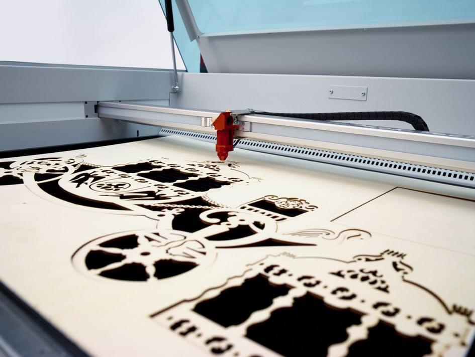

# Lasercutting & Engraving

Laser cutting is a thermal separation process. The laser beam hits the surface of the material and heats it so much that it melts or completely evaporates. Once the laser beam has penetrated the material at a certain point, the actual cutting process begins. The laser system follows the chosen geometry and separates the material in the meantime. 

The main advantages of laser cutting are:

* Suitable for many types of material
* No post-processing is necessary
* Great accuracy
* No wear

| Plastic | Plastic | Others | Metal |
| --- | --- | --- | --- |
| Acrylonitrile butadiene styrene (ABS) | Polyethylene terephthalate (PET) | Wood | Metal foil up to 0.5 mm |
| Acrylic/PMMA  | Polyimide (PI) | Paper (white) | |
| Rubber | Polyoxymethylene (POM) | Paper (colored) | |
| Polyamide (PA) |Polypropylene (PP) | Food | |
| Polybutylene terephthalate (PBT) | Polyphenylene sulfide (PPS) | Leather | |
| Polycarbonate (PC) | Polystyrene (PS) | Fabric | |
| Polyethylene (PE) | Polyurethane (PUR) | Cardboard | |
| Polyester (PES) | Foam (PVC-free) | Cork | |

:::danger 🔥Health danger
Never use materials that are made with chlorine. **Cutting these materials with a laser cutter releases chlorine gas which is corrosive, dangerous and deadly!**
:::
