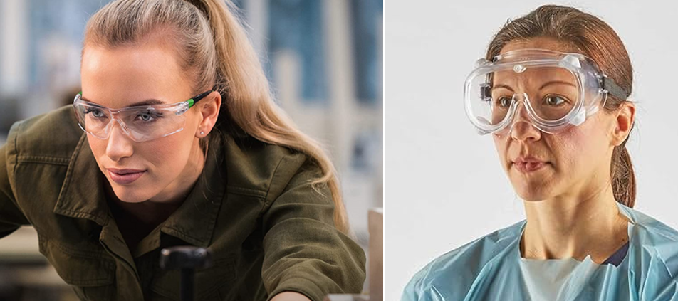
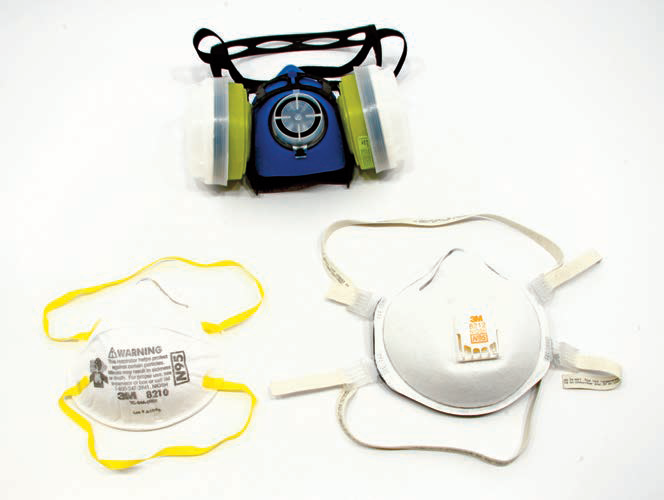
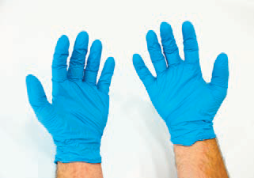
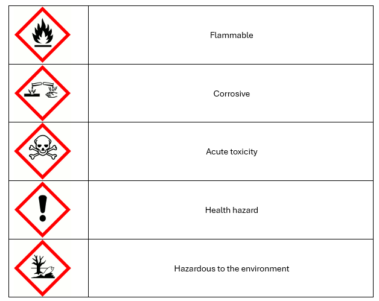
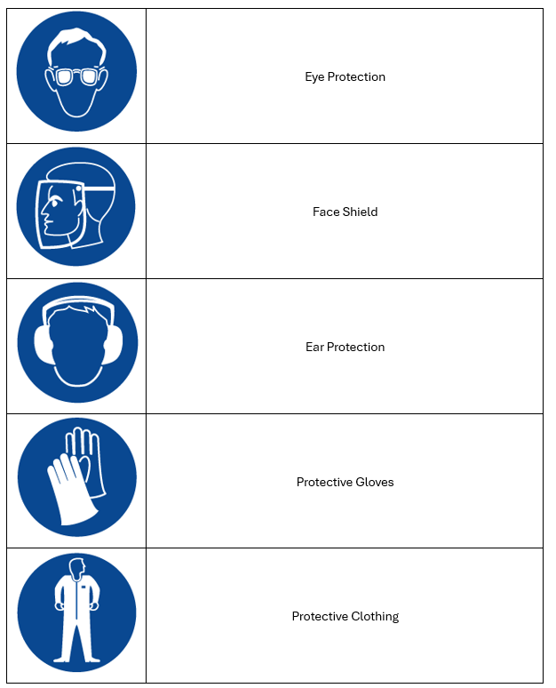

# Health & Safety

Modelmaking has the potential to expose students to hazardous materials, processes, and equipment. This includes, but is not limited to, mechanical
machinery, sharp tools, dust, various materials and chemicals, noise, and fire hazards.

::: warning 📋Safety instruction card
If you are unfamiliar with a tool or appliance in the lab, always consult the **safety instruction card** before using it.
:::

## Hazards

Low-fidelity materials and processes generally require simple tools and can be carried out at the desktop. Other approaches require much more attention to
safety, especially where they involve machines and chemical materials. Choose the safest materials and tools whenever possible. The first step is to be aware of the types of hazards and the necessary precautions. 

### Mechanical Hazards

Tools and machines present a mechanical hazard. Tools should not be used for anything except their designed function as they might break and cause injury
in the process. They should be kept in proper working condition for the same reason. It is also important to keep a clean workspace. Sharp tools hidden below a mass of parts and dirt pose a hazard in and of themselves. Obstacles, dirt, and tools left carelessly on the floor also create a tripping hazard. In addition, a clean environment makes one more aware of one’s surroundings.

You should never operate any equipment while under the influence of alcohol, drugs, or lack of sleep. Competence is a critical aspect of any tool operation and you should have proper training and supervision. For machine tools this automatically implies professional training and supervision by a teacher. Machine tools are very powerful and have the potential to cause serious permanent injury or death. It is important to make sure that machine safety shields are in place before using such machinery. Always be sure to wear appropriate safety gear, including safety glasses and hearing protection, which are outlined at the end of this chapter. Always use common sense.

### Hazardous Substances

Hazardous substances enter the body through inhalation, absorption through the skin, or ingestion through oral cavities. They include chemicals often found
in uncured glues, paints and fillers, or casting compounds. They can also be released through sanding in the form of dust, or when a material is burned or
melted. Dust may include fine wood fibers or silica from filler. Solvents release vapors and polystyrene foam can release harmful gases when melted with a hotwire. Some chemicals become more dangerous if mixed together because they might react. It is therefore important to understand how to safeguard oneself through prevention, control, and protection.
Inhalation is generally prevented through adequate ventilation. This requires that contaminated air be removed in a direction away from the user so that the user only breathes clean air. An open window is not sufficient. Spray booths and fume hoods should therefore be used whenever chemicals are mixed or spray painting is being performed. For woodworking and other dust generation a proper dust-collection system should be employed.
Absorption typically happens through the skin. This is why common sense dictates to keep chemicals away from your body. Lab coats (or other appropriate
clothing) should be worn when handling materials with chemicals in them, as well as appropriate safety gloves (see below), and chemical goggles.
With regard to ingestion it is important not to eat or drink in the environment where modelmaking is taking place or when working with chemical materials.
You should remove your lab coat and wash your hands before eating.

Three different adverse health effects arise from exposure:
1. Sensitization
2. Acute (short-term) reactions
3. Chronic (long-term) reactions

Sensitization is an allergic reaction to a certain material. Once sensitized, a person can no longer tolerate exposure to the material. This can happen quickly or over a longer period of time and will affect each person differently.
Chemicals can cause acute reactions. These typically appear quickly, such as a burn, dizziness, nausea, or other noticeable ailment. If such a reaction occurs, you should stop the activity immediately and seek medical attention.
Chronic exposures can be very serious, but may take months or years to develop. Unfortunately some chronic hazards are still not completely understood.
What is of particular concern to health experts is that new chemicals are being created without knowing if there are chronic long-term effects. This is why it is so important to use common sense and to treat all materials as potentially toxic and protect oneself at all times. People may react differently based on their body size, age, and medical history. A person who has a medical condition, such as asthma or skin rashes for example, can suffer a more adverse reaction than someone who does not. The effect of exposure also varies with the amount and frequency of exposure.

## The Environment

Disposal and cleanup are issues that have to be taken into consideration. Make sure to follow the disposal requirements and laws that pertain to the materials you are using.

## Material Labeling and Safety Data Sheets

It is not enough to assume that because you buy a material from an art, hobby, or home improvement store, the material is safe. The only way to know for certain is to study and understand the chemicals contained in the product. Water-based products are usually preferable to products containing organic solvents. This is because most organic solvents are flammable and can also cause a range of adverse chronic health effects, especially over time and with prolonged use. In addition, solvent-based products typically require additional solvents for thinning and cleanup, thereby increasing exposure. Water-based products may still contain acute as well as chronic hazards, so precautions must be taken. Consumer products should have labels that identify immediate hazards such as flammability (indicating solvents) and poison. Read the labels; the toxicity cannot be determined by smell. Keep all materials safely stored and away from children. Workplace hazardous materials require proper labels and additional health and safety information in the form of Material Safety Data Sheets. 

## Personal Protective Equipment

The risk of exposure should always be minimized. This means removing the hazards as much as possible through engineering controls such as spray-booth
systems and fume hoods for ventilation, and dust-collection systems for woodworking or sanding any material.

### Eye Protection

Safety glasses protect against sharp or flying objects and should always be worn when using machinery or sharp instruments that could accidentally break; they are therefore routinely required in any student laboratories or workshops. Sealed goggles are designed to protect against chemicals and provide a seal. 

### Dust Masks & Respirators

Dust masks should be worn to provide extra protection against airborne dust from sanding various materials, including the polystyrene foam, polyurethane foam, plastic, and wood materials. They are not a substitute for adequate ventilation and a proper dust-collection system. They are not designed to provide protection against fine particulates or chemical vapors.

The best protection from airborne particulates and chemical hazards is from spray booths and fume hoods. Health and safety literature advises that respirators are the last line of defense. Anyone considering the need for a respirator should have a health exam and seek professional training and advice in the selection of a respirator. At schools this typically starts with the health and safety committee and teachers. Employers are required to adhere to stringent rules and laws when it comes to respirators. Wearing a respirator requires health evaluation, fit testing and monitoring, and hence a proper respiratory program. This is because they can create problems for people with asthma or other medical conditions and may not offer adequate protection if they are not worn, fitted, and maintained properly. There are many different types of respirator designed to filter or absorb different types of particulates and vapors. The respirator needs to be matched specifically to the type of hazard being protected against in order to work effectively.

### Disposable Gloves

Disposable gloves are made of various types of material, including latex, nitrile, and neoprene. These need to be worn when handling and using chemical
materials. Some people are allergic to latex. Read the manufacturer’s MSDS sheet when working with materials to select proper glove type. If the sheet is unspecific, call the manufacturer. Gloves should be inspected for tears before use and discarded after use.

### Ear Protection

Excessive noise for extended periods can cause damage to hearing, including hearing loss and tinnitus (prolonged ringing in the ear). Earplugs are simple to wear and should be worn around noisy equipment. They are custom-molded to the ear channel. Earmuffs offer more sound protection.

### Clothing and Footwear, Hair and Jewelry

Loose-fitting clothing and jewelry have to be removed, as they could potentially become entangled in machinery. Long hair is an extreme hazard for the same
reason and must therefore be tied back and covered where necessary. Proper clothing such as a lab coat can provide some skin protection against some
chemical materials. Machine shop coats or aprons are worn to provide protection against dirt and oil, but should also be worn properly so that there is no chance of them getting caught in moving machinery. Shoes should completely cover and shield the foot in order to provide protection against dropped objects
or chemicals.

## Risk Assessment

All work should start with a personal assessment of risk. This includes understanding the safety aspects discussed above and taking the time to read material safety data sheets and instruction labels. It also means wearing appropriate clothing and proper protective equipment for the job at hand.
Never take any chances or rush; be patient. Never play around tools or dangerous environments; it is distracting both to yourself and others, and such
behavior can cause accidents. Also start by doing an inspection of the work area for any hidden dangers. Areas around mechanical machinery should be kept
clean of debris and dirt that could cause you to trip or slip. Also be aware of your surroundings, including people in your vicinity. A visual inspection is also required to ensure that the machinery is sound and properly secured to either the floor or workbench. Any strange noises emanating from machinery indicates that you should turn them off and report the problem to the teacher. Always consider safer methods or tools that would allow you to achieve the modeling objective. Seek professional advice if any doubt exists as to the safety of either equipment or procedure; the role of the teacher is to provide instructions for using the tools and equipment in a safe manner. Above all, exercise caution and common sense. Never work alone or
unsupervised. Overfamiliarity can also be a source of accidents, especially when work is done without thinking through the steps and being cautious.

## Safety pictograms

Before you start working in the prototyping lab it is nessecery that you learn a few pictograms.

### Hazard pictograms

### Protection pictograms

