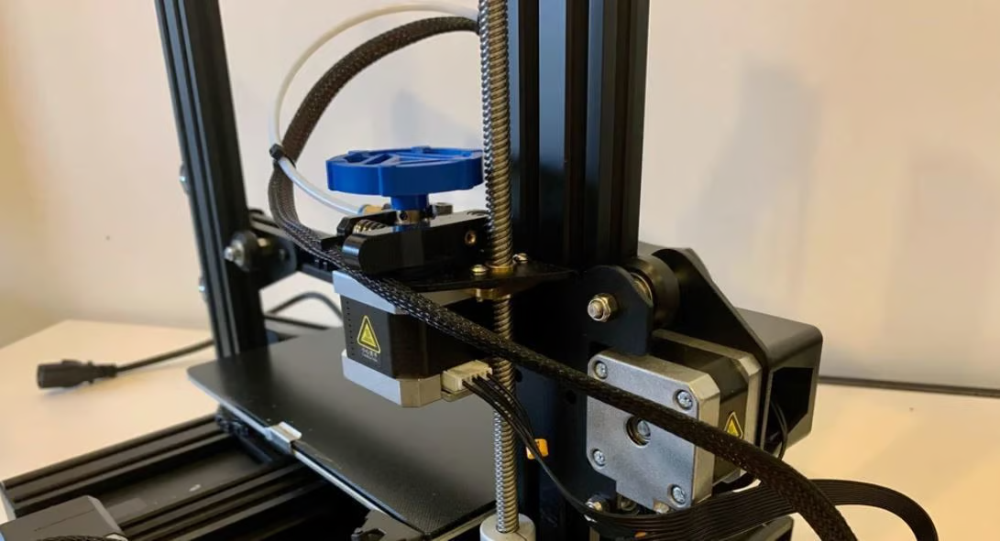

# 3D printing

In our prototyping lab we have the following 3D printers:

**Creality 3D Ender 3 S1**

Specifications:
* Build volume : w=220mm, l=220mm, h=270mm
* Bed heating : 100°C
* Extruder heating : 260°C
* Filament : 1,75mm
* Nozzle : 0,4mm

**Creality 3D Ender 3 S1 Plus**

Specifications:
* Build volume : w=300mm, l=300mm, h=300mm
* Bed heating : 100°C
* Extruder heating : 260°C
* Filament : 1,75mm
* Nozzle : 0,4mm

**Bambu Lab X1C 3D printer with AMS**

Specifications:
* Build volume : w=256mm, l=256mm, h=256mm
* Extruder heating : 300°C
* Filament : 1,75mm
* Nozzle : 0,4mm
* Speed is up to 6x faster then normal 3D printer.

:::warning ✋Attention
Handle these devices with care. Make sure you know what you are doing, if you have doubts, ask the teacher for help!
:::

## Logbook

When you use a 3D printer, then write it in the logbook so we can keep track of the use of the printers, schedule maintenance and order filament.

| Date | Name | Project or destination | Filament | Print time |
| --- | --- | --- | --- | --- |
| Date | your name | The name of the project this is for | Color, weight and meters | Printing time |

## Slicing your model

The base file for a 3D printer is an **.STL or .STEP file**. Both can be exported from CAD software like Fusion 360 we will be using.

An STL file describes a raw, unstructured triangulated surface by the unit normal and vertices of the triangles using a three-dimensional Cartesian coordinate system. STL files contain no scale information, and the units are arbitrary. STL files describe only the surface geometry of a three-dimensional object without any representation of color, texture or other common CAD model attributes.

To be able to print our model we first have to slice that model in the printing layers. 

### Steps to take to slice for the Creality printers

There are many programs that can do this for you but at school we use **Cura** from UltiMaker ([Install info](../52_cura/README.md)).

1. Select the correct 3D printer (You can add the printer if it's not in the list).
2. Select the correct material and nozzle (Normaly this will be PLA and 0,4mm).
3. Select the print quality (leave this at standard, or create a new profile), use infill 20% Cubic for normal printing and 15% Lighting for fast prototyping. (consultate the teacher if you want to change to other settings), check support if needed.
4. In `Custom` > `Material` check the settings for the temperature for the nozzle and bed, you can find the temperature range on a label on the filament roll.
5. Use Brim for a better build plate adhesion.
6. Next you can load the model file(s) and arange them on the printing bed.
7. Once you are done you can hit Slice and the model will be sliced into the printing layers. Here you get the information on the printing time and used material, always write this in the log of the 3D printer when starting a 3D print.
8. Save the produced G-code to the SD-card from the 3D printer.

### Steps to take to slice for the Bambu Lab printers

Here we use the Bambu Studio software ([Install info](../53_bambustudio/README.md))

1. In the tab `Prepare` select the X1 Carbon and the Textured PEI Plate.
2. Change the material to your printing material ( for example Generic PLA, change the color by clicking on '1')
   
   

3. Next you can load the model file(s) and arange them on the printing bed.
4. If needed select support.
5. Now hit the tab `Preview`, the model will be sliced.
6. Open the pull-down menu `Print Plate` and select `Export plate sliced file` and hit it to save the file to the SD-card of the printer.

## Printing your model 

### Steps to take on the Creality printers.

1. Insert the SD-card back into the 3D printer.
2. Power on the printer.
3. Check if the correct filament is loaded, if not folow the steps as described below.
4. Go to the **print** menu and select your model.
5. The bed and nozzel will start to pre-heat to the set temperature.
6. Once reached the printing starts.

#### Change loaded filament

##### Remove the filament currently loaded

In order to do this, you have to heat up the nozzle to the melting temperature of the specific type of filament you’re using. If you’re not sure what the temperature is, typically the recommended temperature range is listed on the side of the spool.

1. To set the temperature, turn on your printer and click the control knob to bring up the menu.
2. Scroll to Control Settings > Temperature > Nozzle.
3. Use the LCD knob to dial the temperature up.
4. Wait for the hot end to reach the desired temperature.
5. Squeeze the extruder lever to release the grip on the filament, withdraw the filament, and remove the spool. You should rotate the knob clockwise to take out the filament.

Now your hot end is free to accept a different filament.

As a good practice, if your filament spool allows for it, loop the end of the filament into one of the holes on the edge of the spool so that it’s held in place for storage.

##### Load the new filament

Now that you have a free and clear extruder, it’s time to load the new filament of your choice.

1. Take your filament out and cut a sharp angle on the end of the strand to help it enter the extruder. 
2. Feed the new material into the extruder. 
3. To feed the filament in, squeeze the extruder arm lever and place the filament in between the toothed extruder gear and the idler pulley.
4. While still pressing the arm, push the filament through, slowly by hand. You can use the extruder knob and rotate it counter-clockwise.
5. Push the new filament until you feel firm resistance. This means it has reached the nozzle.

##### Purge the nozzle

Now that your new filament is at the nozzle, it’s time to feed it through. But, before you can start using the new filament, you must purge the old filament from the nozzle. This will ensure that the old filament is gone from the hot end and you will be printing only the new filament.

It’s important to note that if you’re changing from a higher temperature material to a lower temperature material, you should set the nozzle temperature to the higher value until the purging is complete.

Ender 3 printers have some features in their software to help purge the old filament, so it’s an easy and quick process.

1. Click the LCD knob to open the settings menu and scroll to Move Axis > 1 mm > Extruder.
2. Use the scroll to move the extruder axis 15 to 20 mm. The extruder will start feeding material through the nozzle, which purges the old filament and feeds in the new filament.
3. You may want to do this more than once to ensure all of the old filament is out of the nozzle.

The nozzle is purged once you see the new color or material flow out of the nozzle.

### Steps to take on the Bambu Lab printers

1. Insert the SD-card back into the 3D printer.
2. Power on the printer.
3. Load the correct filament in het AMS.
4. Go to the **source** and select your model from the SD Card.
5. Select the correct AMS spool and hit print.

## Problem solving

If you are having trouble with printing or the result has a poor print quality, then you can consult [this page](https://www.simplify3d.com/resources/print-quality-troubleshooting/) for guidance.

:::danger 🔥Attention
Never change settings on the 3D printers without first consulting your teacher!
:::