# Lasercutting

In our prototying lab we have a Watson 1290LT lasercutter.

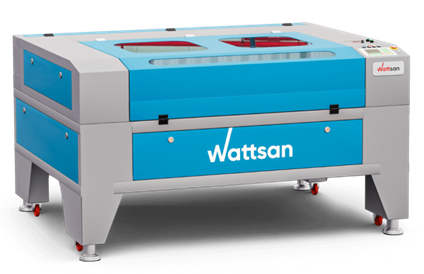

## Safety

When using this machine, you should always be aware of the following dangers!

**The laser beam**

This machine uses a CO2 laser to cut the material. The laser beam that this machine produces is powerful and has the potential to blind someone. The door of the machine is equipped with special glass that blocks this laser beam. This way you can simply look into the machine while it is working.

:::danger
Bypassing the door safety to be able to work with the door open endangers yourself and others!
:::

**Smoke and fumes**

While cutting or engraving, this machine produces smoke and/or fumes, depending on the type of material you are processing. These are extracted and must be discharged outside. 

:::danger
Always wait at least 2 minutes after the process has ended before opening the door of the machine so that most of the smoke and fumes have been removed.
:::

:::danger

**IT IS ABSOLUTELY FORBIDDEN TO PROCESS CHLORINE-CONTAINING MATERIALS (e.g. PVC) WITH THE LASER CUTTER!**
* All uncoated metals such as guides and spindles will corrode immediately and become unusable.
* Chlorine fumes are released which are **extremely harmful and possibly FATAL**!
:::

**Personal protective equipment (PPE)**

It is not necessary to use specific personal protective equipment when using this machine.

## Use of materials & waste streams

For safety reasons and ease of adjustment, only materials provided by the university itself are allowed on this machine.

### Materials

You cannot just edit anything with the laser cutter. Here is a list of the materials that are available for laser cutting or engraving:

**Wood**
| Type            | Thickness | Size      | Price  |
| --------------- | --------- | --------- | ------ |
| MDF Medite      | 3 mm      | 120x90 cm | €11.31 |
| MDF Medite      | 4 mm      | 120x90 cm | €8.48  |
| MDF Spano       | 6 mm      | 120x90 cm | €10.27 |
| White Hardboard | 3 mm      | 120x90 cm | €13.99 |

**Plastic**
| Type          | Thickness | Size      | Price  |
| ------------- | --------- | --------- | ------ |
| PMMA XT Clear | 2 mm      | 120x90 cm | €25.02 |
| PMMA XT Clear | 3 mm      | 120x90 cm | €35.20 |
| PMMA XT Opal  | 2 mm      | 120x90 cm | €34.36 |

### Waste streams

Because we follow all recycling rules, waste material is strictly separated.

* All wood waste ends up in a 'wood' container.
* All plastic waste ends up in a 'plastic' container.
* All leather and textile waste is placed in the residual waste container.

The 'wood' and 'plastic' containers can be emptied in the mini container park of the college, which is located at the bicycle shed block C.

## Preparing a cutting or engraving task

We use the software RD Works (also known as Laser Work) for this.

### First use

When starting up for the first time, it is advisable to set the language to English (Help > Language).

Then open the page settings (Config > Page setting) to enter the dimensions of the laser cutter (1200x900).

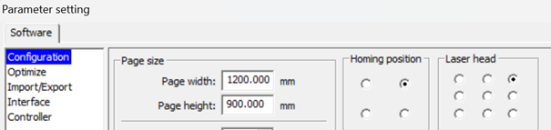

## The general controls

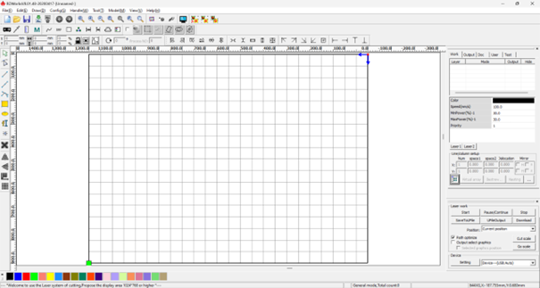

After the software has started, the user interface is displayed, as in the image above.

* **Menu bar**: At the top you will find the menu bar with the main functions of the software (Document, Edit, Draw, Setting, Processing, View and Help)

* **System bar**: Below that you will find the system bar, where the most used action buttons can be found.

* **Graphics bar**: Below that you have the graphics bar where graphic properties can be found, including location, size and scaling.

* **Edit bar**: The edit bar, which is on the left of the screen by default, contains frequently used tools that make using the software more flexible and faster.

* **Alignment bar**: The alignment bar can be found next to the graphics bar. This contains the buttons for aligning the selected objects.

* **Layers bar**: At the bottom you have the layers bar where you can change the layer of the selected object.

* **Control Panel**: On the right you see the control panel to perform laser processes, make layer settings, operate axes, etc.

### Importing a DXF file

You can start drawing a figure yourself in Laser Work, but we always choose to work on the basis of a DXF file that we have either drawn ourselves in our CAD package or downloaded from an internet source.

:::tip Tip
Always make sure that the shape is displayed at **scale 1/1** in the DXF file and that there are **no unnecessary lines** (such as dimensions, frames, text, invisible lines, etc.).
:::

Import (File > Import) the DXF file so that it can be viewed in the user interface.

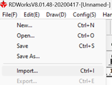

### Removing unwanted lines

If you do find that unwanted lines (lines that should not be cut or engraved) are present, you can now remove them.

Sometimes it can be that lines are on top of each other, you do not see that but the laser would use them as a path to be cut. That is why it is always wise to remove overlapping lines.

Proceed as follows:
* Select everything (Ctrl+A).
* Click on the icon 
* A window will open where you can simply click OK.
* Then you will get a window that tells you how many lines were removed, you click OK again.

### Automatically close figures

Sometimes you find that the contour of a figure is not completely closed while this is actually the intention. You can solve this automatically via the software.

Proceed as follows:
* Select the figure that is not completely closed.
* Click on the icon 
* A window will open where you enter a dimension in mm (e.g. 50), then click OK.
* If the figure does not close you can try again with a larger number.

### Filling in parameters

The principle of the laser cutter is that it has different layers (called Layers) and with each different layer you can fill in other parameters. But because we work in 2D we can not see these layers. To solve this, each layer has been given its own color, you can see this from below your screen.

When your drawing or figure is selected you can give it a different color to fill in other parameters later. 
On the right side of your screen you can see which layers are active and each parameter they have. You can adjust these parameters by double clicking on the row of the layer.

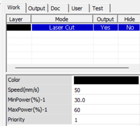

When you double click you will get a screen with extensive parameters.

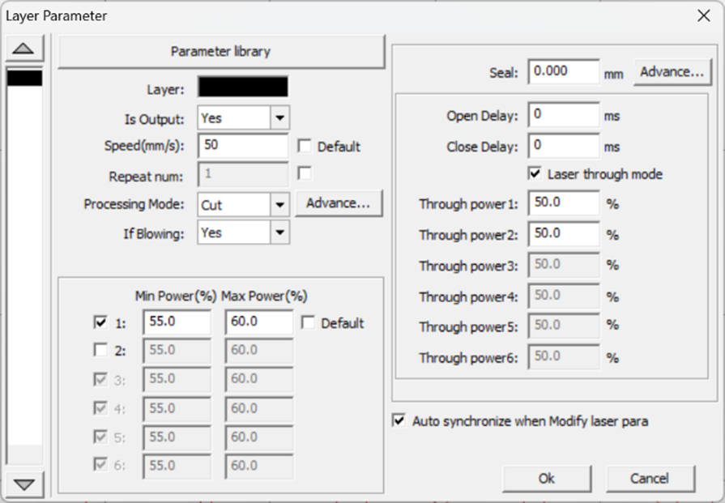

* **Layer**: This is the color of the layer you are adjusting. 

* **Speed(mm/s)**: This is the speed at which the laser will move. 

* **Processing Mode**: For cutting/engraving a single line this will be set to “Cut”. 

* **Min and max power of the laser**: This is the parameter that determines how much energy there will be in the laser. Our machine only has 1 laser so we fill in the parameters of Laser 1. We suggest setting the Min power to 5 percent below the maximum power by default. 

Below are some guideline values for speed and power:

**Cutting**
| Material        | Thickness | Power | Speed |
| --------------- | --------- | ----- | ----- |
| MDF             | 3 mm      | 60    | 50    |
|                 | 4 mm      | 60    | 20    |
|                 | 6 mm      | 60    | 10    |
| White Hardboard | 3 mm      | 60    | 50    |
| PMMA Clear      | 2 mm      | 60    | 45    |
|                 | 3 mm      | 60    | 35    |
| PMMA Opal       | 2 mm      | 60    | 45    |
| Textile         | –         | 60    | 150   |
| Leather         | –         | 60    | 60    |
| Cardboard       | 3 mm      | 50    | 150   |
| Paper           | –         | 40    | 150   |

**Engraving**
| Material        | Power | Speed |
| --------------- | ----- | ----- |
| MDF             | 20    | 500   |
| White Hardboard | 20    | 500   |
| PMMA Clear      | 20    | 500   |
| PMMA Opal       | 20    | 500   |
| Textile         | 20    | 500   |
| Leather         | 20    | 500   |
| Cardboard       | 20    | 500   |

### Simulating a file

When you have filled in everything you can simulate your piece and you will see how long it will take approximately. And which path the laser will follow. You start the simulator by clicking on the icon . 

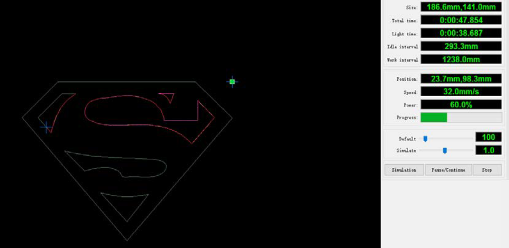

In the box “Total Time” you can see the total time required. 

To leave the simulator, just click on the cross.

## Switching on the lasercutter

### Check before switching on

Before switching on the machine, we will check a few things.

#### Freeing the machine

The first thing we do before starting the machine is to lift the safety cover to see if there are any pieces or other objects in the laser cutter. If there are any, remove them from the machine so that the laser head cannot collide with anything.

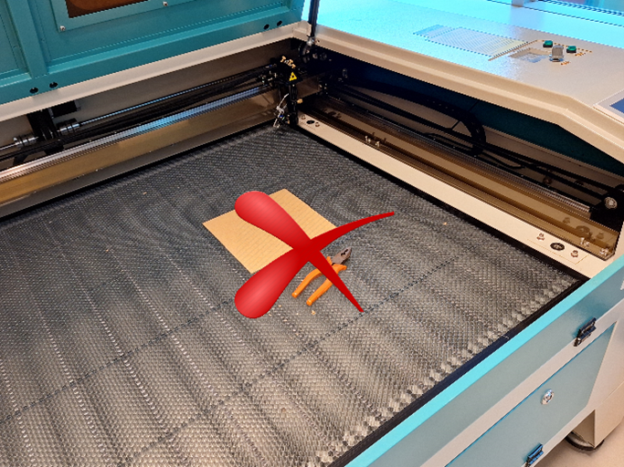

#### Checking mirrors

Next, we check the mirrors for dirt. 

There are 3 mirrors in this machine:
* Mirror 1: Located at the back of the machine near the laser tube (only the teacher has access to this mirror)
* Mirror 2: Located on the left side of the machine
* Mirror 3: Located at the top of the laser head

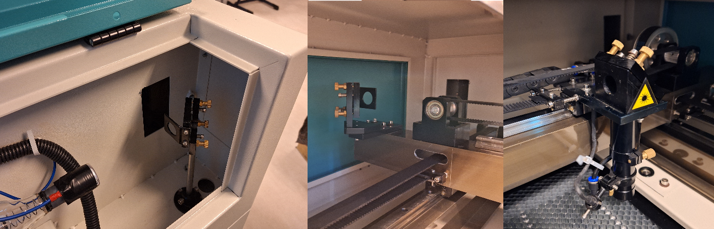

### Starting up the lasercutter

Now that you have carried out preliminary checks, you can switch on the machine.

Switch on the main switches of the water & air pump, the laser and the control in succession.

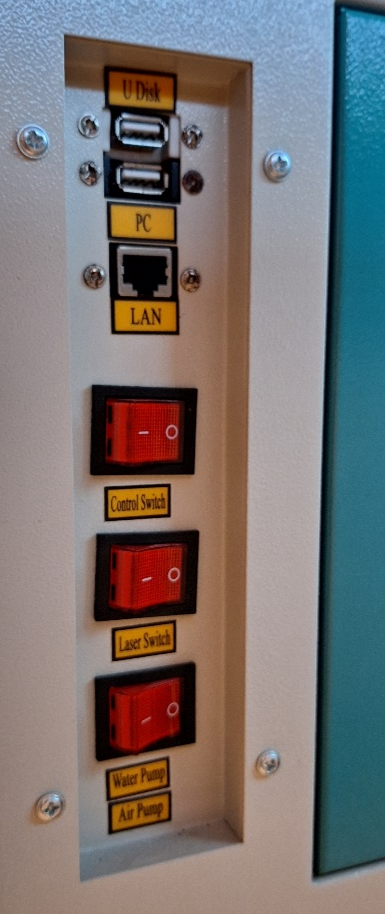

Check that the emergency stop is not pressed and switch on the laser using the key.

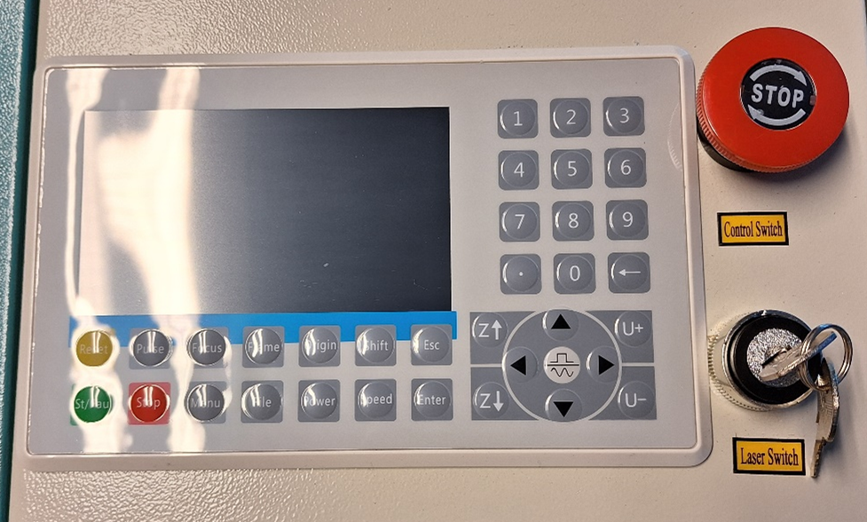

At the slightest indication or suspicion of a problem with the water or air system, stop the machine immediately and notify a teacher.

### Send the task to the machine.

When you have filled in all the parameters correctly and the simulation went well, you are ready to send the task to the machine.

We do this by clicking on download at the bottom right of the screen.

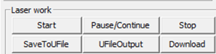

When you click on Download you will have to enter a name and then press OK.

Now your file is in the laser cutter and you can continue.

## Operating, setting and using the laser cutter

Once the laser cutter has run to its reference, you can look to set the laser to laser your project.

### The control panel

We can set and operate the laser cutter via the control panel.

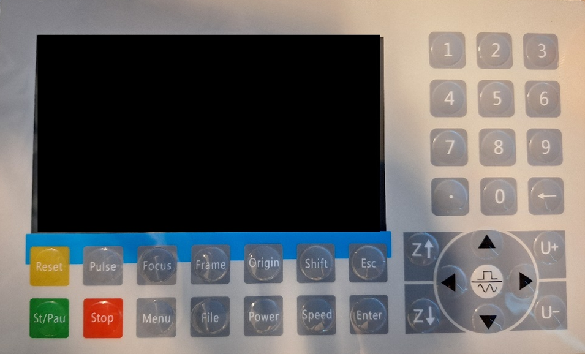

* **File**: With this button you choose the program you want to laser. When you have downloaded your program from the computer, it will automatically be on that program. And then you press Enter and the program will load. 

* **Origin**: When you have positioned your laser and you are happy with it. Then you can press this button and the machine will take this as its workpiece zero point. This point corresponds to the green frame next to your figure in the laserwork program. 

* **Frame**: When you have set your workpiece zero point (by pressing Origin) you can check whether your material is large enough or light enough. And whether the laser head does not collide with anything. If you press Frame, the laser will run around your piece. 

:::tip Tip
set the speed of the machine to 100 so that the laser head does not move too slowly. 
:::

* **Menu**: With this button you go to the menu of the machine. 

* **Stop**: this button only works when the machine is moving/processing. This will cause the machine to immediately stop what it is doing and return to its workpiece zero point.

* **Z+/Z-**: These 2 buttons are to move the table up or down.

* **Arrows**: These buttons are used to 1 when you are in a menu as arrow keys like on a keyboard. 2 When you are not in a menu these buttons are used to position your laser over your material.

* **Enter**: When your program is loaded, you can press enter twice and then you will enter the menu where you can still adjust the layers if this is not set correctly in laserwork.

* **Esc**: This if you want to leave any menu. 

* **Start-Pause**: This starts your program that you have retrieved. And you can pause in the middle of the process to see if everything is still okay. 

* **Power – Speed ​​– Pulse**: These buttons work together. When you press pulse together with the arrows, the laser will move forward and cut at the same time. Be careful, you can and may only do this when the safety screen is down. This allows you to see if the set parameters are correct for the task you have in mind. 

* **Emergency stop**: When everything goes wrong, quickly press the emergency stop and call the teacher. 

On the **display** you can see which program is active for lasering. Here you can also see where your laser head is during lasering.

### Positioning the laser

To limit the risk of breakage, we always follow these steps: 

1. We place the laser head at its highest point. We do this using the golden screw at the top of the laser head. We loosen this, push the head upwards and tighten it again. 

2. Now we bring the table all the way to its highest point by pressing the Z button continuously. 

3. You can now place your material in the laser cutter. 

4. Now we position the laser head above the material to be lasered. 

5. On our material, we now place the 7 mm caliber directly under the laser head. 

6. Now we move the laser head back down to the caliber. Don't forget to tighten it again!

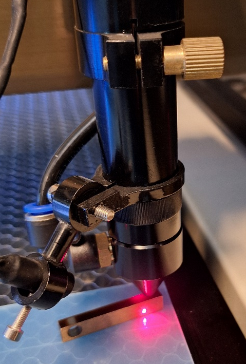

### Select and check task file

Now that the machine is ready to perform a task, you can load the file, place the origin correctly and check whether the prepared material is large enough or is positioned correctly.

You can select the task via **File** on the control panel (the most recent file is normally selected) and confirm via **Enter**.

Now use the **arrows** on the control panel to place the laser head at the desired starting position (green frame in Laserwork) and confirm via **Origin**.

> It looks like you can simply place the laser head at a position and do not have to confirm this with Origin by using the ‘from current position’ setting in Laserworks.

You can then check the size and position of the required material by pressing **Frame**. Always perform a few checks before you do this:

1. Make sure the speed is set to 100 mm/s. You can do this by pressing Speed, entering 100 and confirming with Enter.

2. Check again that there is nothing in the way that the laser head could possibly collide with.

### Execute task

Now that all checks and settings are behind you, you can close the safety cover of the machine and start the task with the **Start** button.

You can always pause with the **Pause** button. You can abort with the **Stop** button.

:::warning
If you hear any strange noise or the slightest indication of problems that could cause machine breakage and certainly human suffering, immediately press the emergency stop. Then notify the instructor!
:::

During machining it is permitted to look through the windows of the safety hood, which is equipped with safety glass that the laser beam does not pass through.

### Removing the pieces and residues

:::warning
**Once the task is completed, wait at least 2 minutes before opening the safety hood.** During this time, most of the fumes and gases that are still in the machine are removed via the exhaust.
:::

Always carefully check that the pieces to be cut have been completely cut through without moving the plate. This way, you can possibly perform the task a second time (if necessary with adjusted parameters) so that it still goes through the plate.

Once everything has been cut or engraved properly, you can remove the workpieces from the laser bed.

## Switching off the machine

### Cleaning the machine

We always leave a used machine clean so that the next user does not have to clean up your waste.

#### Removing remains

You put any still usable pieces of plate back on the stock of material to be cut.
Smaller pieces go in the waste container provided for this purpose.
You will vacuum up very small waste and dust with the vacuum cleaner.

#### Checking mirrors

After lasering, check again whether the mirrors are still clean because a lot of dust can be released during lasering.

Once everything has been checked, the door of the machine can be closed.

### Switching off the machine

Once the check has been carried out, you can now switch off the machine.

Turn off the main switches of the water & air pump, the laser and the control in succession.