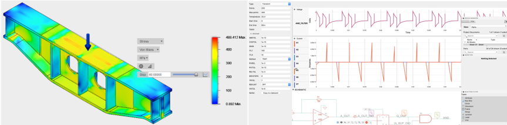
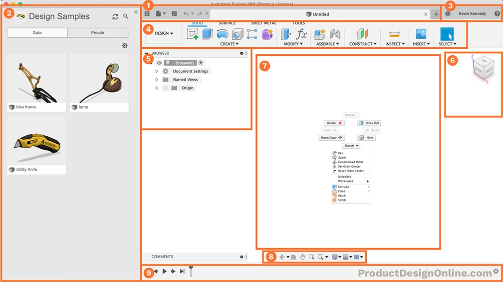
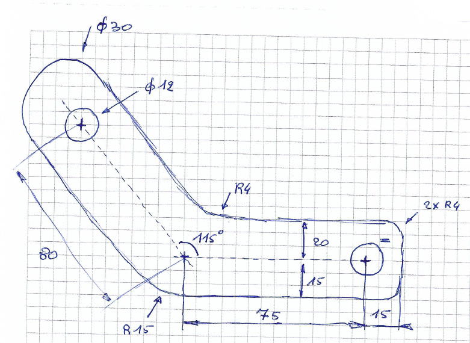
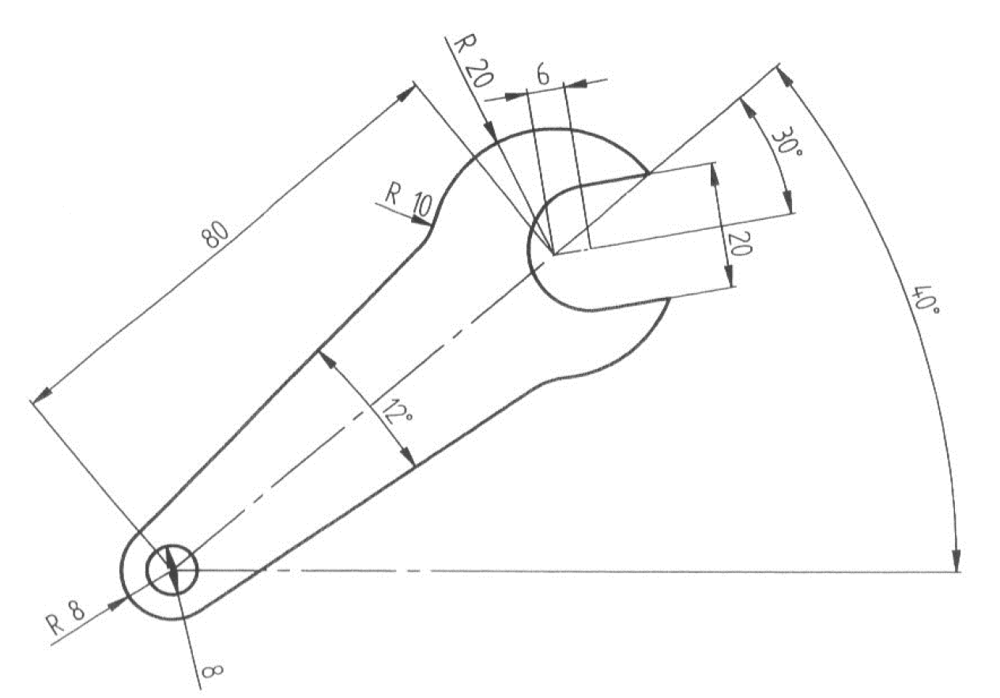

# Introduction to CAD in Fusion 360

> 🌐 Supporting learning material
>
> Autodesk Fusion learning: [Sketch Basics Tutorial](https://www.autodesk.com/learn/ondemand/curated/sketch-basics)

Every product that is mass produced is at some stage of its development drawn in a Computer Aided Design (CAD) software. Once drawn in CAD changes can be made fairly quickly, with assembly's one can see how the parts fit and interact without having to make them first and several tests like strength, vibration, electrical, ... simulations can be done.

We have chosen Fusion 360 ([install info](../51_fusion360/README.md)) as CAD software because it's free for education, you can do the mechanical as electrical design in the same software and it's largely supported by communities and companies.

:::warning 📎Note
In this course I won't go over all the details you need to do to create what you need. In stead we will make a few examples so you understand the methodology of CAD. Once you have mastered that it becomes easy to create whatever part you need in whatever CAD software you want.
:::

## The workspace

1. Application Bar
    
    Within the application bar, there are 4 key areas.
   * **Data panel** – houses your design files.
   * **File menu** – create, export, or share your designs.
   * **Save** – Save your designs along with version descriptions.
   * **Undo and Redo buttons** – to revert your most recent actions.

    Across the top, you’ll see tabs that represent each design file. The file name and version number will be displayed on the tab. However, if you have a large number of files open, then you’ll only be able to see the name on hover. This works in a similar manner to the tabs in your web browser.

2. Data Panel
   
   The Data Panel houses all of your design files. Within the data panel, you can create new projects and folders, to further organize your files.

    The data panel also allows you to manage other users who are collaborating on your projects, but note that there are restrictions based on which license type you’re using.

    Any time that you’re coming back to open a project, you’ll simply need to double-click on the file or right-click and select the “open” option.

3. Profile and Help
   
   * **Notification Center** – Notifications will appear (a few times a year) with important notices, such as planned maintenance.
   * **Job Status** – View job status, Fusion 360 update status, and online/offline status.
   * **Profile** – Click your name to:
     * Access your Autodesk Account
     * Adjust your Fusion 360 preferences
     * Switch between teams
     * View or edit your profile
     * Sign out
  
4. Toolbar
   
    The toolbar allows you to select what type of workspace you would like to work in. It’s important to note that the tools on the toolbar will differ in each workspace.

    Within each toolbar, there are also tabs, which further organize the tools into logical groupings.

    As you start to discover your own common workflows you can customize and rearrange your toolbar features.

5. Browser
   
    The browser lists objects in your design, including planes, sketches, parts, assemblies, and so on. You can think of the Browser as your file structure.

    Within the browser, you can change the visibility of objects as well as change your document units.

6. ViewCube
   
    The viewcube allows you to orbit your design or view the design from standard view positions. You can either select faces, corners, or the arrows, or you can simply click and drag the viewcube around.

    You can also hit the home icon, which is next to the viewcube, to view the model in the default home position.

7. Canvas and Marking Menu
   
    The middle section of Fusion 360 is where you’ll be doing sketching and doing all of your design work. Therefore, this section is referred to as the canvas.

    Within the canvas, you can access the “marking menu,” which is also referred to as the right-click menu.

    If you right-click you’ll see frequently used commands, along with the ability to change workspaces, without having to go to the upper left corner.

    To fully utilize the marking-menu, you’ll want to memorize the position of the available features. The marking-menu gives users the ability to right-click and drag (at the same time) toward the feature they want to quickly access.

    For example, right-click and drag towards two-o-clock to activate the press pull command.

8. Navigation Bar and Display Settings
   
    The navigation bar contains commands used to zoom, pan, and orbit your design. These options will give you a little bit more control over the use of the viewcube.

    The display settings control the appearance of the interface. You can change the environment style (color), you can turn on and off ground shadows and other effects, turn grids on or off, or view your design from multiple views at once.

9. Timeline
    
    The timeline lists the order of operations performed on your design. Double-click on timeline features to quickly edit their properties. You can also right-click operations to make additional changes. 

    Because Fusion 360 is a parametric modeling program, you can also drag the operations around to change the order they are calculated. However, you’ll want to be very careful as changing the order can also cause errors or problems with your model.

## Sketching

Many features that you create in Fusion 360 start with a 2D sketch. In order to create intelligent and predictable designs, a good understanding of how to create sketches and how to apply dimensions and geometric constraints.

### The basics

Sketching is like drawing on a piece of paper, in CAD that paper is a plane or a surface that already exists. The lines and curves you draw are made by using drawing tools and if you want something to be perpendicular, parallel,... we will be using constraints for this. And we even have a gum to remove parts of a drawing.

:::tip 💡Tip
It is considered a good practice to create parts symectricaly around the origin. This is advantageous when you use the parts in an assembly 
:::

#### Sketch tools

<table>
<thead>
<tr>
<th>Tool</th>
<th>Purpose</th>
</tr>
</thead>
<tbody><tr>
<td><strong>Create panel</strong></td>
<td></td>
</tr>
<tr>
<td> Line (L)</td>
<td>Create a series of lines. While using the <strong>Line</strong> tool, you can transition to the <strong>Tangent Arc</strong> tool by holding down the mouse button, and back to the <strong>Line</strong> tool, by releasing the mouse button.</td>
</tr>
<tr>
<td>Rectangle</td>
<td>As a skeleton for building more refined sketches.<ul><li> 2-Point Rectangle - creates a rectangle defined by two clicks in opposite corners of the rectangle. The sides of this rectangle are horizontal and vertical.</li><li> 3-Point Rectangle - creates rectangles that are at an angle. The first two points define the edge of the rectangle. The third point defines the width. All of the constraints added to this rectangle are parallel instead of vertical and horizontal, since this rectangle can be drawn at any angle.</li><li> Center Rectangle - draws a rectangle, with horizontal and vertical sides, based on a center point and a corner. This rectangle includes diagonal construction lines, to ensure that it is centered on the point used to create it.</li></ul></td>
</tr>
<tr>
<td>Circle</td>
<td>Create curved elements, and to aid in the creation of other entities that are drawn in a circular direction.<ul><li> Center Diameter Circle (C) - defines the circle location based on its center point. The first click places the center point and the second sets the diameter.</li><li> 2-Point Circle - creates a circle defined by two points that you position, and which set the diameter.</li><li> 3-Point Circle - positions the circle at three key points in a sketch. The first two points force the circle to pass through those points, and the third sets the diameter.</li><li> 2-Tangent Circle - creates a circle tangent to two lines that you select. As you move the cursor to change the diameter of the circle, the circle stays tangent to the lines even if it's not touching them. Click to place the third point for the circle.</li><li> 3-Tangent Circle - creates a circle defined by three lines that you select. </li></ul></td>
</tr>
<tr>
<td>Arc</td>
<td>Create detailed sketches of profiles that include curvature between two points or entities and general curved geometry.<ul><li> 3-Point Arc - connects two points with a curve. Place the two endpoints, move the mouse to change the radius of the arc and preview it, and click a third time to place the arc.</li><li> Center Point Arc - used to create concentric features using a common center point, for example, a cutout. Click to set the center point, click a second time to define the radius and the start of the arc, and click a third time to complete the arc. Repeat using the same center point, but a different radius, to create concentric arcs.</li><li> Tangent Arc - connects two sketch entities with a curve that is tangent to the first entity selected. The tangent arc command automatically adds a tangent constraint to the first point, but also adds one to the second point, if the two points are spaced appropriately.</li></ul></td>
</tr>
<tr>
<td>Polygon</td>
<td>Build sketches of multi-faceted geometry.<ul><li> Circumscribed Polygon - uses the center point you select, the number of sides you specify, and the radius and orientation you define, to create a polygon. The radius defines the length from the center of the polygon to an <em>edge</em>.</li><li> Inscribed Polygon - uses the center point you select, the number of sides you specify, and the radius and orientation you define, to create a polygon. The radius defines the length from the center of the polygon to <em>a corner</em>.</li><li> Edge Polygon - creates a polygon based on the edge length and orientation you define, and the number of sides you specify.</li></ul></td>
</tr>
<tr>
<td> Ellipse</td>
<td>Aid in the creation of non-circular, curved entities.</td>
</tr>
<tr>
<td>Slot</td>
<td>Create linear slots in 3D geometry.<ul><li> Center to Center Slot - creates a slot based on the center point of each arc, the distance between the two arc centers, and the arc radius or slot width.</li><li> Overall Slot - uses the orientation, length, and width you provide to create a linear slot.</li><li> Center Point Slot - creates a slot based on the center point of the slot, the center point of the arcs, and the arc radius or slot width.</li></ul></td>
</tr>
<tr>
<td> Fit Point Spline</td>
<td>Create a free form curve that passes through a series of points.</td>
</tr>
<tr>
<td> Conic Curve</td>
<td>Create a curve that is defined by two end points and a rho value. Rho determines if the curve is elliptical, parabolic, or hyperbolic.</td>
</tr>
<tr>
<td> Point</td>
<td>Position hole features, construction planes, axes, and to create sketch entities.</td>
</tr>
<tr>
<td> Mirror</td>
<td>Copy and flip sketch entities across a line of symmetry, with a relationship between the mirror and the original entity. To mirror bodies, use the <strong>Mirror</strong> command in the <strong>Create</strong> panel.</td>
</tr>
<tr>
<td> Circular Pattern</td>
<td>Create a specified number of copies of sketch entities around a center point.</td>
</tr>
<tr>
<td> Rectangular Pattern</td>
<td>Create copies of sketch entities with a specified spacing and number of instances.</td>
</tr>
<tr>
<td>Project/Include</td>
<td>Create sketch geometry from selected objects.<ul><li> Project (P) - creates copies of existing model geometry and sketch entities in the active sketch.</li><li> Intersect - creates sketch curves from the intersection of the selected objects and the plane of the active sketch.</li><li> Include 3D Geometry - projects faces, edges, and points into the active sketch, as 3D sketch geometry.</li><li> Project to Surface - creates a 3D sketch by projecting 2D sketch objects to BRep faces.</li><li> Intersection Curve - intersects 2D sketch geometry with faces or other 2D sketch geometry, to create a 3D sketch.</li></ul></td>
</tr>
<tr>
<td> Sketch Dimension (D)</td>
<td>Control the size and position of sketch curves.</td>
</tr>
<tr>
<td><strong>Modify panel</strong></td>
<td></td>
</tr>
<tr>
<td> Fillet</td>
<td>Round corners and edges.</td>
</tr>
<tr>
<td> Trim (T)</td>
<td>Remove unwanted curved and linear line segments. If a sketch has elements that need to be extended, it is best to create the extensions first and trim away the unwanted segments after.  Note: Trimming sketch entities is not critical to create 3D features. They can be created from any closed-loop profile; however trimming all the extra lines will make the sketch more robust as well as more clearly defined.</td>
</tr>
<tr>
<td> Extend</td>
<td>Extend sketch elements, both curved and linear, so that they connect with other lines without having to re-sketch entire sections.</td>
</tr>
<tr>
<td> Break</td>
<td>Break curve entities into two or more sections.</td>
</tr>
<tr>
<td> Sketch Scale</td>
<td>Enlarge or reduce a selected sketch geometry based on a specified scale factor.</td>
</tr>
<tr>
<td> Offset (O)</td>
<td>Create new sketch geometry from existing sketches or edges.</td>
</tr>
<tr>
<td> Move/Copy (M)</td>
<td>Move or copy a face, body, sketch curve, component, or sketch geometry.</td>
</tr>
<tr>
<td><strong>Constraints panel</strong></td>
<td></td>
</tr>
<tr>
<td> Coincident</td>
<td>Constrains the position of two points or a point and a line or curve together.</td>
</tr>
<tr>
<td> Collinear</td>
<td>Constrains two or more objects so that they share a common line.</td>
</tr>
<tr>
<td> Concentric</td>
<td>Constrains two or more arcs, circles, or ellipses to the same center point.</td>
</tr>
<tr>
<td> MidPoint</td>
<td>Constrains a point or object to the midpoint of another object.</td>
</tr>
<tr>
<td> Fix/UnFix</td>
<td>Locks the size and location of a point or object.</td>
</tr>
<tr>
<td> Parallel</td>
<td>Constrains two lines so that they extend in the same direction and never intersect.</td>
</tr>
<tr>
<td> Perpendicular</td>
<td>Constrains two objects so that they lie perpendicular (at a 90-degree angle) to each other.</td>
</tr>
<tr>
<td> Horizontal/Vertical</td>
<td>Constrains a single line, or two points, to lie on either the horizontal or vertical axis, whichever is closer to the current alignment.</td>
</tr>
<tr>
<td> Tangent</td>
<td>Constrains a curve and another object so that they touch at a single point but never cross each other.</td>
</tr>
<tr>
<td> Equal</td>
<td>Constrains similar objects so that their sizes are identical. When the size of one object changes, the others adjust, too.</td>
</tr>
<tr>
<td> Symmetry</td>
<td>Constrains two or more objects so that they are symmetrical (identical to each other in relation to a common axis).</td>
</tr>
</tbody></table>

#### Excercise 1

We will draw this sketch on the XZ plane.

#### Excercise 2

We will draw this sketch on a plane with an offset of 50 from the XY plane.

