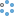
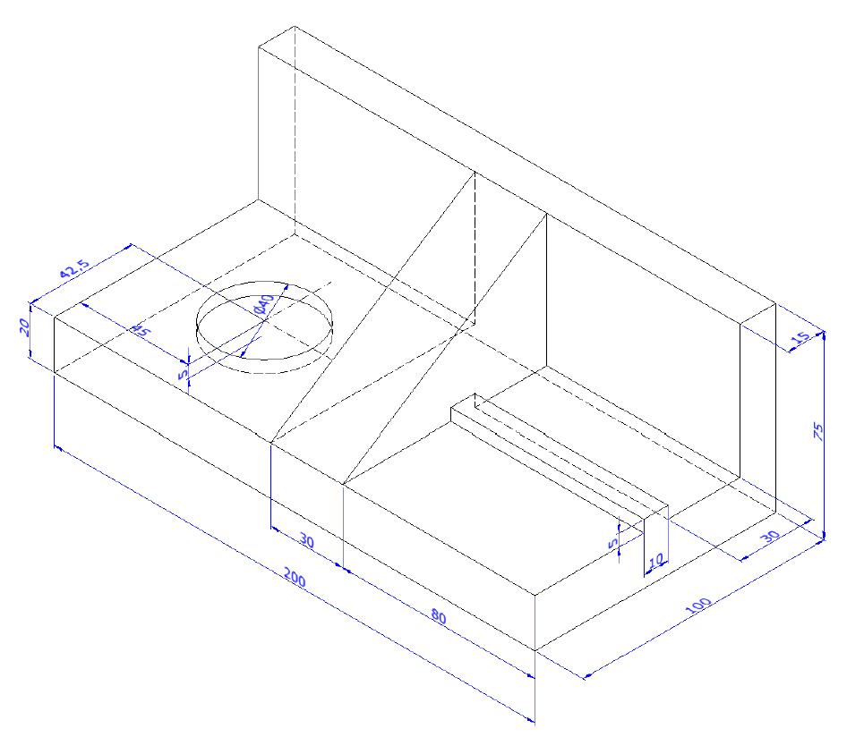
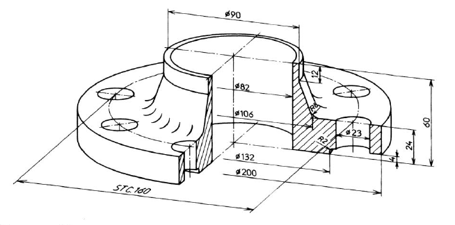
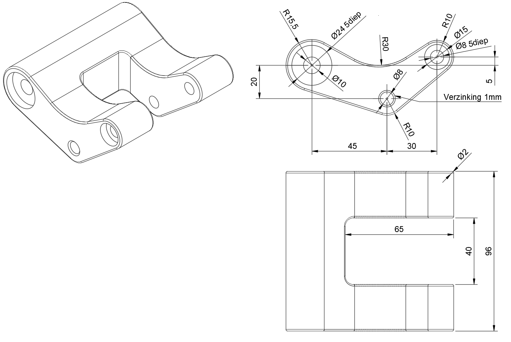
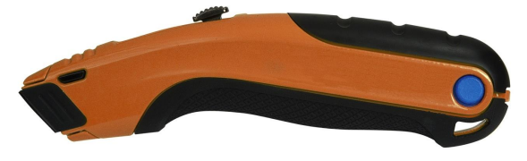
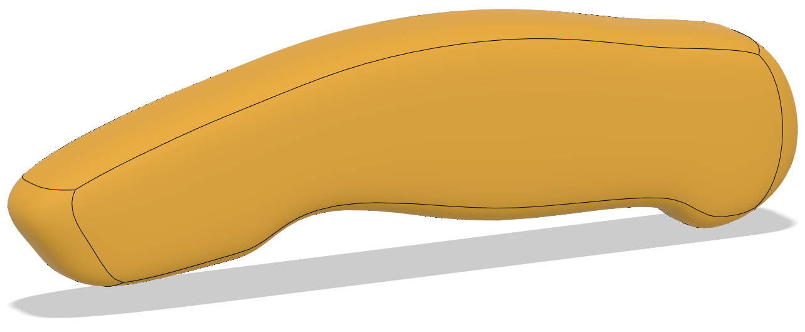
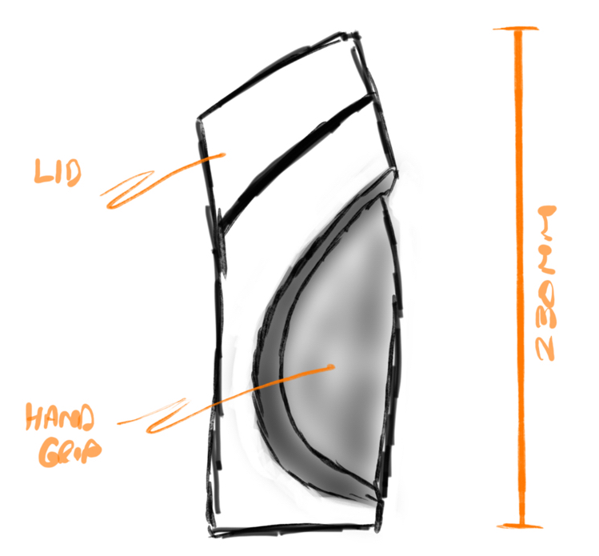

# Part modeling

Now that we know how to make sketches we can start creating parts. 

There are a few diferent part drawing categories:
* Basic parts
* Organic parts
* Sheet metal parts (we won't be handeling this in this course)

## Basic parts

We will go over the most commen tools to create basic parts, if you need the more complex tools just ask the teacher or look for a tutorial online.
First let's take a look at some of the tools we have.

### Create tools for solid modeling

<table>
<thead>
<tr>
<th>Tool</th>
<th>Purpose</th>
</tr>
</thead>
<tbody>
<tr>
<td> Create Sketch</td>
<td>Start a sketch either on a blank document, or on the face of an existing 3D geometry. Click this to access the Sketch Tools.</td>
</tr>
<tr>
<td> Extrude</td>
<td>Extend the shape of a solid body, in a straight line.</td>
</tr>
<tr>
<td> Revolve</td>
<td>Extend the shape of a solid body, about an axis.</td>
</tr>
<tr>
<td> Sweep</td>
<td>Extend the shape of a solid body, along a defined path.</td>
</tr>
<tr>
<td> Rib</td>
<td>Add support to a model using a single line or curve that intersects with already created geometry. The curve must intersect with solid model geometry in both directions.</td>
</tr>
<tr>
<td> Hole</td>
<td>Create a hole through a solid body.</td>
</tr>
<tr>
<td>More Solids</td>
<td>Create solid bodies from sketches.<ul><li> Loft - connects two or more closed profiles by means of a smooth surface transition shape.</li><li> Web - similar to the Rib tool, the Web tool creates geometry from open sketch curves that intersect with pre-existing bodies. The Web tool uses multiple curves to create several merged elements.</li><li> Torus - creates a solid body ring.</li><li> Coil - creates a solid coil.</li><li> Pipe - creates a solid pipe.</li><li> Thread - adds real or cosmetic threads to your design. Cosmetic threads apply the appearance of threads. The Modeled option cuts actual threads into the geometry.</li></ul></td>
</tr>
<tr>
<td>Pattern</td>
<td>Create copies of faces, features, bodies, and components.<ul><li> Rectangular - creates copies of objects in one or two directions.</li><li>Circular Pattern - creates copies of objects around a selected axis.</li><li>Pattern on Path - copies objects along a selected path, rather than following a circular or rectangular path.</li></ul></td>
</tr>
<tr>
<td> Mirror</td>
<td>Create a mirror image of faces, features, bodies, or whole components, on the opposite side of a face or plane.</td>
</tr>
<tr>
<td> Thicken</td>
<td>Create a solid by thickening a surface face.</td>
</tr>
<tr>
<td> Fluid Volume</td>
<td>Create a body that either envelopes, or fills, the interior of the selected bodies.</td>
</tr>
</tbody></table>

### Extrude

Once you have a sketch you can use that to give it a certain with. Extrude can be used to create or add body to a part but also to cut body away from the part.

#### Exercise

### Revolve and hole

A revolve is used to create a round part, you sketch the section of the part on one side of the axis and revolve it around that axis to get the part.

A hole is used to create drilled and/or tapped holes.

#### Exercise

Change 4 holes to M22 and 4 holes to Ø20 with counterbore Ø26x8.

### Round and chamfer

These functions are used respectively to provide a rounding or chamfer to edges.

#### Excercise

## Organic parts

When trying to draw organic shapes one has two main ways of approach:
* Starting from a basic shape and "molding" it into the desired shape.
* Starting from a few contour lines, surfaces are formed that are then sewn together and ultimately form the desired model.

### Image as guide

Often a handmade sketch is used as a guideline to create organic shapes. So let us first look on how to import an image and scale it to the desired dimension.

In Fusion 360 you can find Insert > Canvas in your toolbar, just select the image from your computer and place it on the surface or plane you want. Then you get a window and some handles to initially setup that image.

Now we want the image to be the right scale, to do this we go to Canvases in our browser and click Calibrate in the right mouse menu.

If we now want the image be on a specific position just click on Edit Canvas in the right mouse menu and drag the image to the wanted position.

#### Exercise

Let's import, scale an position this image in a new part.

This utility knife has a length of 180 mm.

## Sculpting from base form

Now based on the imported image try to sculpt the model using a base form.

You can follow [these instructions](/files/sculpting_from_base_form.pdf) to complete this.

## Sculpting from splines and surfaces

In this example a model is made from a handsketch by using splines and surfaces.

<YoutubeVideo videoId="8uVYv86-LfQ" />

## Export to STL

With your part open, go to File > Export and select `*.stl` as file type.
Adjust your local directory if needed and click export.
The job will be put in the job list.

