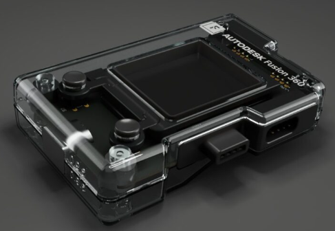
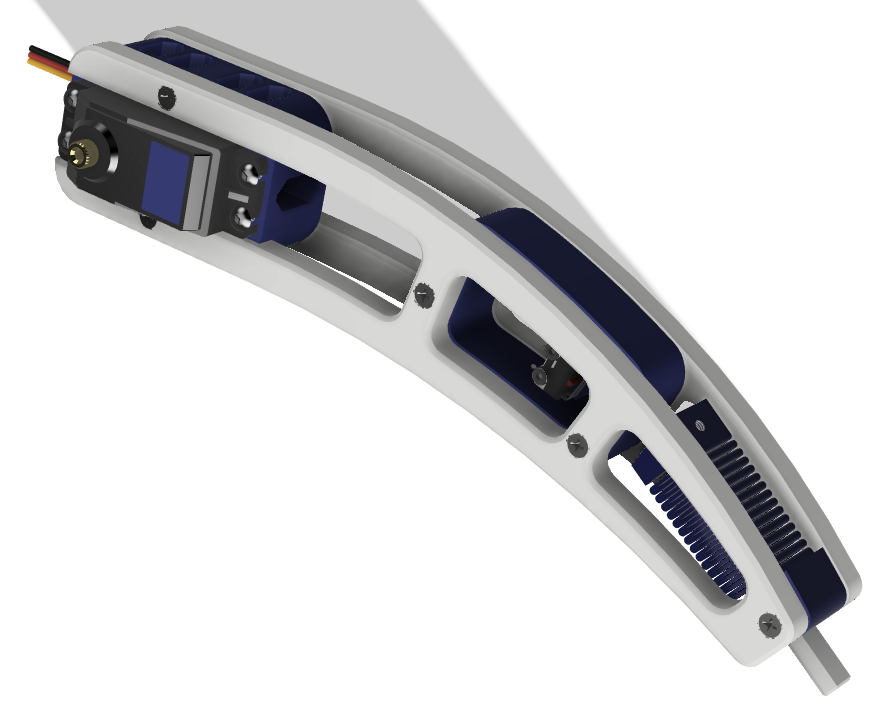
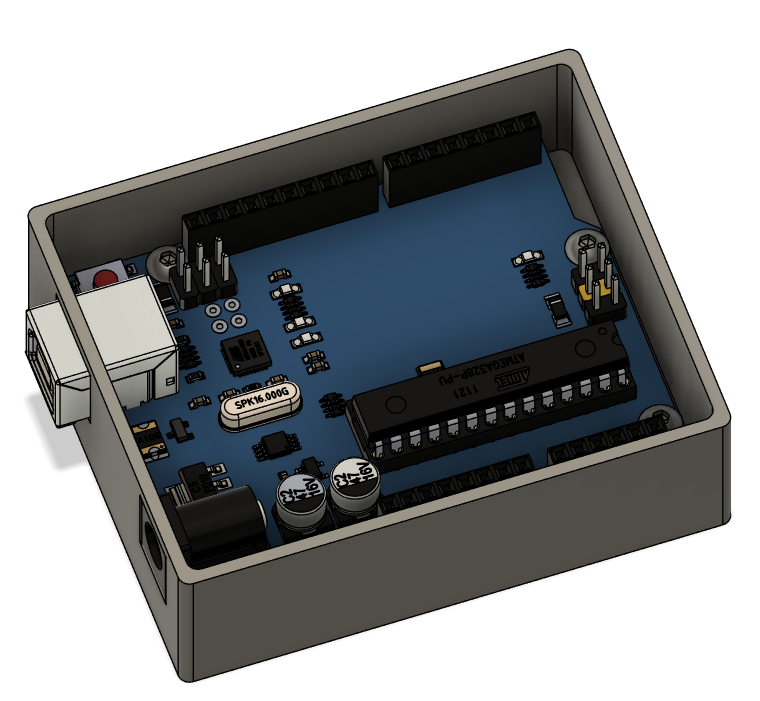

# Assembly modeling

Assembly modeling is a technology and method used in CAD to represent multiple files that combined form a product or part of a product (also known as a subassembly).

These assemblies can hold mechanical and/or electronical parts.

## Assembly based on already modeled parts

The basic steps of building an assembly from already modeled parts are:
* import all parts needed for the product or subassembly
* make one part the ground part (this is usualy a body part or a part that is used for mounting to the wall, seiling or floor)
* position all other parts relative to this ground part or other other already positioned parts

The end result is that all parts are fixed, they can not be moved in space.

During this proces issue's can occur, for instance parts that don't fit, so adjustments need to be made.

You should always double check the end result to make sure no issues remain. Changing the visualisation to `wireframe` can be a big help in this proces.

### Excercise

Let's make a assembly of a hexapod tibia, this is a subassembly used in the leg assembly of the hexapod.

* Download [this](/files/tibia_parts.zip) zip file and import all files to a new project.
* Start a new file and save it, then drag your first part (the servo) into this file, make it the ground part and save this file
* Now you can add each part one by one and position it using joints
* Once all parts are in position you can start adding the fasteners with the Insert Fasteners tool. 

## Part In-Place creation

Here the idea is again to start from one part, but this can be any part, it is usualy that part that places the most restrictions on other parts. This can be for instance the pcb of a controller.

Here you will again start with importing that one part and making it the ground part.
Next you will create other parts from within the assembly and by doing so you will be able to use geometry from the already existing parts in that assembly. So you won't position that part by using contraints but by using geometry.
You are still able to import other parts into the assembly and position these parts by using constraints.

:::warning 👀Be carfull
Making changes to geometry of parts can result in errors in your assembly that will need your attention.
:::

### Excercise

 

1. Base part
   
   * Download the Arduino Uno R3 from [GrabCad](https://grabcad.com/library/arduino-uno-r3-8) and unzip.
   * Open the .step file and save.
  
2. Assembly
   
   * Start a new file and save it
   * Drag the Arduino Uno part into it and make it the ground part
  
3. Create a new part in place

   *  Create a new component, choose external and give your component a name.
   *  Create a body bottom part that fits the arduino.

## Export to STEP

With your assembly open, go to File > Export and select `*.step` as file type.
Adjust your local directory if needed and click export.
The job will be put in the job list.
