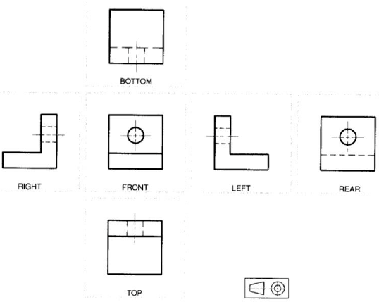
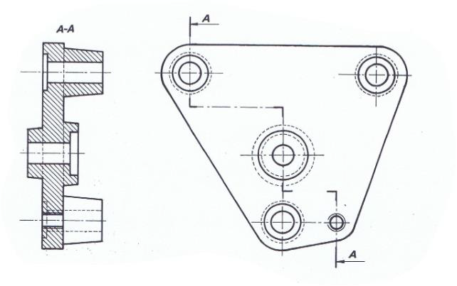
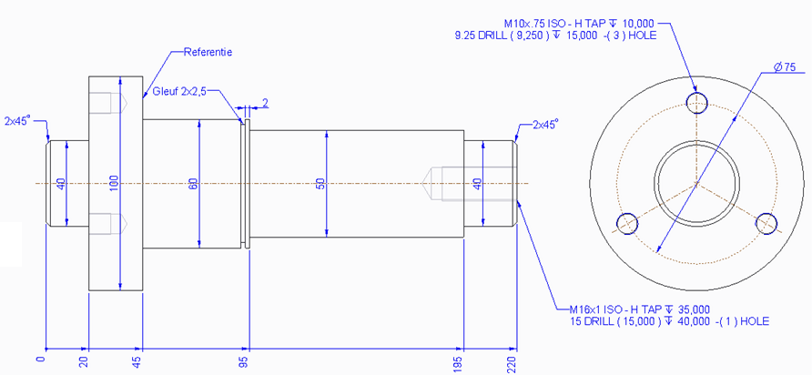
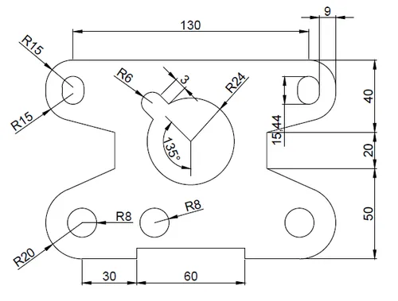

# Drawing

> 🌐 Supporting learning material
>
> Autodesk Fusion learning: [Intro to Fusion drawings Tutorial](https://www.autodesk.com/learn/ondemand/curated/intro-to-fusion-drawings) 
> Autodesk Fusion learning: [Setting up drawing views in Fusion Tutorial](https://www.autodesk.com/learn/ondemand/curated/setting-up-views) 
> Autodesk Fusion learning: [Annotating a drawing Tutorial](https://www.autodesk.com/learn/ondemand/curated/annotating-a-drawing)

In the past, a technical drawing was necessary to produce a part. With today's technology, parts are more often produced based on the 3D model.
The technical drawing is then used for quality control and during the setup of the manufacturing of serie production to control if the first parts are good.

## The technical drawing

In Europe we use the Europian rules and therefore also the Europian projection.

We place only the view needed to make clear how the part looks like. In some cases a section is used to reveal internal geometry.

Once all views are place we need to add dimensions.

### Exercise

Let's model this part and then make the drawing.

## Export to DXF

When you want to cut out something on the lasercutter you need a `.DXF` file.

Drawing eXchange Format is intended to provide an exact representation of the data in a drawing.

Therefore it is usefull to exchange the shape of a part to a machine.

First and foremost, it is important that the scale of your drawing view is set to 1/1. No hidden lines or edges from fillets should be visible, and no dimensions are added. In fact the only visible lines fo the part are shown.

Once the view is made, right click it and choose `export sheet as dxf`.