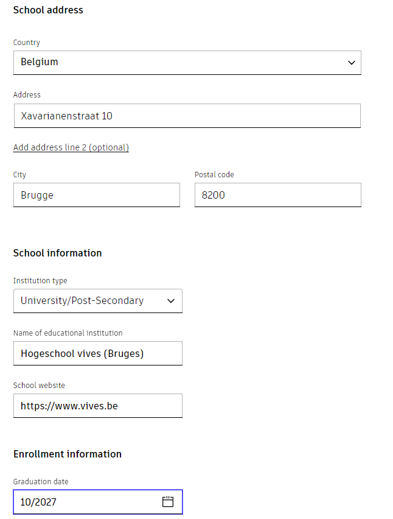
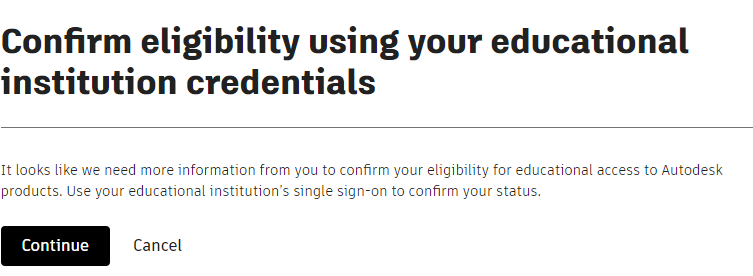

# Fusion 360
<!--

This is the old way, it seems to have been changed...

## Register your Education-account with Autodesk

### You don't have an existing Autodesk-account

Folow these steps:

* Click on `Get started` on the [Education page of Autodesk](https://www.autodesk.com/education/edu-software/overview?sorting=featured&filters=individual)
* Create a new Autodesk-account 
* Fill in all required information and upload a picture of your studentcard.
  * Select `student` as your educational role
  * The school adress is Xavarianenstraat 10 8820 Bruges
  * Select `University/Post-Secondary` as the institution type
  * It is important that the start- and enddate are mentioned on the picture or your request will be denied.

You will recieve an email to confirm your account.
The verification for your Education-account can take a few days.

### You already have an Autodesk-account

Folow these steps:

* Click on `Get started` on the [Education page of Autodesk](https://www.autodesk.com/education/edu-software/overview?sorting=featured&filters=individual)
* Add the information of VIVES and your start- and enddate for your studies.
* Click on `Confirm Eligibility` with your educational institution single sign-on to login with your school account and get access.

## Install Fusion 360

Folow these steps:

* Download the installer [here](https://www.autodesk.com/products/fusion-360/appstream)

-->

## Autodesk Educational Account

* Surf to the [Education page of Autodesk](https://www.autodesk.com/education/edu-software/overview?sorting=featured&filters=individual) and hit `select` on the Fusion tile.
* Choose Student and hit `select` again.
* Fill in your student email address and hit `continue`.
* Fill in your first and last name, your educational role (student) and your date of birth, then hit `continue`.
* Fill in your school information and hit `continue`.

* To confirm your eligibility, hit `continue` and login with your KU Leuven Authenticator.

* The next screen you can close.

## Install Fusion 360

* Download the [installer](https://www.autodesk.com/products/fusion-360/appstream), start it up and just follow the installation process.
* Once installed, start it up and you will get a wizzard.
* Login using your Autodesk account you created (you will need to verify your email).
* Create a team with a name of your choosing and then go to that team.

