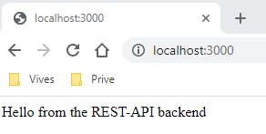
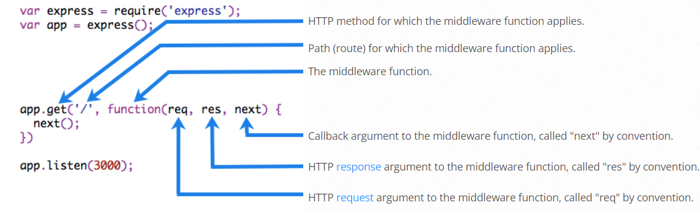

# Intro into Express.js

Express is a minimal and flexible **Node.js** web application framework that provides a robust set of features for web and mobile applications. The mail goal is to create robust API's to provide the interaction between your frontend and backend.

## Setup

Assuming you’ve already installed *Node.js*, create a directory to hold your backend application.

Open that folder with Visual Code and start a new terminal. Use the `npm init` command to create a *package.json file* for your application. This command prompts you for a number of things, such as the name and version of your application. For now, you can simply hit `RETURN` to accept the defaults for most of them, with the following exception:

```bash
entry point: src/server.js
```

Now install Express in the *myapp* directory and save it in the dependencies list.

```bash
npm install express
```

Your backend application is now *Express ready*.

## Hello World example

Go to [Express](https://expressjs.com/en/starter/hello-world.html) to get the *Hello World example code* and place it in a new file `src/server.js` (the entry point you selected).

If everything is setup correctly, we should be able to start our backend application (REST-API) and test it.
Just start it with `npm run dev` and surf to `localhost:3000`.



Congratulations, you just build your first REST-API with Express.js.

Let's take a closer look at the code.

First we load all dependencies we need, in this case this is only Express.
```js
const express = require('express');
const app = express();
```

Next we define the port our REST-API will be listening to.
```js
const port = 3000
```

Now we define our routes, which I will explain in a bit.
```js
app.get('/', (req, res) => {
  res.send('Hello from the REST-API backend')
})
```
Basicly it states that is you surft to the host's root folder, then this routes will activate and result in a `Hello from the REST-API backend` message.

Finaly we start the application and tell it to listen to the port we defined.
```js
app.listen(port, () => {
  console.log(`Example app listening on port ${port}`)
})
```
This will trigger a log in your terminal with the text `Example app listening on port 3000`.

## Routing

**Routing** refers to determining how an application responds to a client request to a particular endpoint, which is a URI (or path) and a specific HTTP request method (GET, POST, and so on).

Each route can have one or more handler functions, which are executed when the route is matched.

Route definition takes the following structure:
```js
app.METHOD(PATH, HANDLER)
```
Where:
* `app` is an instance of express.
* `METHOD` is an HTTP request method, in lowercase.
* `PATH` is a path on the server.
* `HANDLER` is the function executed when the route is matched.

This is an example of a PUT request to the `/user` route:
```js
app.put('/user', (req, res) => {
  res.send('Got a PUT request at /user')
})
```

### Route methodes

A route method is derived from one of the HTTP methods, and is attached to an instance of the express class.

The following code is an example of routes that are defined for the GET and the POST methods to the root of the app.

```js
// GET method route
app.get('/', (req, res) => {
  res.send('GET request to the homepage')
})

// POST method route
app.post('/', (req, res) => {
  res.send('POST request to the homepage')
})
```

Express supports methods that correspond to all HTTP request methods: get, post, and so on.

There is a special routing method, `app.all()`, used to load middleware functions at a path for **all** HTTP request methods. For example, the following handler is executed for requests to the route “/secret” whether using GET, POST, PUT, DELETE, or any other HTTP request method supported in the http module.

```js
app.all('/secret', (req, res, next) => {
  console.log('Accessing the secret section ...')
  next() // pass control to the next handler
})
```

### Route paths

Route paths, in combination with a request method, define the endpoints at which requests can be made. Route paths can be strings, string patterns, or regular expressions.

The characters ?, +, *, and () are subsets of their regular expression counterparts. The hyphen (-) and the dot (.) are interpreted literally by string-based paths.

If you need to use the dollar character `($)` in a path string, enclose it escaped within ([ and ]). For example, the path string for requests at `/data/$book`, would be `/data/([\$])book`.

### Route parameters

Route parameters are named URL segments that are used to capture the values specified at their position in the URL. The captured values are populated in the req.params object, with the name of the route parameter specified in the path as their respective keys.

```js
Route path: /users/:userId/books/:bookId
Request URL: http://localhost:3000/users/34/books/8989
req.params: { "userId": "34", "bookId": "8989" }
```

To define routes with route parameters, simply specify the route parameters in the path of the route as shown below.

```js
app.get('/users/:userId/books/:bookId', (req, res) => {
  res.send(req.params)
})
```

Since the hyphen (-) and the dot (.) are interpreted literally, they can be used along with route parameters for useful purposes.

```js
Route path: /flights/:from-:to
Request URL: http://localhost:3000/flights/LAX-SFO
req.params: { "from": "LAX", "to": "SFO" }
```

```js
Route path: /plantae/:genus.:species
Request URL: http://localhost:3000/plantae/Prunus.persica
req.params: { "genus": "Prunus", "species": "persica" }
```

To have more control over the exact string that can be matched by a route parameter, you can append a regular expression in parentheses (()):

```js
Route path: /user/:userId(\d+)
Request URL: http://localhost:3000/user/42
req.params: {"userId": "42"}
```

### Route handlers

You can provide multiple callback functions that behave like middleware to handle a request. The only exception is that these callbacks might invoke next('route') to bypass the remaining route callbacks. You can use this mechanism to impose pre-conditions on a route, then pass control to subsequent routes if there’s no reason to proceed with the current route.

Route handlers can be in the form of a function, an array of functions, or combinations of both, as shown in the following examples.

A single callback function can handle a route. For example:

```js
app.get('/example/a', (req, res) => {
  res.send('Hello from A!')
})
```

More than one callback function can handle a route (make sure you specify the next object). For example:

```js
app.get('/example/b', (req, res, next) => {
  console.log('the response will be sent by the next function ...')
  next()
}, (req, res) => {
  res.send('Hello from B!')
})
```

An array of callback functions can handle a route. For example:

```js
const cb0 = function (req, res, next) {
  console.log('CB0')
  next()
}

const cb1 = function (req, res, next) {
  console.log('CB1')
  next()
}

const cb2 = function (req, res) {
  res.send('Hello from C!')
}

app.get('/example/c', [cb0, cb1, cb2])
```

A combination of independent functions and arrays of functions can handle a route. For example:

```js
const cb0 = function (req, res, next) {
  console.log('CB0')
  next()
}

const cb1 = function (req, res, next) {
  console.log('CB1')
  next()
}

app.get('/example/d', [cb0, cb1], (req, res, next) => {
  console.log('the response will be sent by the next function ...')
  next()
}, (req, res) => {
  res.send('Hello from D!')
})
```

### Response methodes

The methods on the response object (res) in the following table can send a response to the client, and terminate the request-response cycle. If none of these methods are called from a route handler, the client request will be left hanging.

| Method	| Description |
|-----------|-------------|
| `res.download()` | Prompt a file to be downloaded. |
| `res.end()` |	End the response process. |
| `res.json()` | Send a JSON response. |
| `res.jsonp()` | Send a JSON response with JSONP support. |
| `res.redirect()` | Redirect a request. |
| `res.render()` | Render a view template. |
| `res.send()` | Send a response of various types. |
| `res.sendFile()` | Send a file as an octet stream. |
| `res.sendStatus()` | Set the response status code and send its string representation as the response body. |

## Middleware

Middleware functions are functions that have access to the *request object* (req), the *response object* (res), and the next function in the application’s request-response cycle. The next function is a function in the Express router which, when invoked, executes the middleware succeeding the current middleware.

Middleware functions can perform the following tasks:
* Execute any code.
* Make changes to the request and the response objects.
* End the request-response cycle.
* Call the next middleware in the stack.

If the current middleware function does not end the request-response cycle, it must call next() to pass control to the next middleware function. Otherwise, the request will be left hanging.

The following figure shows the elements of a middleware function call:



## Error Handling

It’s important to ensure that Express catches all errors that occur while running route handlers and middleware.

Errors that occur in synchronous code inside route handlers and middleware require no extra work. If synchronous code throws an error, then Express will catch and process it.

For errors returned from asynchronous functions invoked by route handlers and middleware, you must pass them to the next() function, where Express will catch and process them. For example:

```js
app.get('/', (req, res, next) => {
  fs.readFile('/file-does-not-exist', (err, data) => {
    if (err) {
      next(err) // Pass errors to Express.
    } else {
      res.send(data)
    }
  })
})
```

Starting with Express 5, route handlers and middleware that return a Promise will call next(value) automatically when they reject or throw an error. For example:

```js
app.get('/user/:id', async (req, res, next) => {
  const user = await getUserById(req.params.id)
  res.send(user)
})
```

If getUserById throws an error or rejects, next will be called with either the thrown error or the rejected value. If no rejected value is provided, next will be called with a default Error object provided by the Express router.

If you pass anything to the next() function (except the string 'route'), Express regards the current request as being an error and will skip any remaining non-error handling routing and middleware functions.

If the callback in a sequence provides no data, only errors, you can simplify this code as follows:

```js
app.get('/', [
  function (req, res, next) {
    fs.writeFile('/inaccessible-path', 'data', next)
  },
  function (req, res) {
    res.send('OK')
  }
])
```

### Default error handler

Express comes with a built-in error handler that takes care of any errors that might be encountered in the app. This default error-handling middleware function is added at the end of the middleware function stack.

If you pass an error to next() and you do not handle it in a custom error handler, it will be handled by the built-in error handler.

When an error is written, the following information is added to the response:

* The `res.statusCode` is set from `err.status` (or `err.statusCode`). If this value is outside the 4xx or 5xx range, it will be set to 500.
* The `res.statusMessage` is set according to the status code.
* The body will be the HTML of the status code message when in production environment, otherwise will be err.stack.
* Any headers specified in an err.headers object.

If you call `next()` with an error after you have started writing the response (for example, if you encounter an error while streaming the response to the client) the Express default error handler closes the connection and fails the request.

So when you add a custom error handler, you must delegate to the default Express error handler, when the headers have already been sent to the client:

```js
function errorHandler (err, req, res, next) {
  if (res.headersSent) {
    return next(err)
  }
  res.status(500)
  res.render('error', { error: err })
}
```

## Database integration

To use our mySQL database we will need to install the following dependencies:

```bash
npm install mysql dotenv
```

Now make a `.env` file in the root folder of our project with the following content:

```env
DB_HOST=<hostname>
DB_USER=<your username>
DB_PASS=<your password>
DB_DTBS=<database name>
```

Now make a `db.js` file that contains the handles for the routes.

In our `server.js` we add this package:

```js
const db = require('./db');
```

In the routes section of `server.js` you can refer to the handler methodes with `db.<name of methode>`.

Example:
```js
app.get('/products', db.getAllProducts);
```

In the `db.js` file we need define our methode:

```js
// get all products 
getAllProducts = (req, res) => {
    // code will be added here
}
...
module.exports = { getAllProducts, ... };
```

First we import our database credentials and make a connection (in our methode):

```js
// db credentials import
require('dotenv').config();
const mysql = require("mysql");
const DB_HOST = process.env.DB_HOST;
const DB_USER = process.env.DB_USER;
const DB_PASS = process.env.DB_PASS;
const DB_DTBS = process.env.DB_DTBS;
// Create a connection to the database
const connection = mysql.createConnection({
    host: DB_HOST,
    user: DB_USER,
    password: DB_PASS,
    database: DB_DTBS
});
// open the MySQL connection
connection.connect(error => {
    if (error) {
        res.status(503).send({ error: 'Unable to connect to database.'});
        return;
    } else {
        console.log("Successfully connected to the database.");
    }
});
```

Next we run our query:

```js
// run query
connection.query( 'SELECT * FROM <name table>', (err, data) => {
    if(err){
        res.status(404).send({ error: 'Unable to perform the database query.' });
        return;
    } else {
        console.log('The query answer is: ', data);
        res.send(data);            
    }
});
```

The result will be in JSON format.

Finaly we need to close our connection:
```js
//close connection
connection.end(); 
```

