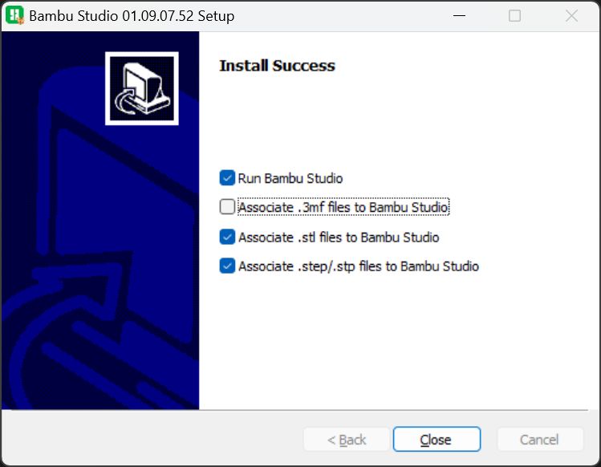

# Bambu Studio

For the Bambu Lab X1 Carbon 3D printer we will be using the Bambu Studio software.

You can download the latest version on [Bambu Studio](https://bambulab.com/en-eu/download/studio).

Start the downloaded install `.exe` file and follow the instructions. 

Deselect `.3mf` at the last screen before closing.

