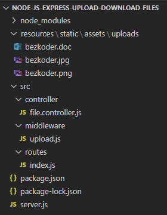
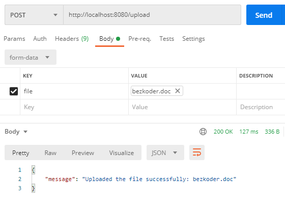
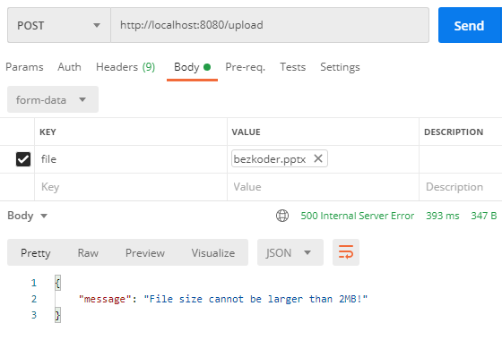
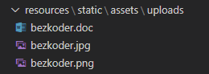
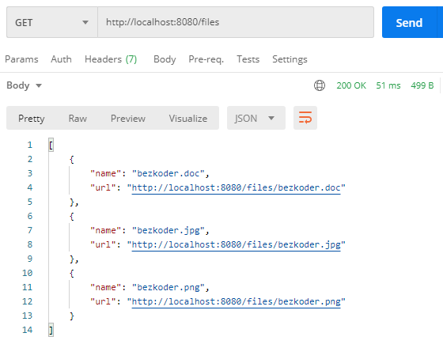
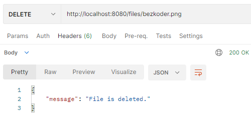
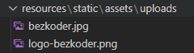

# Build RESP-API's for file interactions

Our application will provide APIs for:

| Methode | Url | Action |
| --- | --- | --- |
| POST | `/upload` | upload a file |
| GET | `/files` | get list of files (name & url) |
| GET | `/files/[filename]` | download a file |
| DELETE | `/files/[filename]` | delete a file |

## Project structure

This is the project structure that we are aiming for:



* `resources/static/assets/uploads`: folder for storing uploaded files.
* `middleware/upload.js`: initializes Multer Storage engine and defines middleware function to save uploaded files in uploads folder.
* `file.controller.js` exports Rest APIs: POST a file, GET all files’ information, download a File with url.
* `routes/index.js`: defines routes for endpoints that is called from HTTP Client, use controller to handle requests.
* `server.js`: initializes routes, runs Express app.

## Installing dependencies

We will be installing the following dependencies:
* Multer (handeling multipart/form-data along with uploading files)
* Cors (allowing Cross-origin resource sharing)

```bash
npm install multer cors // along with express ofcourse
```

## Uploading and downloading

### Create middleware for file upload

Now we create the middleware for file upload by creating the `upload.js` file :

```js
const util = require("util");       // for node.js 5
const multer = require("multer");
import util from ('util');          // for node.js 6
import multer from ('multer');
const maxSize = 2 * 1024 * 1024;

let storage = multer.diskStorage({
  // folder to store the uploaded files
  destination: (req, file, cb) => {
    cb(null, __basedir + "/resources/static/assets/uploads/");
  },
  // name of the file inside the destination folder
  filename: (req, file, cb) => {
    console.log(file.originalname);
    cb(null, file.originalname);
  },
});

let uploadFile = multer({
  storage: storage,
  // limit the size of the file
  limits: { fileSize: maxSize },
}).single("file");

// make sure the middleware can be used with the ASYNC/AWAIT
let uploadFileMiddleware = util.promisify(uploadFile); 
module.exports = uploadFileMiddleware;
```

### Create controller for file upload/download

In controller folder, create `file.controller.js`:

* For File Upload method, we will export `upload()` function that:

    * use middleware function for file upload
    * catch Multer error (in middleware function)
    * return response with message

* For File Information and Download:

    * `getListFiles()`: read all files in uploads folder, return list of files’ information (name, url)
    * `download()`: receives file name as input parameter, then uses Express res.download API to transfer the file at path (directory + file name) as an ‘attachment’.

```js
const uploadFile = require("../middleware/upload");   // for node.js 5
import uploadFile from ('../middleware/upload');      // for node.js 6

const upload = async (req, res) => {
  try {
    await uploadFile(req, res);

    if (req.file == undefined) {
      return res.status(400).send({ message: "Please upload a file!" });
    }

    res.status(200).send({
      message: "Uploaded the file successfully: " + req.file.originalname,
    });
  } catch (err) {
    // catch error for filesize limit to provide a specific response
    if (err.code == "LIMIT_FILE_SIZE") {
      return res.status(500).send({
        message: "File size cannot be larger than 2MB!",
      });
    }
    res.status(500).send({
      message: `Could not upload the file: ${req.file.originalname}. ${err}`,
    });
  }
};

const getListFiles = (req, res) => {
  const directoryPath = __basedir + "/resources/static/assets/uploads/";

  fs.readdir(directoryPath, function (err, files) {
    if (err) {
      res.status(500).send({
        message: "Unable to scan files!",
      });
    }

    let fileInfos = [];

    files.forEach((file) => {
      fileInfos.push({
        name: file,
        url: baseUrl + file,
      });
    });

    res.status(200).send(fileInfos);
  });
};

const download = (req, res) => {
  const fileName = req.params.name;
  const directoryPath = __basedir + "/resources/static/assets/uploads/";

  res.download(directoryPath + fileName, fileName, (err) => {
    if (err) {
      res.status(500).send({
        message: "Could not download the file. " + err,
      });
    }
  });
};

module.exports = {
  upload,
  getListFiles,
  download,
};
```

### Define route for uploading file

When a client sends HTTP requests, we need to determine how the server will response by setting up the routes.

There are 3 routes with corresponding controller methods:
* POST `/upload`: `upload()`
* GET `/files`: `getListFiles()`
* GET `/files/[fileName]`: `download()`

Create index.js file inside **routes** folder with content like this:

```js
const express = require("express");   // for node.js 5
import express from ('express');      // for node.js 6
const router = express.Router();
const controller = require("../controller/file.controller");  // for node.js 5
import controller from ('../controller/file.controller');  // for node.js 6

let routes = (app) => {
  router.post("/upload", controller.upload);
  router.get("/files", controller.getListFiles);
  router.get("/files/:name", controller.download);

  app.use(router);
};

module.exports = routes;
```

You can see that we use controller from `file.controller.js`.

### Create Express app server

Now we create our Express server in `server.js`:

```js
const cors = require("cors");         // for node.js 5
const express = require("express");
import cors from ('cors');            // for node.js 6
import express from ('express');

const app = express();

global.__basedir = __dirname;

var corsOptions = {
  origin: "http://localhost:8081"
};

app.use(cors(corsOptions));

const initRoutes = require("./src/routes");

app.use(express.urlencoded({ extended: true }));
initRoutes(app);

let port = 8080;
app.listen(port, () => {
  console.log(`Running at localhost:${port}`);
});
```

What we do are:
* import `express` and `cors` modules:
    * Express is for building the Rest apis
    * cors provides Express middleware to enable CORS with various options.
* create an Express app, then add `cors` middlewares using `app.use()` method. Notice that we set origin: `http://localhost:8081`.
* listen on port 8080 for incoming requests.

### Run & Test

First we need to create **uploads** folder with the path `resources/static/assets`.
On the project root folder, run this command: `node server.js`.

* Let’s use **Postman** to make HTTP POST request with a file:



* Upload a file with size larger than max file size (2MB):



* Check uploads folder after uploading several files:



* Retrieve list of Files’ information:



## Deleting

Now that is working, let's look at deleting a file.

To delete a file in Node.js, we can use the `unlink()` function offered by the Node built-in fs module. The method doesn’t block the Node.js event loop because it works asynchronously.

Here is an illustration showing how you can apply the technique:

```js
const fs = require('fs'); // for node.js 5
import fs from ('fs');    // for node.js 6

fs.unlink(directoryPath + fileName, (err) => {
    if (err) {
        throw err;
    }

    console.log("Delete File successfully.");
});
```

### Create controller for file delete

In controller folder, create `file.controller.js`:

We will export `remove()` function that:
* use `fs.unlink` function for deleting file by its name
* return response with message

```js
const fs = require('fs'); // for node.js 5
import fs from ('fs');    // for node.js 6

const remove = (req, res) => {
  const fileName = req.params.name;
  const directoryPath = __basedir + "/resources/static/assets/uploads/";

  fs.unlink(directoryPath + fileName, (err) => {
    if (err) {
      res.status(500).send({
        message: "Could not delete the file. " + err,
      });
    }

    res.status(200).send({
      message: "File is deleted.",
    });
  });
};

module.exports = {
  remove,
};
```

### Defining route for deleting file

When a client sends HTTP requests, we need to determine how the server will response by setting up the routes.

Here is route with corresponding controller method:
* DELETE `/files/[fileName]`: `remove()`

Create `index.js` file inside **routes** folder with content like this:

```js
const express = require("express");   // for node.js 5
import express from ('express');      // for node.js 6
const router = express.Router();
const controller = require("../controller/file.controller");  // for node.js 5
import controller from ('../controller/file.controller');  // for node.js 6

let routes = (app) => {
  router.delete("/files/:name", controller.remove);

  app.use(router);
};

module.exports = routes;
```

You can see that we use controller from `file.controller.js`.

### Run & Test

Let’s use **Postman** to make HTTP DELETE request with a file name in url:



Check the result:



