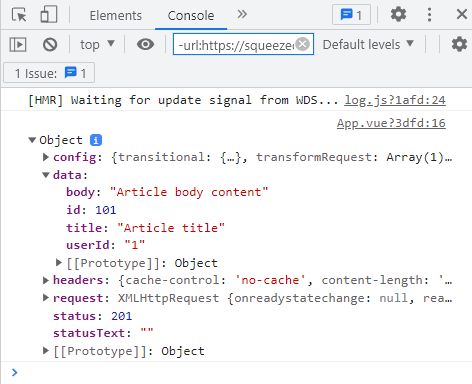

# Axios a alternative to fetch

Axios is a simpler alternative to the native Javascript Fetch API. It has some additional benefits lilke automatic JSON data transformation.

Like the Fetch API, it’s a promise-based HTTP client and works in the browser. It also works isomorphically on Node.js, which means it can share a codebase in both the browser and Node.js.

Axios was inspired by the HTTP service in Angular and is built with the following features.

* Makes XMLHttpRequests from the browser.
* Makes http requests from Node.js.
* Supports the Promise API .
* Intercepts requests and responses.
* Transform request and response data.
* Ability to cancel requests.
* Automatic transformation of JSON data.
* Client side support for protecting against Cross Site Request Forgery (XSRF).

## How to install Axios

You can install Axios with npm by executing the following command in your project folder.

```bash
npm install axios
```

When we want to use it in a component in Vue, we have to import the axios package above the config object in the component’s script block.

```vue
<script>
import axios from 'axios'

export default { }
</script>
```

If you want to load Axios through a CDN, you can use JsDeliver or unpkg.

```html
// jsDeliver
<script src="https://cdn.jsdelivr.net/npm/axios/dist/axios.min.js"></script>

// unpkg
<script src="https://unpkg.com/axios/dist/axios.min.js"></script>
```

## The Axios API and convenience methods

Axios allows us to send HTTP requests in one of two ways.

We can pass a configuration object to its constructor that consists of at least the request method (get, post etc.) and the url we want to send the request to. If we’re creating or updating data, we also include a data object.

```js
axios({
  method: 'post',
  url: 'https://jsonplaceholder.typicode.com/posts',
  data: {
    title: 'Article title',
    body:  'Article body content',
    userId: 1,
  }
})
```

Alternatively, we can use one of the following convenience methods.

* `axios.get()`
* `axios.post()`
* `axios.put()`
* `axios.patch()`
* `axios.delete()`

These methods take up to three arguments, with only the first parameter (the url we want to send the request to) being required.

### How to get data with axios.get

To receive data with Axios, we use the **get** convenience method with the URL of the API we send the request to as argument.

For our example, we want to fetch only a single blog post from JSONPlaceholder so the url is `https://jsonplaceholder.typicode.com/posts/1` .

```vue
<template>
  <div></div>
</template>

<script>
import axios from 'axios'

export default {
  mounted() {
    axios.get('https://jsonplaceholder.typicode.com/posts/1')
  }
}
</script>
```

The get method will return a response object and because Axios is promise-based, we can chain a then block to the request to handle the response.

As an example, let’s add a *then* block and use it to log the data we get back to the console.

```vue{12-14}
<template>
  <div></div>
</template>

<script>
import axios from 'axios'

export default {
  mounted() {
    axios
      .get('https://jsonplaceholder.typicode.com/posts/1')
      .then((response) => {
        console.log(response)
      })
  }
}
</script>
```

If we open the developer tools and go to the console, we will see an object in the log. If we expand this object and then its *data* property, we will see the post data.

So if we want to access values like the post title, we have to do it through *response.data*.

```vue{13}
<template>
  <div></div>
</template>

<script>
import axios from 'axios'

export default {
  mounted() {
    axios
      .get('https://jsonplaceholder.typicode.com/posts/1')
      .then((response) => {
        console.log(response.data.title)
      })
  }
}
</script>
```

But logging the data to the console isn’t very useful, so let’s show it in the template block.

The blog posts from JSONPlaceholder contain 4 properties.

* id
* userId
* title
* body

We’ll output everything except the userId in the template block.

```vue{2-3,10-14,19}
<template>
  <h2>{{ posts.id }} {{ posts.title }}</h2>
  <p>{{ posts.body }}</p>
</template>

<script>
import axios from 'axios'

export default {
  data() {
    return {
      posts: []
    }
  },
  mounted() {
    axios
      .get('https://jsonplaceholder.typicode.com/posts/1')
      .then((response) => {
        this.posts = response.data
      })
  }
}
</script>
```

Getting multiple posts works the same, except the API path is different and we output them in the template with the *v-for* directive.

```vue{2}
<template>
  <div v-for="post in posts" :key="post.id">
    <h2>{{ post.id }} {{ post.title }}</h2>
    <p>{{ post.body }}</p>
  </div>
</template>

<script>
import axios from 'axios'

export default {
  data() {
    return {
      posts: []
    }
  },
  mounted() {
    axios
      .get('https://jsonplaceholder.typicode.com/posts/')
      .then((response) => {
        this.posts = response.data
      })
  }
}
</script>
```

### How to send data with axios.post

To send data with Axios, we use the post convenience method with the URL of the API we send the request to as the first argument, and the data we want to send as the second argument.

For our example, we want to create a blog post on JSONPlaceholder so the url is `https://jsonplaceholder.typicode.com/posts`. We will also log the data we just sent.

```vue
<template>
  <div></div>
</template>

<script>
import axios from 'axios'

export default {
  mounted() {
    axios
    .post('https://jsonplaceholder.typicode.com/posts', {
      userId: '1',
      title:  'Article title',
      body:   'Article body content'
    })
    .then((response) => console.log(response))
  }
}
</script>
```

If we open the developer tools and take a look in the console, we should see the object with data we just sent. In the data property we can see that our new post has been added as id:101 .



The data can also come from a pre-existing object like a data property that captured form input.

In the example below we have a data property called post data. It receives the data from the form with v-model, when the submit event fires. Axios then uses the object as the data it posts to JSON placeholder.

```vue
<template>
  <section>
    <form @submit.prevent="createPost">
      <div>
        <label for="userId">UserID:</label>
        <input type="text" id="userId" v-model="postData.userId">
      </div>
      <div>
        <label for="title">Title: </label>
        <input type="text" id="title" v-model="postData.title">
      </div>
      <div>
        <label for="body">Body: </label>
        <textarea id="body" rows="6" cols="22" v-model="postData.body"></textarea>
      </div>
      <button>Create Post</button>
    </form>
  </section>
</template>

<script>
import axios from 'axios'

export default {
  data() {
    return {
      postData: {
        userId: '',
        title:  '',
        body:   ''
      }
    }
  },
  methods: {
  	createPost() {
		axios
		  .post('https://jsonplaceholder.typicode.com/posts', this.postData)
		  .then((response) => console.log(response))
	}
  }
}
</script>

<style>
html,body{margin:0;padding:0}
section{height:100vh;display:grid;justify-items:center;padding-top:40px}
div{margin:24px auto}
label{font-weight:bolder;display:block;margin-bottom:4px}
</style>
```

We can run the example in the browser and enter some dummy data. If we submit the form, we’ll see the console update with the post we just created.

### How to PUT update data with axios.put

To *PUT* update data with Axios, we use the put convenience method with the URL of the API we send the request to as the first argument, and the data we want to update as the second argument.

For our example, we want to update the post with id:1 on JSONPlaceholder, so the url is `https://jsonplaceholder.typicode.com/posts/1` . We will also log the data we just updated.

:::tip 💡Note
When using PUT as the update method we have to specify **all** the keys even if we don’t update their values.
::: 

```vue
<template>
  <div></div>
</template>

<script>
import axios from 'axios'

export default {
  mounted() {
    axios
      .put('https://jsonplaceholder.typicode.com/posts/1', {
        id: '1',
        userId: '1',
        title:  'Article title',
        body:   'Article body content'
      })
      .then((response) => console.log(response))
  }
}
</script>
```

If open the developer tools and take a look in the console, we should see the object with data we just updated. In the data property we can see that post 1 has been updated with the values we specified.

### How to PATCH update data with axios.patch

To *PATCH* update data with Axios, we use the patch convenience method with the URL of the API we send the request to as the first argument, and the data we want to update as the second argument.

For our example, we want to update the post with id:1 on JSONPlaceholder, so the url is `https://jsonplaceholder.typicode.com/posts/1`. We will also log the data we just updated.

```vue
<template>
  <div></div>
</template>

<script>
import axios from 'axios'

export default {
  mounted() {
    axios
      .patch('https://jsonplaceholder.typicode.com/posts/1', {
        title:  'Article title only'
      })
      .then((response) => console.log(response))
  }
}
</script>
```

If open the developer tools and take a look in the console, we should see the object with data we just updated. In the data property we can see that post 1 has been updated with the values we specified.

### How to delete data with axios.delete

To delete data with Axios, we use the *delete* convenience method with the URL of the resource we want to delete in the API as the argument.

For our example, we want to delete the post with id:1 on JSONPlaceholder so the url is `https://jsonplaceholder.typicode.com/posts/1`. We will also log the data we just deleted.

```vue
<template>
  <div></div>
</template>

<script>
import axios from 'axios'

export default {
  mounted() {
    axios
      .delete('https://jsonplaceholder.typicode.com/posts/1')
      .then((response) => console.log(response))
  }
}
</script>
```

This time when we take a look in the console, the data property will be empty.

## Using presets in Axios

It is possible to define some presets for Axios.

```ts
const api = axios.create({
  baseURL: 'https://reqres.in/api',
  headers: {'X-Custom-Header': 'foobar'}
})

api.get('/color/1')
.then( (result) => console.log(result.data))
```

## How to handle errors in Axios

Axios returns an *error* object that we can use in a chained catch block to see what went wrong and were.

As an example, we’ll use the wrong url in a GET request and log the error in a *catch* block.

```vue
<template>
  <div></div>
</template>

<script>
import axios from 'axios'

export default {
  mounted() {
    axios
      .get('https://jsonplaceholder.typicode.com/wrong/')
      .catch((error) => console.log(error))
  }
}
</script>
```

Because the resource doesn’t exist, we see a 404 error in the console. If we want more information about the error, we can use the toJSON Javascript method on it.

```vue{12}
<template>
  <div></div>
</template>

<script>
import axios from 'axios'

export default {
  mounted() {
    axios
      .get('https://jsonplaceholder.typicode.com/wrong/')
      .catch((error) => console.log(error.toJSON()))
  }
}
</script>
```

This time our error has a lot more information.

```json
...
{
  "url": "https://jsonplaceholder.typicode.com/wrong/",
  "method": "get",
  "headers": {
    "Accept": "application/json, text/plain, */*"
  },
  "transformRequest": [null],
  "transformResponse": [null],
  "timeout": 0,
  "xsrfCookieName": "XSRF-TOKEN",
  "xsrfHeaderName": "X-XSRF-TOKEN",
  "maxContentLength": -1,
  "maxBodyLength": -1
}
message: "Request failed with status code 404"
name: "Error"
...
```