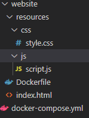
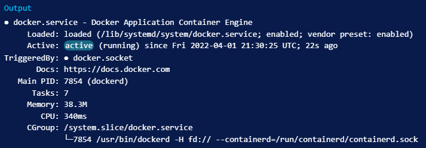

# Docker

For this, we presume you already have a device that will function as your server and uses Linux as operating system.
We recommend [Ubuntu's latest LTS version](https://ubuntu.com/download/desktop).

Docker is an application that simplifies the process of managing application processes in containers. Containers let you run your applications in resource-isolated processes. They’re similar to virtual machines, but containers are more portable, more resource-friendly, and more dependent on the host operating system.

For applications depending on several services, orchestrating all the containers to start up, communicate, and shut down together can quickly become unwieldy. Docker Compose is a tool that allows you to run multi-container application environments based on definitions set in a YAML file. It uses service definitions to build fully customizable environments with multiple containers that can share networks and data volumes.

## Installing Docker & Docker Compose

### Installing Docker

Update your list of packages & install a few prerequisite packages which let `apt` use packages over HTTPS:

```bash
sudo apt update
sudo apt install apt-transport-https ca-certificates curl software-properties-common
```

Add the GPG key for the official Docker repository to your system and add it to your APT sources:

```bash
curl -fsSL https://download.docker.com/linux/ubuntu/gpg | sudo gpg --dearmor -o /usr/share/keyrings/docker-archive-keyring.gpg
echo "deb [arch=$(dpkg --print-architecture) signed-by=/usr/share/keyrings/docker-archive-keyring.gpg] https://download.docker.com/linux/ubuntu $(lsb_release -cs) stable" | sudo tee /etc/apt/sources.list.d/docker.list > /dev/null
```

Update your list of packages again & make sure you are about to install from the Docker repo instead of the default Ubuntu repo:

```bash
sudo apt update
apt-cache policy docker-ce
```



Install Docker & check that it's running:

```bash
sudo apt install docker-ce
sudo systemctl status docker
```


### Install Docker Compose

Download Docker Compose:

```bash
mkdir -p ~/.docker/cli-plugins/
curl -SL https://github.com/docker/compose/releases/download/v2.3.3/docker-compose-linux-x86_64 -o ~/.docker/cli-plugins/docker-compose
```

Next, set the correct permissions so that the Docker Compose command is executable:

```bash
chmod +x ~/.docker/cli-plugins/docker-compose
```

To verify that the installation was successful, you can run:

```bash
docker compose version
```

You should get the version that is installed.

### Usefull commands for Docker Compose

* To create and start containers: `docker-compose up`
* Start services with detached mode (services keep running until stopped): `docker-compose -d up`
* Get a list of all images: `docker-compose images`
* Get a list of all containers: `docker-compose ps`
* Stop all containers and remove images, volumes: `docker-compose down`

## Example of a project  run in Docker Compose

Let's say you have a project called `FieldMonitor` with a *Express.js* backend in the folder `field-api` and a *Vue* frontend in the folder `vue-monitor`.

Without Docker Compose you would start the project as follows:

```bash
// Start backend-api
cd field-api
npm install
npm run dev

// Start frontend
cd vue-monitor
npm install
npm run dev
```

### Backend Dockerfile

With Docker Compose installed, you need two seperate docker files for each environment. 
Let's name these Dockerfiles as `Dockerfile-dev`.

```dockerfile
FROM node:10
WORKDIR /usr/src/app/field-api
COPY package*.json ./
RUN npm install
EXPOSE 3080
CMD ["npm", "run", "dev"]
```

1. We are starting from the base image `node:10`.
2. Set the working directory as `/usr/src/app/field-api`.
3. Copy the `package.json` to install all the dependencies.
4. Install all the dependencies
5. We need to put this expose command for the documentation purpose so that other developers know this service runs on port `3080`.
6. Finally, we run the command `npm run dev`

### Frontend Dockerfile

```dockerfile
FROM node:10
WORKDIR /usr/src/app/vue-monitor
COPY package*.json ./
RUN npm install
EXPOSE 8080
CMD ["npm", "run", "dev"]
```

1. We are starting from the base image `node:10`.
2. Set the working directory as `/usr/src/app/vue-monitor`
3. Copy the `package.json` to install all the dependencies
4. Install all the dependencies
5. Exposing the port `8080`
6. Finally, we run the command `npm run dev`

### Start commands in Package.json

In the above Dockerfiles, we are running commands with npm on instantiating the containers. Let’s see what are those commands in each `package.json` files.

For the backend, we are running this command `npm run dev` which in turn runs this command `nodemon src/server.js`. Since it’s a development environment we are using nodemon which listens for the changes in files and restart the server automatically.


For the frontend, we are running this command `npm run dev` which in turn runs this command `vite` We are using Vite here to serve the application on port 8080.


### Docker Compose file

Finally, let’s look at the docker-compose file here. Since we need to run Vue on port **8080** and express API on port **3080** we need to define two services: nodejs-server and vue-ui.

```yml
version: '3'
services:
  nodejs-server:
    build:
      context: ./field-api
      dockerfile: Dockerfile-dev
    ports:
      - "3080:3080"
    container_name: field-api
    volumes:
       - ./field-api:/usr/src/app/field-api
       - /usr/src/app/field-api/node_modules
  vue-ui:
    build:
      context: ./vue-monitor
      dockerfile: Dockerfile-dev
    ports:
      - "8080:8080"
    container_name: vue-monitor
    volumes:
       - ./my-app:/usr/src/app/vue-monitor
       - /usr/src/app/vue-monitor/node_modules
```

If you look at the above file we defined two services each has its own docker file. The most important thing here is the volumes part we need to mount the whole part of the application and node_modules folder as well. We need to mount the node_modules folder because the volume is not mounted during the build.

### Run in development

Let’s run the following steps to run the whole setup in the development mode

```bash
// build with no cache
docker-compose build --no-cache
// start the services
docker-compose up
// list the services
docker-compose ps
// list the containers
docker ps
// stop services
docker-compose stop
```

### Communication between services

Now the services are running on the default network and these services should be reachable by the service name. By default Compose sets up a single network for your app. Each container for a service joins the default network and is both reachable by other containers on that network, and discoverable by them at a hostname identical to the container name.

We should have the service name in the `vue.config.js` instead of the localhost.

```js
module.exports = {
    devServer: {
      proxy: {
        '^/field-api': {
          target: 'http://field-api:3080',
          changeOrigin: true
        },
      }
    }
  }
```

### Start your project

To start your project just use `docker-compose up` for temperary use or `docker-compose -d up` to run the services until you kill them.


To be added.