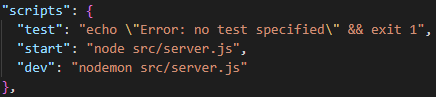

# Deploy your project on a Docker container

First you need to have a server or virtual machine to work on. In our case we then have setup a VPN tunnel to that server and use the extension `ssh remote` to connect to the server through Visual Code.

## Installation of Docker and Docker-compose

For the installation of docker I will be refering to the install procedure "[Install Docker Engine on Ubuntu](https://docs.docker.com/engine/install/ubuntu/)"

## Making the directory structure in docker

1. Add `docker` folder to `/opt/`

```bash
cd /opt
sudo mkdir docker

```

2. Make the docker-group the owner

```bash
sudo chown root:docker docker
```

3. Change rights to write

```bash
sudo chmod g+w docker
```

4. Change rights to make sure that new folder enherite the same rights

```bash
sudo chmod g+s docker
```

5. Add `compose`, `data` and `apps` folder 

```bash
cd docker
sudo mkdir compose
sudo mkdir data
sudo mkdir apps
```

We will be using the folder `compose` to run Docker Containers from third party images like mySQL.
The folder `apps` will be used to run Docker Containers from a complete GitHub repository.
And the `data` folder will contain the data from our running containers. That makes it easier to manage Backup systems.

6. Add user `<user>` to the docker-group

```bash
sudo adduser <user> docker
```

7. Changer rights to write for the new folders

```bash
cd ..
sudo chmod -R g+w docker
```

## Deploying a mySQL server on Docker

Because we are only building a mySQL server container that is stand-alone we will be building our project in the folder `compose`.
In a newly created folder for our project we need to start building a `docker-compose.yml` file.

```bash
cd compose
sudo mkdir mysql-server
nano docker-compose.yml
```

::: tip **Tip**
You can also open the `/opt/docker/` folder in Visual Code and then use that UI for adding/editing folders and files.
:::

```yml
version: '3'
services:
  db:
    image: mysql
    restart: unless-stopped
    ports:
      - ${MYSQLDB_LOCAL_PORT}:${MYSQLDB_DOCKER_PORT}
    env_file: ./.env
    environment:
      - MYSQL_ROOT_PASSWORD=${MYSQLDB_ROOT_PASSWORD}
      - MYSQL_DATABASE=${MYSQLDB_DATABASE}
    volumes:
      - /opt/docker/data/mysql-server:
      /var/lib/mysql
    container_name: mysql-server
```

* `version: '3'` :  This instructs Docker Compose that we’re using version 3 of the tool.
* `services:` : This will instruct Docker Compose that what follows will be the services to deploy. 
* `db:` : This is the db service that will be defined.
* `image: mysql` : We instruct Docker Compose to use the mysql image for the database.
* `restart: unless-stopped` : We instruct Docker to always retry to start this service unless it was stopped by the admin.
* `ports:` : We define both the external and internal ports to use for the database. Normaly this is `- "3306:3306"` but in our example we use Environmental variables to define those ports".
* `env_file: ./.env` : To be able to use those Environmental variables we need to define in which file they are defined.
* `environment:` : We configure the database environment. The environment will be the configuration options for the database (passwords, users, database name).
* `volumes:` : This is optional, but in our case we want the data to be writen in our data folder we made. Therefore we define both the internal and external path.
* `container_name: ` : If you want your container to have a specific name you can define it like this.

Once our Docker-compose file is ready, we need to make our file with the Environmental variables named `.env`.


```env
MYSQLDB_ROOT_PASSWORD=<your root password>
MYSQLDB_DATABASE=vives
MYSQLDB_LOCAL_PORT=3306
MYSQLDB_DOCKER_PORT=3306
```

Once we have done that, we are ready to build and run our service.

* use `docker-compose up` to deploy your container in attached mode, so you won't get your bash prompt returned.
* use `docker-compose up -d` to deploy your container, now you get your bash prompt returned.
* use `docker-compose ps` to see the name of the containers and status.
* use `docker-compose down` to stop the docker containers.

Once our service is running we can connect to it with WorkBench and create our webuser like we did [before](../45_create_db_user).

## Deploying a Express.js Backend-API on Docker

Now let's dockerize a backend API made in Express.js that provides the CRUD actions to a database.

In stead of creating a new project folder in `compose` we will be editing our project repository (if you want you can make a new 'docker' branch for this).

Again in the root folder of the project we create a `docker-compose.yml` file starting form our previous one:

```yml
version: '3'
services:
  db:
    image: mysql
    restart: unless-stopped
    ports:
      - ${MYSQLDB_LOCAL_PORT}:${MYSQLDB_DOCKER_PORT}
    env_file: ./.env
    environment:
      - MYSQL_ROOT_PASSWORD=${MYSQLDB_ROOT_PASSWORD}
      - MYSQL_DATABASE=${MYSQLDB_DATABASE}
    volumes:
      - /opt/docker/data/mysql-server:/var/lib/mysql
    container_name: mysql-server
  api:
    depends_on:
      - db
    build: ./<name of your project folder>
    restart: unless-stopped
    env_file: ./.env
    ports:
      - ${API_LOCAL_PORT}:${API_DOCKER_PORT}
    environment:
      - DB_HOST=db
      - DB_USER=${MYSQLDB_USER}
      - DB_USER_PASSWORD=${MYSQLDB_USER_PASSWORD}
      - DB_NAME=${MYSQLDB_DATABASE}
      - DB_PORT=${MYSQLDB_DOCKER_PORT}
    stdin_open: true
    tty: true
```

*  `depends_on:` : Dependency order, db is started before api.
* `build:` : Configuration options that are applied at build time that we will define in the Dockerfile with relative path
* `stdin_open` and `tty` : Keep open the terminal after building container


To be added...

## Deploying a Vue.js Frontend-UI on Docker

To be added.

## Deploying an example project on docker

Before you can deploy your project to docker we need to make some changes to our project.
I would recommend to make a new branch `docker` of your repo.

Let's say you have a project called `FieldMonitor` with a *Express.js* backend in the folder `field-api` and a *Vue* frontend in the folder `vue-monitor`.

Without Docker Compose you would start the project as follows:

```bash
// Start backend-api
cd field-api
npm install
npm run dev

// Start frontend
cd vue-monitor
npm install
npm run dev
```

### Docker files

With Docker Compose installed, you need two seperate docker files for each environment. 
Let's name these Dockerfiles as `Dockerfile`.

**Backend-api**
```dockerfile
# The image to start from
FROM node:18
# Setup a working directory for our app
WORKDIR /usr/src/app/field-api
# Copy the package.json to install all the dependencies
COPY package*.json ./
# Install all the dependencies
RUN npm install
# Expose port 3000 for our app
EXPOSE 3000
# Start the backend
CMD ["npm", "run", "dev"]
```

**Frontend-UI**
```dockerfile
# The image to start from
FROM node:18
# Setup a working directory for our app
WORKDIR /usr/src/app/vue-monitor
# Copy the package.json to install all the dependencies
COPY package*.json ./
# Install all the dependencies
RUN npm install
# Expose port 8080 for our app
EXPOSE 8080
# Start the frontend
CMD ["npm", "run", "dev"]
```

### Start commands in Package.json

In the above Dockerfiles, we are running commands with npm on instantiating the containers. Let’s see what are those commands in each `package.json` files.

For the backend, we are running this command `npm run dev` which in turn runs this command `nodemon src/server.js`. Since it’s a development environment we are using nodemon which listens for the changes in files and restart the server automatically.



For the frontend, we are running this command `npm run dev` which in turn runs this command `vite` We are using Vite here to serve the application on port 8080.


### Docker Compose file

Finally, let’s look at the docker-compose file `Docker-compose.yml`. Since we need to run Vue on port **8080** and express API on port **3000** we need to define two services: nodejs-server and vue-ui. But we also need mySQL, so a third service must be defined.

```yml
version: '3'
services:
  # mySQL database
  mysql-server:
    image: mysql:5.7
    restart: unless-stopped
    env_file: ./.env
    environment:
      - MYSQL_ROOT_PASSWORD=$MYSQLDB_ROOT_PASSWORD
      - MYSQL_DATABASE=$MYSQLDB_DATABASE
    ports:
      - $MYSQLDB_LOCAL_PORT:$MYSQLDB_DOCKER_PORT
    container_name: mysql-server
    volumes:
      - data:/var/lib/mysql
  # backend Express
  field-api:
    depends_on:
      - mysql-server
    build:
      context: ./field-api
      dockerfile: Dockerfile
    restart: unless-stopped
    env_file: ./.env  
    ports:
      - $NODE_LOCAL_PORT:$NODE_DOCKER_PORT
    environment:
      - DB_HOST=mysqldb
      - DB_USER=$MYSQLDB_USER
      - DB_PASSWORD=$MYSQLDB_USER_PASSWORD
      - DB_NAME=$MYSQLDB_DATABASE
      - DB_PORT=$MYSQLDB_DOCKER_PORT
    stdin_open: true
    tty: true  
    container_name: field-api
    volumes:
       - ./field-api:/usr/src/app/field-api
       - /usr/src/app/field-api/node_modules
  # frontend Vue
  vue-monitor:
    depends_on: 
       - field-api
    build:
      context: ./vue-monitor
      dockerfile: Dockerfile
    restart: unless-stopped
    ports:
      - $VUE_LOCAL_PORT:$VUE_DOCKER_PORT      
    container_name: vue-monitor
    volumes:
       - ./vue-monitor:/usr/src/app/vue-monitor
       - /usr/src/app/vue-monitor/node_modules
```

If you look at the above file we defined three services. The most important thing here is the volumes part we need to mount the whole part of the application and node_modules folder as well. We need to mount the node_modules folder because the volume is not mounted during the build.

**mysqldb**:

* image: official Docker image
* restart: configure the restart policy
* env_file: specify our .env path that we will create later
* environment: provide setting using environment variables
* ports: specify ports will be used
* volumes: map volume folders

**field-api**:

* depends_on: dependency order, mysqldb is started before app
* build: configuration options that are applied at build time that we defined in the Dockerfile with relative path
* environment: environmental variables that Node application uses
* stdin_open and tty: keep open the terminal after building container

**vue-monitor**:

Same as previous.

### Docker Compose Environment variables with mySQL

In the service configuration, we used environmental variables defined inside the .env file:

```env
MYSQLDB_USER=root
MYSQLDB_ROOT_PASSWORD=<your root password>
MYSQLDB_DATABASE=vives
MYSQLDB_USER=webuser
MYSQLDB_USER_PASSWORD=secretpassword
MYSQLDB_DOCKER_HOST=mysql-server
MYSQLDB_LOCAL_PORT=3306
MYSQLDB_DOCKER_PORT=3306

NODE_LOCAL_PORT=3000
NODE_DOCKER_PORT=3000

VUE_LOCAL_PORT=8080
VUE_DOCKER_PORT=8080
```

Next you should change all your environmental variables references in your backend-api to the newly defined ones.

For example:

```js
    const DB_HOST = process.env.DB_HOST;
    const DB_PORT = process.env.DB_PORT;
    const DB_USER = process.env.DB_USER;
    const DB_PASS = process.env.DB_PASS;
    const DB_DTBS = process.env.DB_DTBS;

    //becomes

    const DB_HOST = process.env.MYSQLDB_DOCKER_HOST;
    const DB_PORT = process.env.MYSQLDB_DOCKER_PORT;
    const DB_USER = process.env.MYSQLDB_USER;
    const DB_PASS = process.env.MYSQLDB_USER_PASS;
    const DB_DTBS = process.env.MYSQLDB_DATABASE;
```

## Deploying your project on Docker

### cloning your docker repo branch

1. go to your docker repo and copy the https link in `code`

2. Clone repo in `apps`

```bash
cd apps
git clone <https link repo>
```

### Running your project

First go the the docker app you want to run

```bash
cd <folder>
```

To start docker in development

```bash
docker compose up 
```

Docker will start and close if terminal is exited.

To start docker in background

```bash
docker compose up -d
```

To stop docker

```bash
docker compose down
```

## Create the tables in your database

Every project we make has a `restore.sql` file to do just that.
Run that query in the Workbench.

## Making changes to your project in docker

You can edit the files with nano. After the changes you can rebuild with

```bash
docker compose down
docker compose up --build -d
```

