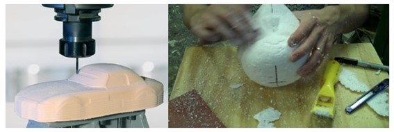

# Materials

When using recources you always want the lowest cost and the quickest way suited for the type of prototype you want to produce.

## Mechanical prototypes

### Polyurethane (PU) or Polystyrene (PS)

Polyurethane and polystyrene are very easy to work with. You can either manually or mechanically extract your model from a block or plate. These materials are also easy to glue together, so you can build your prototype from multiple segments.

### Cardboard

Cardboard and paper are very easy to work with and with the help of some tape, cotter pins and other additions you can make a realistic model.

### Wood

Wood is also a valuable material that can be processed using various techniques (milling, sawing, laser cutting, waterjet, bending, etc.).

### Clay

Making models in clay is labor intensive and not every clay is suitable for it. It is best to use oil-based clay. It also requires some experience to make such models. It is an expensive solution but still the best solution for car manufacturers who want to shape the lines of a new model.

### 3D printing

3D printing can be a relatively smooth way to build a prototype. Larger prototypes will easily take several hours to print and will therefore be expensive.

### Combined materials

Of course it is also possible to combine different materials to build a prototype.

## Electrical prototypes

### Breadboard and jumper cables

The quickest way to build your circuit for testing is by placing all components on a breadboard and making connections with jumper cables.

### Prototyping PCB Board

A more permenent solution is by using a prototyping pcb board.

